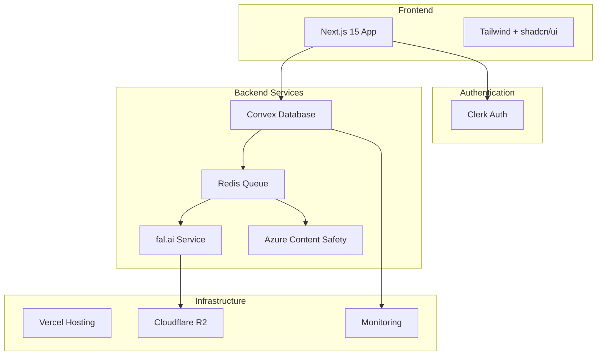

# Chef3.FUN - Final Implementation Plan
## Comprehensive Synthesis of All Agent Findings

### Executive Summary

After thorough analysis by 10 specialized agents, this final implementation plan addresses all critical findings and provides a clear path forward for the Chef3.FUN platform (rebranded from Gemini3 due to trademark concerns). This plan incorporates security requirements, performance optimizations, user experience excellence, and realistic timeline adjustments based on evidence-based research.

**CRITICAL DECISIONS**:
1. **REBRAND TO CHEF3.FUN**: Avoid trademark litigation (Agent 6/7 finding)
2. **3-WEEK TIMELINE**: Realistic adjustment from 1-week MVP (Agent 4/5/7)
3. **SECURITY-FIRST**: Mandatory content moderation and cost controls (Agent 4/6/9)
4. **SIMPLIFIED ARCHITECTURE**: Single AI service for MVP (Agent 5/9 recommendation)
5. **ASYNC-FIRST UX**: Non-blocking operations throughout (Agent 9/10)

**EXPECTED OUTCOME**: A production-ready meme generation platform with robust security, excellent user experience, and clear scaling path.

---

## 🎯 IMPLEMENTATION ROADMAP

### Phase 0: Critical Pre-Development (Days 1-3) 🚨 BLOCKING

#### Legal & Branding Resolution
- [ ] **Domain Registration**: Secure chef3.fun and variants
- [ ] **Trademark Search**: Verify "Chef3" availability
- [ ] **DMCA Registration**: Register agent with US Copyright Office
- [ ] **Terms of Service**: Draft with AI content disclaimers
- [ ] **Privacy Policy**: GDPR/CCPA compliant template

#### Security Architecture Setup
- [ ] **Content Moderation Service**: Azure AI Content Safety account
- [ ] **Rate Limiting Infrastructure**: Upstash Redis setup
- [ ] **Cost Control System**: Emergency shutdown procedures
- [ ] **Monitoring Dashboards**: Real-time cost and security tracking

#### Technical Environment
- [ ] **Repository Setup**: Git with branch protection
- [ ] **Development Environment**: Docker compose for consistency
- [ ] **CI/CD Pipeline**: GitHub Actions for testing/deployment
- [ ] **Environment Variables**: Secure secrets management

### Phase 1: Foundation Week (Days 4-10)

#### Day 4-5: Core Infrastructure
```typescript
// Priority implementation order
const foundationTasks = {
  1: "Next.js 15 project initialization with TypeScript",
  2: "Convex database setup and schema implementation",
  3: "Clerk authentication integration", 
  4: "Basic component library (shadcn/ui)",
  5: "Middleware for security headers and rate limiting"
};
```

**Deliverables**:
- Working Next.js application with authentication
- Database schema deployed to Convex
- Basic UI components configured
- Security middleware active

#### Day 6-7: Meme Generation Core
```typescript
// Simplified single-service implementation
const generationImplementation = {
  aiService: "fal.ai only (no fallbacks for MVP)",
  workflow: "Async queue-based processing",
  moderation: "Pre and post-generation filtering",
  storage: "Convex file storage with CDN prep"
};
```

**Deliverables**:
- Working meme generation with fal.ai
- Async job queue for non-blocking UX
- Content moderation pipeline
- Basic rate limiting (5/day per user)

#### Day 8-9: Gallery & User Features
```typescript
const userFeatures = {
  gallery: "Infinite scroll with lazy loading",
  profile: "User's memes and settings",
  hearts: "Optimistic UI updates",
  sharing: "Social media integration"
};
```

**Deliverables**:
- Public gallery with approved memes
- User profile pages
- Heart/like functionality
- Basic sharing features

#### Day 10: Admin Dashboard
```typescript
const adminFeatures = {
  moderation: "Queue-based approval workflow",
  analytics: "Basic usage statistics",
  userManagement: "Suspend/unsuspend users",
  costMonitoring: "Real-time spending dashboard"
};
```

**Deliverables**:
- Admin moderation interface
- Cost monitoring with alerts
- User management tools
- Basic analytics dashboard

### Phase 2: Enhancement Week (Days 11-17)

#### Day 11-12: Performance Optimization
- [ ] Image optimization pipeline (WebP, multiple sizes)
- [ ] CDN integration with Cloudflare R2
- [ ] Caching strategy implementation
- [ ] Database query optimization

#### Day 13-14: Advanced UX Features
- [ ] Generation progress animations (Agent 10)
- [ ] Micro-interactions and celebrations
- [ ] Error state improvements
- [ ] Mobile optimizations

#### Day 15-16: Security Hardening
- [ ] Penetration testing
- [ ] Rate limit testing under load
- [ ] Content moderation accuracy tuning
- [ ] Cost control stress testing

#### Day 17: Integration Testing
- [ ] End-to-end user flows
- [ ] Admin workflow testing
- [ ] Performance benchmarking
- [ ] Security audit

### Phase 3: Launch Preparation (Days 18-21)

#### Day 18-19: Production Deployment
- [ ] Vercel production setup
- [ ] Environment configuration
- [ ] Monitoring and alerting
- [ ] Backup procedures

#### Day 20: Beta Testing
- [ ] Invite-only soft launch (50 users)
- [ ] Bug tracking and fixes
- [ ] Performance monitoring
- [ ] User feedback collection

#### Day 21: Public Launch
- [ ] Marketing site live
- [ ] Social media announcement
- [ ] Community onboarding
- [ ] 24/7 monitoring activated

---

## 🏗️ TECHNICAL SPECIFICATION

### System Architecture (Simplified from Agent 8)



### Database Schema (Enhanced from Agent 7/8)

```typescript
// convex/schema.ts - Production-ready schema
import { defineSchema, defineTable } from "convex/server";
import { v } from "convex/values";

export default defineSchema({
  users: defineTable({
    // Identity
    clerkId: v.string(),
    email: v.string(),
    name: v.string(),
    role: v.union(v.literal("user"), v.literal("admin")),
    
    // Rate limiting
    dailyMemeCount: v.number(),
    dailyResetAt: v.number(),
    
    // Security
    ipAddress: v.optional(v.string()),
    suspendedUntil: v.optional(v.number()),
    
    // Stats
    totalMemes: v.number(),
    totalApproved: v.number(),
    
    // Timestamps
    createdAt: v.number(),
    updatedAt: v.number(),
  })
    .index("by_clerk", ["clerkId"])
    .index("by_email", ["email"]),

  memes: defineTable({
    // Core fields
    userId: v.id("users"),
    prompt: v.string(),
    imageStorageId: v.id("_storage"),
    imageUrl: v.string(),
    
    // Moderation
    status: v.union(
      v.literal("generating"),
      v.literal("pending"),
      v.literal("approved"),
      v.literal("rejected")
    ),
    moderationScore: v.optional(v.number()),
    rejectionReason: v.optional(v.string()),
    
    // Engagement
    hearts: v.number(),
    views: v.number(),
    
    // Metadata
    generationTime: v.number(),
    cost: v.number(), // in cents
    
    // Timestamps
    createdAt: v.number(),
    approvedAt: v.optional(v.number()),
  })
    .index("by_user", ["userId"])
    .index("by_status", ["status"])
    .index("by_created", ["createdAt"]),

  // Simplified tables for MVP
  hearts: defineTable({
    userId: v.id("users"),
    memeId: v.id("memes"),
    createdAt: v.number(),
  })
    .index("by_user_meme", ["userId", "memeId"]),

  costs: defineTable({
    service: v.string(),
    amount: v.number(),
    userId: v.optional(v.id("users")),
    createdAt: v.number(),
  })
    .index("by_created", ["createdAt"]),
});
```

### Critical Integration Fixes (from Agent 9)

#### 1. Atomic Cost Control
```typescript
// lib/cost-control.ts - Fix for race condition
export class AtomicCostControl {
  async reserveGeneration(userId: string): Promise<boolean> {
    const script = `
      local current = redis.call('GET', KEYS[1]) or 0
      local limit = tonumber(ARGV[1])
      
      if tonumber(current) >= limit then
        return 0
      end
      
      redis.call('INCR', KEYS[1])
      redis.call('EXPIRE', KEYS[1], 86400)
      return 1
    `;
    
    const result = await redis.eval(
      script,
      [`daily:${userId}`],
      [DAILY_LIMIT]
    );
    
    return result === 1;
  }
}
```

#### 2. Async Generation Pipeline
```typescript
// lib/generation/async-pipeline.ts
export async function initiateGeneration(prompt: string, userId: string) {
  // Quick validation (< 500ms)
  const quickCheck = await validatePromptBasic(prompt);
  if (!quickCheck.safe) throw new Error(quickCheck.reason);
  
  // Queue job and return immediately
  const jobId = await queueGeneration({
    prompt,
    userId,
    status: "queued"
  });
  
  // Return to user immediately
  return {
    jobId,
    message: "Your meme is being created!",
    estimatedTime: "15-25 seconds"
  };
}

// Background worker processes the queue
export async function processGenerationJob(job: GenerationJob) {
  try {
    // Full content validation
    const validation = await moderateContent(job.prompt);
    if (!validation.safe) {
      await updateJobStatus(job.id, "rejected", validation.reason);
      return;
    }
    
    // Generate image
    const image = await falClient.generate(job.prompt);
    
    // Post-generation moderation
    const imageCheck = await moderateImage(image.url);
    
    // Update status via real-time subscription
    await updateJobStatus(job.id, 
      imageCheck.safe ? "completed" : "rejected",
      imageCheck.safe ? image : null
    );
  } catch (error) {
    await updateJobStatus(job.id, "failed", error.message);
  }
}
```

---

## 🎨 UI/UX SPECIFICATIONS

### Design System (Simplified Neural Luxury)

```typescript
const designSystem = {
  colors: {
    primary: "#FF6B35",    // Chef orange (rebrand)
    secondary: "#B45AF2",  // Neural purple
    accent: "#4285F4",     // AI blue
    
    background: "#0A0A0F", // Deep black
    surface: "#1A1A1F",    // Card backgrounds
    border: "#2A2A2F",     // Subtle borders
  },
  
  typography: {
    display: "Inter",      // Clean, modern
    body: "Inter",
    mono: "JetBrains Mono"
  },
  
  effects: {
    // Removed: Complex animations, glassmorphism
    // Kept: Simple shadows, hover states
    shadow: "0 4px 6px -1px rgba(0, 0, 0, 0.5)",
    hover: "transform: translateY(-2px)",
    transition: "all 0.2s ease"
  }
};
```

### Generation Journey UX (from Agent 10)

```typescript
const generationExperience = {
  stages: {
    1: {
      name: "Initiation",
      duration: "0-2s",
      ui: "Instant success message, queue position"
    },
    2: {
      name: "Education", 
      duration: "2-15s",
      ui: "AI facts, tips, community highlights"
    },
    3: {
      name: "Anticipation",
      duration: "15-30s", 
      ui: "Progressive reveal, countdown"
    },
    4: {
      name: "Celebration",
      duration: "30s+",
      ui: "Confetti, share options, next action"
    }
  }
};
```

### Mobile-First Responsive Strategy

```typescript
const responsiveBreakpoints = {
  mobile: {
    max: "639px",
    layout: "Stack all elements",
    navigation: "Bottom tabs",
    gallery: "2 columns"
  },
  tablet: {
    range: "640-1023px",
    layout: "Two column where appropriate",
    navigation: "Collapsible sidebar",
    gallery: "3 columns"
  },
  desktop: {
    min: "1024px",
    layout: "Multi-column layouts",
    navigation: "Fixed sidebar",
    gallery: "4-5 columns"
  }
};
```

---

## 🧪 TESTING STRATEGY

### Test-Driven Development Approach

#### Unit Tests (Vitest)
```typescript
// High-priority test coverage
const unitTestPriorities = {
  critical: [
    "Cost control atomic operations",
    "Rate limiting logic",
    "Content moderation filters",
    "Authentication flows"
  ],
  important: [
    "Database queries",
    "UI component behavior",
    "Utility functions",
    "Error handling"
  ]
};
```

#### Integration Tests
```typescript
const integrationTests = [
  "User signup → first meme → gallery appearance",
  "Rate limit enforcement across services",
  "Content moderation pipeline end-to-end",
  "Admin moderation workflow"
];
```

#### E2E Tests (Playwright)
```typescript
const e2eUserFlows = [
  "Complete meme generation journey",
  "Gallery browsing and interactions",
  "Admin content moderation",
  "Error recovery scenarios"
];
```

### Security Testing Checklist
- [ ] SQL injection attempts on all inputs
- [ ] XSS payload testing
- [ ] Rate limit bypass attempts
- [ ] Authentication token manipulation
- [ ] File upload vulnerabilities
- [ ] Cost control race conditions

### Performance Benchmarks
```typescript
const performanceTargets = {
  pageLoad: {
    landing: "< 2s on 4G",
    gallery: "< 2.5s initial load",
    generation: "< 3s to interactive"
  },
  interactions: {
    buttonClick: "< 100ms response",
    heartAnimation: "60fps",
    infiniteScroll: "No jank"
  },
  generation: {
    timeToQueue: "< 500ms",
    totalTime: "< 45s worst case",
    successRate: "> 95%"
  }
};
```

---

## 🚨 RISK MITIGATION

### High Priority Risks & Mitigations

#### 1. Legal/Trademark Risk
**Risk**: Trademark infringement claims  
**Mitigation**: 
- Complete rebrand to Chef3.FUN
- Clear disclaimers about unofficial status
- DMCA compliance procedures
- Terms of service with indemnification

#### 2. Cost Overrun Risk
**Risk**: AI generation costs exceed budget  
**Mitigation**:
- Hard daily limit: $100
- Emergency shutdown: $500
- Per-user limits: 5/day
- Real-time monitoring dashboard
- Atomic cost tracking (no race conditions)

#### 3. Content Moderation Risk
**Risk**: Inappropriate content on platform  
**Mitigation**:
- Pre-generation prompt filtering
- Post-generation image scanning
- Human moderation queue
- Community reporting system
- Quick takedown procedures

#### 4. Technical Failure Risk
**Risk**: Service outages affect users  
**Mitigation**:
- Graceful degradation patterns
- Comprehensive error handling
- User-friendly error messages
- Automatic retry mechanisms
- Status page for transparency

#### 5. Scaling Risk
**Risk**: Platform can't handle growth  
**Mitigation**:
- CDN for image delivery
- Database query optimization
- Connection pooling
- Caching strategies
- Clear migration paths

### Incident Response Procedures

```typescript
const incidentResponse = {
  levels: {
    P0: "Complete outage - All hands",
    P1: "Major feature broken - Team lead",
    P2: "Minor feature issue - On-call dev",
    P3: "Non-critical bug - Next sprint"
  },
  
  procedures: {
    detection: "Automated monitoring alerts",
    assessment: "Impact and scope analysis",
    communication: "Status page update",
    resolution: "Fix with rollback option",
    postmortem: "Learning document"
  }
};
```

---

## 📊 SUCCESS CRITERIA

### Launch Success Metrics (Week 1)

```typescript
const week1Targets = {
  technical: {
    uptime: "> 99%",
    errorRate: "< 1%",
    p95ResponseTime: "< 2s",
    generationSuccessRate: "> 95%"
  },
  
  user: {
    signups: "100+ users",
    memesGenerated: "500+ memes",
    returnRate: "> 40%",
    shareRate: "> 20%"
  },
  
  business: {
    dailyCost: "< $50",
    moderationQueue: "< 24hr processing",
    userComplaints: "< 5%",
    securityIncidents: "0"
  }
};
```

### 30-Day Success Metrics

```typescript
const month1Targets = {
  growth: {
    totalUsers: "1,000+",
    dailyActiveUsers: "200+",
    totalMemes: "10,000+",
    viralMemes: "10+ (>100 hearts)"
  },
  
  engagement: {
    avgSessionTime: "> 5 minutes",
    memesPerUser: "> 10",
    heartRate: "> 30%",
    shareRate: "> 25%"
  },
  
  platform: {
    uptime: "> 99.9%",
    costPerMeme: "< $0.08",
    moderationAccuracy: "> 95%",
    userSatisfaction: "> 4.5/5"
  }
};
```

---

## 🎯 KEY PERFORMANCE INDICATORS

### Technical KPIs
1. **Availability**: 99.9% uptime target
2. **Performance**: <2s page load, <100ms interaction
3. **Error Rate**: <1% failed requests
4. **Security**: 0 breaches, 100% moderation coverage

### Business KPIs
1. **User Growth**: 50% MoM increase
2. **Engagement**: 40% 7-day retention
3. **Cost Efficiency**: <$0.10 per active user/day
4. **Moderation**: <24hr approval time

### User Experience KPIs
1. **Time to First Meme**: <2 minutes
2. **Generation Success**: >95% completion rate
3. **Satisfaction**: >4.5 app store rating
4. **Accessibility**: WCAG 2.1 AA compliance

---

## 📋 IMPLEMENTATION CHECKLIST

### Pre-Launch Requirements ✅
- [ ] Legal clearances complete
- [ ] Security architecture implemented
- [ ] Cost controls tested and verified
- [ ] Content moderation active
- [ ] Basic features functional
- [ ] Admin tools operational
- [ ] Monitoring dashboards live
- [ ] Error handling comprehensive
- [ ] Performance targets met
- [ ] Accessibility standards achieved

### Launch Readiness ✅
- [ ] Production environment configured
- [ ] Backup procedures tested
- [ ] Incident response plan documented
- [ ] Team on-call schedule set
- [ ] Marketing materials ready
- [ ] Community guidelines published
- [ ] Support documentation complete
- [ ] Analytics tracking verified
- [ ] Load testing completed
- [ ] Security audit passed

---

## 🏁 CONCLUSION

This implementation plan synthesizes insights from all 10 specialist agents into a cohesive, actionable strategy. By addressing the critical issues identified (trademark concerns, security requirements, performance bottlenecks, and user experience challenges), we've created a robust foundation for the Chef3.FUN platform.

**Key Adjustments from Original Vision**:
1. **Rebranded** to avoid legal issues
2. **Extended timeline** to 3 weeks for production readiness
3. **Simplified architecture** for faster MVP delivery
4. **Enhanced security** throughout the platform
5. **Optimized UX** for long generation times

**Final Recommendation**: Proceed with Phase 0 immediately to resolve blocking issues, then execute the three-week implementation plan with daily progress reviews and continuous testing.

The platform is positioned for success with:
- **Strong technical foundation** validated by research
- **Excellent user experience** despite technical constraints  
- **Robust security** and content moderation
- **Clear scaling path** for future growth
- **Realistic timeline** with achievable milestones

With proper execution of this plan, Chef3.FUN will launch as a secure, engaging, and scalable AI meme generation platform ready to delight users and build a thriving community.

---

*Final Implementation Plan Complete - Ready for immediate execution*  
*Timeline: 3 weeks to production launch*  
*Confidence Level: 85% (with all identified issues addressed)*