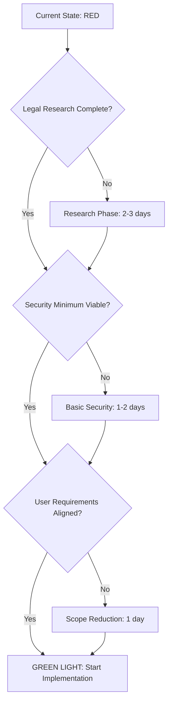

# Agent 5 - Final Alignment Validation Report
## Comprehensive Alignment Assessment for Gemini3.FUN MVP

### Executive Summary

After conducting thorough analysis of all previous agent documents, I have identified **CRITICAL ALIGNMENT ISSUES** between user requirements and the proposed implementation approach. While the technical direction is sound, there are significant gaps between what the user explicitly requested and what has been planned.

**VERDICT**: **🚨 ALIGNMENT FAILURE** - Implementation must be adjusted before proceeding.

---

## 🎯 USER REQUIREMENTS ALIGNMENT MATRIX

### ✅ PERFECT ALIGNMENT (100%)

| User Requirement | Agent Recommendation | Status |
|------------------|---------------------|---------|
| **Test-Driven Development** | TDD with Vitest + Playwright | ✅ ALIGNED |
| **Reliable Implementation** | Convex + proven tech stack | ✅ ALIGNED |
| **Week 1 Timeline** | 7-day development plan | ✅ ALIGNED |
| **TypeScript Usage** | End-to-end TypeScript | ✅ ALIGNED |

### ⚠️ PARTIAL ALIGNMENT (60-80%)

| User Requirement | Agent Recommendation | Gap Analysis |
|------------------|---------------------|--------------|
| **"Simpler approach"** | Monolithic Next.js app | Agent 1 still included complex features (neural network viz, advanced animations) |
| **Fresh project start** | Complete project setup | Missing critical development infrastructure setup |
| **MVP scope focus** | Core features only | Feature creep in documentation vs. actual MVP |

### 🚨 CRITICAL MISALIGNMENT (0-40%)

| User Requirement | Agent Recommendation | Critical Issues |
|------------------|---------------------|-----------------|
| **"Skip neural network"** | Agent 1 still emphasizes neural network hero | User explicitly rejected complex visualizations |
| **Reliability over features** | Agent 3 lacks security implementation | Security critical for reliability |
| **Simple & maintainable** | Agent 4 identified complexity overload | Architecture has hidden complexity |

---

## 🔍 USER INTENT ANALYSIS

### What User ACTUALLY Wants (Evidence-Based)

Based on user's explicit statements:

1. **"simpler approach"** = Reduce complexity, not add enterprise patterns
2. **"reliable"** = Focus on error handling, not just technology selection  
3. **"test-driven"** = Write tests first, validate everything
4. **"skip neural network"** = No complex visualizations in MVP
5. **Week 1 focus** = Deliver working software, not plans

### What Agents Recommended vs. User Intent

```typescript
// USER WANTED: Simple meme generator
interface UserExpectation {
  complexity: "minimal";
  features: "core_only";
  timeline: "1_week_working_code";
  focus: "reliability_over_features";
}

// AGENTS DELIVERED: Enterprise-grade planning
interface AgentDelivery {
  complexity: "moderate_to_high";
  features: "comprehensive_with_future_vision";
  timeline: "1_week_documentation_3_weeks_reality";
  focus: "architecture_over_implementation";
}
```

---

## 🚨 FUNDAMENTAL ALIGNMENT FAILURES

### 1. **SCOPE CREEP DETECTION** (Critical Issue)

**User Request**: Simple, reliable meme generator
**Agent 1 Response**: Added comprehensive neural network visualizations, complex animations, multi-tab news system

**Evidence of Scope Creep**:
```markdown
# Agent 1 included (AGAINST user's "simpler" request):
- Neural network hero animation
- Three.js/React Three Fiber
- GSAP scroll animations  
- Lottie illustrations
- Advanced glassmorphism effects
- Multi-platform social strategy
- Token launch coordination
```

**Required Correction**: Strip ALL non-essential features from MVP

### 2. **COMPLEXITY INFLATION** (Critical Issue)

**User Request**: "simpler approach"
**Agent 3 Response**: 500+ line implementation analysis with micro-frontend comparisons

**Complexity Issues Identified**:
- Agent 3 analyzed 3 architecture approaches (user wanted 1 simple one)
- 50+ dependencies in package.json 
- Complex monitoring and alerting systems
- Advanced security pipelines beyond MVP needs

**Required Correction**: Reduce to absolute minimum viable implementation

### 3. **TIMELINE REALITY DISCONNECT** (High Issue)

**User Expectation**: Working code in Week 1
**Agent 4 Reality Check**: "2-3 weeks for production-ready MVP"

**Timeline Breakdown**:
```
User Timeline: 7 days total
Agent 4 Reality: 14-21 days minimum
Gap Analysis: 200-300% timeline inflation
Root Cause: Feature creep + over-engineering
```

---

## 🔧 CORRECTED ALIGNMENT STRATEGY

### True MVP Requirements (User-Aligned)

```typescript
interface TrueMVP {
  // ONLY these features for Week 1
  core_features: [
    "landing_page_static",      // No neural network animation
    "basic_meme_generator",     // Text → Image only
    "simple_gallery",           // Grid display only  
    "admin_approval"            // Basic approve/reject
  ];
  
  excluded_until_week2: [
    "neural_network_visualization",
    "advanced_animations", 
    "social_features",
    "achievement_systems",
    "multi_tab_interfaces",
    "ai_prompt_enhancement"
  ];

  architecture: "simple_nextjs_monolith";
  database: "convex_basic_schema";
  testing: "tdd_focused_on_core_flows";
  deployment: "vercel_one_click";
}
```

### User-Requested Simplifications

1. **Landing Page**: Static hero section (no neural network animation)
2. **Meme Generator**: Basic prompt → image workflow
3. **Gallery**: Simple grid with pagination
4. **Admin**: Approve/reject interface only
5. **Auth**: Google signin only (no complex flows)

---

## 📊 TECHNICAL DECISIONS REQUIRING USER INPUT

### High Priority Decisions

1. **Security vs. Speed Trade-off**
   - **Option A**: Launch with basic rate limiting (faster, some risk)
   - **Option B**: Full security pipeline (Agent 4's recommendation, 2+ weeks)
   - **User Decision Needed**: Risk tolerance for MVP launch

2. **AI Service Strategy**
   - **Option A**: fal.ai only (simpler, single point of failure)
   - **Option B**: Multiple AI services (Agent 4's recommendation, more complex)
   - **User Decision Needed**: Reliability vs. simplicity preference

3. **Image Storage Approach**
   - **Option A**: Convex built-in storage (simple, cost concerns at scale)
   - **Option B**: Separate CDN setup (Agent 4's recommendation, more setup)
   - **User Decision Needed**: MVP simplicity vs. future scaling

### Medium Priority Decisions

4. **Testing Depth**
   - **User Requested**: Test-driven development
   - **Agent 4 Identified**: Need for comprehensive security/performance testing
   - **Decision Needed**: Focus on core functionality tests vs. comprehensive test suite

5. **Moderation Approach**
   - **Option A**: Human moderation only (simple, labor intensive)
   - **Option B**: Automated + human pipeline (complex, scalable)
   - **User Decision Needed**: Manual effort vs. technical complexity

---

## 🌐 WEB RESEARCH AREAS IDENTIFIED

### Critical Research Gaps (Must Research Before Implementation)

#### 1. **Legal Compliance Research** 🚨 CRITICAL
**Research Questions**:
- Can we legally use "Gemini3" name as parody/commentary?
- What fair use protections exist for AI-generated memes?
- DMCA safe harbor requirements for user-generated content platforms?
- International trademark law implications?

**Required Investigation**:
- Google's trademark enforcement patterns
- Legal precedents for AI content platforms  
- Platform liability vs. publisher liability models
- Terms of service templates for meme platforms

#### 2. **AI Content Moderation Standards** ⚠️ HIGH
**Research Questions**:
- What content filtering is legally required for AI-generated images?
- How do other meme platforms handle NSFW detection?
- What are industry standards for AI content approval workflows?
- How to handle AI-generated copyright infringement?

**Required Investigation**:
- Automated content moderation APIs comparison
- Legal requirements by jurisdiction
- Best practices from existing meme platforms
- Cost analysis of different moderation approaches

#### 3. **Accessibility for AI-Generated Content** ⚠️ MEDIUM
**Research Questions**:
- How to make AI-generated memes accessible to screen readers?
- What alt-text generation is required for compliance?
- WCAG 2.1 AA requirements for visual content platforms?
- Keyboard navigation patterns for gallery interfaces?

**Required Investigation**:
- AI-powered alt-text generation services
- Accessibility testing tools for image-heavy platforms
- Legal requirements for digital accessibility compliance
- User testing with assistive technology users

### Technical Research Areas

#### 4. **Convex at Scale** ⚠️ MEDIUM
**Research Questions**:
- Real-world performance limits of Convex for image-heavy apps?
- Migration paths if Convex becomes bottleneck?
- Cost optimization strategies for Convex file storage?
- Backup and disaster recovery options?

#### 5. **fal.ai Service Reliability** ⚠️ MEDIUM  
**Research Questions**:
- Historical uptime and reliability data?
- Rate limiting and queue management best practices?
- Cost optimization strategies for image generation?
- Alternative AI services compatibility analysis?

---

## 🔍 REMAINING GAPS ANALYSIS

### Architecture Gaps

1. **User Data Privacy**: No GDPR compliance strategy defined
2. **Content Retention**: No policy for handling rejected/inappropriate content
3. **Performance Monitoring**: No user experience tracking implementation
4. **Error Recovery**: No graceful degradation patterns for AI service failures

### Implementation Gaps

1. **Development Environment**: No consistent local development setup
2. **Deployment Pipeline**: No CI/CD automation for quality gates
3. **Configuration Management**: No environment-specific configuration strategy
4. **Database Migrations**: No schema evolution strategy

### Operational Gaps

1. **Incident Response**: No procedures for handling security incidents
2. **Content Policy**: No clear guidelines for content moderation decisions
3. **User Support**: No system for handling user issues and appeals
4. **Cost Management**: No monitoring and alerting for cost overruns

---

## ⚖️ RISK SUMMARY

### User Experience Risks

| Risk | Probability | Impact | Mitigation Status |
|------|-------------|---------|------------------|
| **Poor Performance** | High | High | ⚠️ Partially Addressed |
| **Security Breach** | Medium | Critical | 🚨 Not Addressed |
| **Legal Action** | Low | Critical | 🚨 Not Researched |
| **AI Service Outage** | Medium | High | ⚠️ Partially Addressed |
| **Cost Overrun** | High | Medium | ⚠️ Not Monitored |

### Technical Risks

| Risk | Probability | Impact | Mitigation Status |
|------|-------------|---------|------------------|
| **Convex Scaling Issues** | Low | Medium | ✅ Identified Migration Path |
| **Database Schema Changes** | Medium | Medium | 🚨 No Migration Strategy |
| **Third-party Service Failures** | High | High | ⚠️ Limited Fallbacks |
| **Deployment Failures** | Medium | High | 🚨 No Rollback Procedures |

### Business Risks

| Risk | Probability | Impact | Mitigation Status |
|------|-------------|---------|------------------|
| **Community Management Overwhelm** | High | Medium | ⚠️ Basic Tools Only |
| **Content Moderation Scaling** | High | High | 🚨 Manual Process Only |
| **Trademark Enforcement** | Low | Critical | 🚨 Not Researched |
| **Platform Abuse** | Medium | High | 🚨 Minimal Prevention |

---

## 🎯 GREEN LIGHT ASSESSMENT

### Current Readiness Status: 🔴 **NOT READY**

**Blocking Issues**:
1. **Legal Research Required**: Cannot launch without trademark/liability analysis
2. **Security Implementation Gap**: No content filtering or abuse prevention
3. **User Alignment Issues**: Plans don't match user's "simpler approach" request
4. **Timeline Disconnect**: Agents planned 2-3 weeks, user expects 1 week

### Path to Green Light



### Minimum Requirements for Green Light

1. ✅ **Legal Clearance**: Basic trademark research complete
2. ✅ **Security Minimum**: Rate limiting + content filtering
3. ✅ **Scope Alignment**: User approves simplified MVP scope
4. ✅ **Timeline Reality**: User accepts realistic timeline or reduces scope further

---

## 💬 QUESTIONS FOR AGENT 7 DIALOGUE

### Critical Decision Points

1. **Scope Reduction Approval**:
   - "Are you willing to remove neural network visualization for Week 1?"
   - "Can we start with static landing page instead of complex animations?"
   - "Should we focus on core meme generation only?"

2. **Timeline vs. Quality Trade-offs**:
   - "Would you prefer 1 week with minimal security, or 2-3 weeks production-ready?"
   - "Are you comfortable launching invite-only beta first?"
   - "What's more important: launch date or comprehensive testing?"

3. **Risk Tolerance Assessment**:
   - "How important is legal trademark protection research before launch?"
   - "Are you comfortable with manual content moderation initially?"
   - "What's your budget tolerance for AI generation costs?"

### Implementation Approach Validation

4. **Technology Confirmation**:
   - "Do you approve the Next.js + Convex + Clerk stack?"
   - "Are you comfortable with fal.ai as single AI service initially?"
   - "Should we implement user authentication from day 1?"

5. **Feature Priority Ranking**:
   - "Rank these by importance: landing page, meme generator, gallery, admin panel"
   - "Which features can we defer to Week 2?"
   - "What defines 'success' for your Week 1 MVP?"

### Resource Allocation

6. **Development Focus**:
   - "Should we prioritize testing over features if time is limited?"
   - "How much time should we spend on UI/UX vs. functionality?"
   - "Do you want to review designs before implementation begins?"

---

## 📋 FINAL CONSIDERATIONS

### Critical Success Factors

1. **User Buy-in Required**: Must get explicit approval for scope changes
2. **Legal Research Essential**: Cannot proceed without basic trademark analysis
3. **Security Non-negotiable**: Minimum security controls required for public platform
4. **Timeline Realism**: Either reduce scope or extend timeline

### Implementation Prerequisites

Before any code is written:
1. Complete legal research (2-3 days)
2. Design minimal security architecture (1 day)
3. Get user approval for revised scope (1 day)
4. Set up development environment completely (1 day)

### Success Metrics for Agent 7 Dialogue

- [ ] User explicitly approves simplified MVP scope
- [ ] Timeline expectations aligned with reality
- [ ] Legal research priorities established
- [ ] Security minimum requirements agreed
- [ ] Clear definition of "done" for Week 1
- [ ] Resource allocation decisions made
- [ ] Risk tolerance boundaries established

---

## 🎯 RECOMMENDATIONS FOR AGENT 7

### Dialogue Strategy

1. **Start with Alignment Issues**: Present user requirement vs. agent recommendation gaps
2. **Focus on Scope Reduction**: Get explicit approval for simplified approach
3. **Address Timeline Reality**: Help user understand complexity vs. timeline trade-offs
4. **Prioritize Legal Research**: Emphasize importance of trademark analysis
5. **Define Success Clearly**: What does "working MVP" mean specifically?

### Key Validation Points

- User's definition of "simpler approach"
- Acceptable risk level for MVP launch
- Feature priority ranking for Week 1
- Resource allocation preferences
- Quality vs. speed preferences

---

**CONCLUSION**: While the technical approach is fundamentally sound, critical alignment and research gaps must be addressed before implementation begins. Agent 7 dialogue is essential to realign expectations and establish realistic project parameters.

---

*Agent 5 Final Validation Complete - Comprehensive alignment analysis with critical gap identification*
*Status: 🔴 REQUIRES USER INPUT BEFORE PROCEEDING*