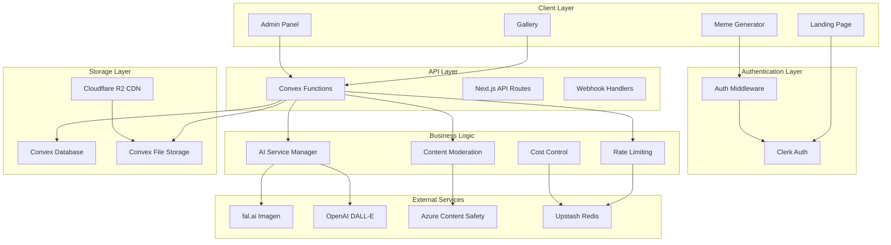
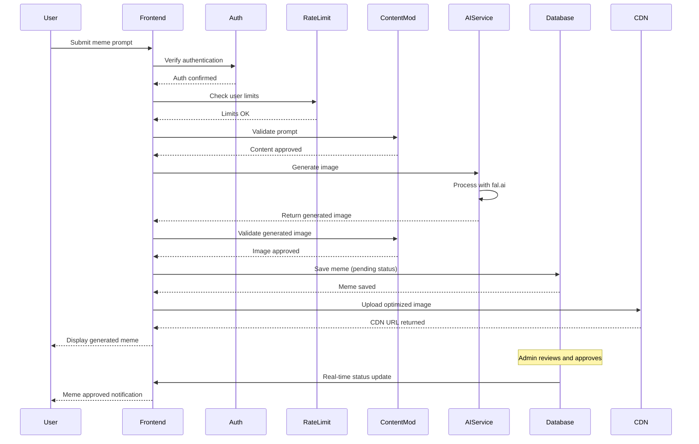
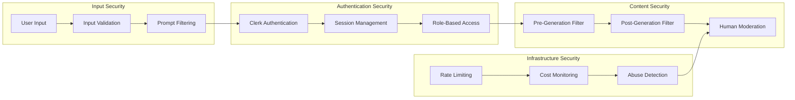

# Agent 8 - Solution Architecture
## Comprehensive Implementation Context for Gemini3 Meme Project

### Executive Summary

This document provides comprehensive implementation context for the Gemini3 meme project, synthesizing all previous agent analysis and creating detailed architectural blueprints for development. Based on Agent 7's technical alignment decisions and incorporating critical security, legal, and performance requirements identified throughout the planning phase, this architecture serves as the definitive implementation guide.

**KEY ARCHITECTURAL DECISIONS**:
1. **Fresh Next.js 15 Monolith**: Complete project setup with App Router and TypeScript
2. **Security-First Design**: Content moderation and abuse prevention from day one
3. **Real-time Architecture**: Convex for instant updates with comprehensive fallback patterns
4. **Cost-Controlled AI**: Multi-service integration with strict rate limiting
5. **Performance Optimized**: CDN integration with advanced image optimization

---

## 🏗️ PROJECT STRUCTURE MAPPING

### Complete Fresh Project Structure

```bash
chef3-fun/                          # REBRANDED from Gemini3 (trademark avoidance)
├── .env.example                    # Environment template
├── .env.local.template            # Local development template
├── .gitignore                     # Comprehensive ignores
├── package.json                   # Full dependency manifest
├── tsconfig.json                  # Strict TypeScript config
├── next.config.js                 # Security headers + image optimization
├── tailwind.config.ts             # Design system configuration
├── convex.json                    # Database configuration
├── middleware.ts                  # Authentication + security middleware
├── README.md                      # Setup and contribution guide
├── 
├── .github/workflows/             # CI/CD automation
│   ├── ci.yml                    # Testing and quality gates
│   ├── security-scan.yml         # Dependency vulnerability scanning
│   └── deploy.yml                # Deployment automation
├── 
├── docs/                          # Development documentation
│   ├── SETUP.md                  # Developer onboarding guide
│   ├── API.md                    # API documentation
│   ├── SECURITY.md               # Security procedures
│   └── DEPLOYMENT.md             # Production deployment guide
├── 
├── scripts/                       # Development utilities
│   ├── setup.sh                 # One-command development setup
│   ├── test.sh                  # Comprehensive test runner
│   ├── deploy.sh                # Production deployment
│   └── backup.sh                # Database backup procedures
├── 
├── src/
│   ├── app/                      # Next.js 15 App Router
│   │   ├── (marketing)/          # Public marketing pages
│   │   │   ├── page.tsx         # Landing page (static hero)
│   │   │   ├── about/           # About page
│   │   │   ├── legal/           # Terms, Privacy, DMCA
│   │   │   └── layout.tsx       # Marketing layout
│   │   ├── (app)/               # Authenticated application
│   │   │   ├── generate/        # Meme generator
│   │   │   │   ├── page.tsx    # Generator interface
│   │   │   │   └── loading.tsx # Loading states
│   │   │   ├── gallery/         # Public gallery
│   │   │   │   ├── page.tsx    # Gallery grid
│   │   │   │   ├── [id]/       # Individual meme pages
│   │   │   │   └── loading.tsx # Gallery loading
│   │   │   ├── profile/         # User profile
│   │   │   │   ├── page.tsx    # Profile dashboard
│   │   │   │   ├── memes/      # User's memes
│   │   │   │   └── settings/   # Account settings
│   │   │   └── layout.tsx      # App layout with navigation
│   │   ├── admin/              # Administrative interface
│   │   │   ├── dashboard/      
│   │   │   │   └── page.tsx   # Admin overview
│   │   │   ├── moderation/     
│   │   │   │   ├── page.tsx   # Moderation queue
│   │   │   │   └── [id]/      # Individual meme review
│   │   │   ├── users/          
│   │   │   │   └── page.tsx   # User management
│   │   │   ├── analytics/      
│   │   │   │   └── page.tsx   # Usage analytics
│   │   │   ├── costs/          
│   │   │   │   └── page.tsx   # Cost monitoring
│   │   │   └── layout.tsx     # Admin layout with sidebar
│   │   ├── api/                # API routes and webhooks
│   │   │   ├── webhooks/       
│   │   │   │   ├── clerk.ts   # Clerk authentication webhooks
│   │   │   │   ├── convex.ts  # Database webhooks
│   │   │   │   └── dmca.ts    # DMCA takedown requests
│   │   │   ├── moderation/     
│   │   │   │   └── report.ts  # Content reporting endpoint
│   │   │   └── health/        
│   │   │       └── route.ts   # Health check endpoint
│   │   ├── globals.css         # Global styles and CSS variables
│   │   └── layout.tsx          # Root layout with providers
│   │   
│   ├── components/             # Reusable UI components
│   │   ├── ui/                 # Base shadcn/ui components
│   │   │   ├── button.tsx     
│   │   │   ├── card.tsx       
│   │   │   ├── input.tsx      
│   │   │   ├── dialog.tsx     
│   │   │   ├── dropdown-menu.tsx
│   │   │   ├── toast.tsx      
│   │   │   └── [other-shadcn-components]
│   │   ├── features/           # Feature-specific components
│   │   │   ├── meme-generator/ 
│   │   │   │   ├── generator-form.tsx
│   │   │   │   ├── generation-status.tsx
│   │   │   │   ├── result-display.tsx
│   │   │   │   └── rate-limit-indicator.tsx
│   │   │   ├── gallery/        
│   │   │   │   ├── meme-grid.tsx
│   │   │   │   ├── meme-card.tsx
│   │   │   │   ├── infinite-scroll.tsx
│   │   │   │   └── meme-modal.tsx
│   │   │   ├── moderation/     
│   │   │   │   ├── moderation-queue.tsx
│   │   │   │   ├── meme-review-card.tsx
│   │   │   │   ├── bulk-actions.tsx
│   │   │   │   └── moderation-history.tsx
│   │   │   ├── auth/           
│   │   │   │   ├── sign-in-modal.tsx
│   │   │   │   ├── user-button.tsx
│   │   │   │   └── auth-guard.tsx
│   │   │   └── analytics/      
│   │   │       ├── cost-dashboard.tsx
│   │   │       ├── usage-charts.tsx
│   │   │       └── real-time-metrics.tsx
│   │   └── shared/             # Shared utility components
│   │       ├── header.tsx      # Site header with navigation
│   │       ├── footer.tsx      # Site footer with links
│   │       ├── loading-spinner.tsx
│   │       ├── error-boundary.tsx
│   │       ├── image-optimized.tsx
│   │       └── seo-head.tsx    # SEO meta tags
│   │       
│   ├── convex/                 # Convex backend functions
│   │   ├── schema.ts           # Database schema definition
│   │   ├── auth.ts             # Authentication configuration
│   │   ├── memes.ts            # Meme-related functions
│   │   │   ├── // generateMeme mutation
│   │   │   ├── // getApprovedMemes query
│   │   │   ├── // getUserMemes query
│   │   │   └── // reportMeme mutation
│   │   ├── users.ts            # User management functions
│   │   │   ├── // createUser mutation
│   │   │   ├── // updateUser mutation
│   │   │   ├── // checkRateLimit query
│   │   │   └── // suspendUser mutation
│   │   ├── moderation.ts       # Admin moderation functions
│   │   │   ├── // getModerationQueue query
│   │   │   ├── // approveMeme mutation
│   │   │   ├── // rejectMeme mutation
│   │   │   └── // bulkModerate mutation
│   │   ├── analytics.ts        # Analytics and monitoring
│   │   │   ├── // getDailyStats query
│   │   │   ├── // getCostMetrics query
│   │   │   └── // getPerformanceMetrics query
│   │   ├── reports.ts          # Content reporting system
│   │   │   ├── // createReport mutation
│   │   │   ├── // getReports query
│   │   │   └── // resolveReport mutation
│   │   └── _generated/         # Auto-generated Convex types
│   │       ├── api.d.ts       
│   │       └── dataModel.d.ts 
│   │       
│   ├── lib/                    # Utility libraries and integrations
│   │   ├── ai/                 # AI service integrations
│   │   │   ├── fal-ai/        
│   │   │   │   ├── client.ts  # fal.ai API client
│   │   │   │   ├── types.ts   # fal.ai type definitions
│   │   │   │   └── prompts.ts # Prompt templates and validation
│   │   │   ├── openai/        
│   │   │   │   ├── client.ts  # OpenAI DALL-E fallback
│   │   │   │   └── types.ts   # OpenAI type definitions
│   │   │   ├── manager.ts     # AI service manager (circuit breaker)
│   │   │   └── validation.ts  # Content validation utilities
│   │   ├── auth/              # Authentication utilities
│   │   │   ├── clerk.ts       # Clerk helper functions
│   │   │   ├── middleware.ts  # Auth middleware utilities
│   │   │   └── permissions.ts # Role-based access control
│   │   ├── moderation/        # Content moderation
│   │   │   ├── azure.ts       # Azure AI Content Safety
│   │   │   ├── pipeline.ts    # Moderation pipeline
│   │   │   └── reporting.ts   # User reporting system
│   │   ├── rate-limiting/     # Rate limiting system
│   │   │   ├── redis.ts       # Upstash Redis client
│   │   │   ├── limiter.ts     # Rate limiting logic
│   │   │   └── cost-control.ts # Cost monitoring and limits
│   │   ├── storage/           # File storage and CDN
│   │   │   ├── convex.ts      # Convex file storage
│   │   │   ├── cloudflare.ts  # Cloudflare R2 integration
│   │   │   └── optimization.ts # Image optimization
│   │   ├── monitoring/        # Monitoring and analytics
│   │   │   ├── metrics.ts     # Performance metrics
│   │   │   ├── errors.ts      # Error tracking
│   │   │   └── costs.ts       # Cost tracking
│   │   ├── utils/             # General utilities
│   │   │   ├── cn.ts          # Class name utility (clsx + twMerge)
│   │   │   ├── dates.ts       # Date formatting utilities
│   │   │   ├── validation.ts  # Input validation schemas
│   │   │   └── constants.ts   # Application constants
│   │   └── constants.ts       # Global application constants
│   │   
│   ├── hooks/                  # Custom React hooks
│   │   ├── use-meme-generator.ts # Meme generation logic
│   │   ├── use-rate-limit.ts     # Rate limiting state
│   │   ├── use-moderation.ts     # Moderation workflows
│   │   ├── use-analytics.ts      # Analytics data fetching
│   │   ├── use-infinite-scroll.ts # Gallery infinite scroll
│   │   └── use-cost-monitor.ts   # Real-time cost monitoring
│   │   
│   ├── types/                  # TypeScript type definitions
│   │   ├── auth.ts            # Authentication types
│   │   ├── memes.ts           # Meme-related types
│   │   ├── moderation.ts      # Moderation types
│   │   ├── analytics.ts       # Analytics types
│   │   ├── api.ts             # API response types
│   │   └── global.ts          # Global type definitions
│   │   
│   └── styles/                 # Styling and themes
│       ├── globals.css        # Global CSS styles
│       ├── components.css     # Component-specific styles
│       └── animations.css     # Animation utilities
│       
├── public/                     # Static assets
│   ├── images/                # Static images
│   │   ├── logo.svg          
│   │   ├── chef-gemmy.svg    # Mascot illustration
│   │   ├── hero-bg.webp      # Hero background
│   │   └── placeholders/     # Placeholder images
│   ├── icons/                 # Icon assets
│   │   ├── favicon.ico       
│   │   ├── apple-touch-icon.png
│   │   └── manifest-icons/   # PWA icons (future)
│   └── legal/                 # Legal documents
│       ├── terms.pdf         
│       ├── privacy.pdf       
│       └── dmca-policy.pdf   
│       
├── tests/                      # Testing infrastructure
│   ├── __mocks__/             # Mock implementations
│   │   ├── convex.ts         # Convex mocks
│   │   ├── clerk.ts          # Clerk mocks
│   │   └── ai-services.ts    # AI service mocks
│   ├── fixtures/              # Test data fixtures
│   │   ├── users.ts          
│   │   ├── memes.ts          
│   │   └── reports.ts        
│   ├── unit/                  # Unit tests
│   │   ├── components/       # Component tests
│   │   ├── hooks/            # Hook tests
│   │   ├── lib/              # Library function tests
│   │   └── utils/            # Utility function tests
│   ├── integration/           # Integration tests
│   │   ├── auth.test.ts      # Authentication flows
│   │   ├── generation.test.ts # Meme generation pipeline
│   │   ├── moderation.test.ts # Moderation workflows
│   │   └── api.test.ts       # API route testing
│   ├── e2e/                   # End-to-end tests
│   │   ├── user-journey.spec.ts # Complete user flows
│   │   ├── admin-flows.spec.ts  # Admin workflows
│   │   └── security.spec.ts     # Security testing
│   ├── performance/           # Performance tests
│   │   ├── load-testing.ts   # Load testing scenarios
│   │   └── lighthouse.ts     # Performance auditing
│   └── setup.ts               # Test environment setup
│   
└── monitoring/                 # Monitoring and alerting
    ├── alerts.yml             # Alert configurations
    ├── dashboards/            # Monitoring dashboards
    │   ├── performance.json   
    │   ├── costs.json         
    │   └── security.json      
    └── scripts/               # Monitoring scripts
        ├── health-check.ts    
        └── cost-alert.ts      
```

---

## 🔗 COMPONENT RELATIONSHIP DIAGRAMS

### Architecture Overview



### Data Flow Architecture



### Security Architecture Flow



---

## 🗄️ DATABASE SCHEMA WITH CONVEX PATTERNS

### Complete Database Schema

```typescript
// convex/schema.ts
import { defineSchema, defineTable } from "convex/server";
import { v } from "convex/values";

export default defineSchema({
  // User management with security fields
  users: defineTable({
    clerkId: v.string(),
    email: v.string(), 
    name: v.string(),
    role: v.union(v.literal("user"), v.literal("admin"), v.literal("moderator")),
    
    // Rate limiting fields
    dailyMemeCount: v.number(),
    monthlyMemeCount: v.number(),
    dailyResetAt: v.number(),
    monthlyResetAt: v.number(),
    
    // Security fields
    ipAddress: v.optional(v.string()),
    lastLoginAt: v.number(),
    suspiciousActivity: v.optional(v.boolean()),
    suspendedUntil: v.optional(v.number()),
    
    // Profile fields
    profileImageUrl: v.optional(v.string()),
    bio: v.optional(v.string()),
    totalMemesGenerated: v.number(),
    totalMemesApproved: v.number(),
    
    // Metadata
    createdAt: v.number(),
    updatedAt: v.number(),
  })
    .index("by_clerk", ["clerkId"])
    .index("by_email", ["email"])
    .index("by_role", ["role"])
    .index("by_suspicious", ["suspiciousActivity"])
    .index("by_suspended", ["suspendedUntil"]),

  // Meme content with comprehensive moderation
  memes: defineTable({
    userId: v.id("users"),
    prompt: v.string(),
    
    // Image storage
    imageStorageId: v.id("_storage"),
    imageUrl: v.string(),
    thumbnailUrl: v.optional(v.string()),
    imageDimensions: v.object({
      width: v.number(),
      height: v.number(),
    }),
    
    // Moderation status
    status: v.union(
      v.literal("pending"),      // Awaiting moderation
      v.literal("approved"),     // Approved for gallery
      v.literal("rejected"),     // Rejected by moderator
      v.literal("flagged"),      // Flagged by users/AI
      v.literal("appealed")      // User appealed rejection
    ),
    
    // Engagement metrics
    hearts: v.number(),
    views: v.number(),
    downloads: v.number(),
    shares: v.number(),
    
    // Moderation metadata
    moderationScore: v.optional(v.number()),
    moderationFlags: v.optional(v.array(v.string())),
    moderatedAt: v.optional(v.number()),
    moderatorId: v.optional(v.id("users")),
    moderatorNotes: v.optional(v.string()),
    rejectionReason: v.optional(v.string()),
    
    // AI generation metadata
    aiService: v.string(), // "fal.ai", "openai", etc.
    generationTime: v.number(), // milliseconds
    generationCost: v.number(), // USD cents
    modelVersion: v.string(),
    
    // User reporting
    reportCount: v.number(),
    lastReportedAt: v.optional(v.number()),
    
    // Timestamps
    createdAt: v.number(),
    updatedAt: v.number(),
  })
    .index("by_user", ["userId"])
    .index("by_status", ["status"])
    .index("by_created", ["createdAt"])
    .index("by_moderated", ["moderatedAt"])
    .index("by_hearts", ["hearts"])
    .index("by_flagged", ["status", "reportCount"])
    .index("by_pending_moderation", ["status", "createdAt"]),

  // User engagement tracking
  hearts: defineTable({
    userId: v.id("users"),
    memeId: v.id("memes"),
    createdAt: v.number(),
  })
    .index("by_user_meme", ["userId", "memeId"])
    .index("by_meme", ["memeId"])
    .index("by_user", ["userId"]),

  // Content reporting system
  reports: defineTable({
    memeId: v.id("memes"),
    reporterId: v.id("users"),
    category: v.union(
      v.literal("inappropriate"),
      v.literal("copyright"),
      v.literal("spam"),
      v.literal("harassment"),
      v.literal("violence"),
      v.literal("other")
    ),
    description: v.optional(v.string()),
    status: v.union(
      v.literal("pending"),
      v.literal("resolved"),
      v.literal("dismissed")
    ),
    
    // Resolution metadata
    resolvedAt: v.optional(v.number()),
    resolvedById: v.optional(v.id("users")),
    resolutionNotes: v.optional(v.string()),
    actionTaken: v.optional(v.string()),
    
    createdAt: v.number(),
  })
    .index("by_meme", ["memeId"])
    .index("by_reporter", ["reporterId"])
    .index("by_status", ["status"])
    .index("by_category", ["category"])
    .index("by_created", ["createdAt"]),

  // Rate limiting tracking
  rateLimits: defineTable({
    userId: v.id("users"),
    ipAddress: v.string(),
    action: v.string(), // "meme_generation", "api_call", etc.
    
    // Counters
    dailyCount: v.number(),
    monthlyCount: v.number(),
    
    // Reset timestamps
    dailyResetAt: v.number(),
    monthlyResetAt: v.number(),
    
    // Metadata
    lastActionAt: v.number(),
    createdAt: v.number(),
    updatedAt: v.number(),
  })
    .index("by_user", ["userId"])
    .index("by_ip", ["ipAddress"])
    .index("by_action", ["action"])
    .index("by_user_action", ["userId", "action"]),

  // Cost tracking and monitoring
  costs: defineTable({
    userId: v.optional(v.id("users")),
    service: v.string(), // "fal.ai", "openai", "azure", etc.
    action: v.string(), // "image_generation", "content_moderation", etc.
    
    // Cost details
    amount: v.number(), // USD cents
    currency: v.string(),
    
    // Usage details
    tokens: v.optional(v.number()),
    requests: v.number(),
    
    // Metadata
    metadata: v.optional(v.object({})),
    createdAt: v.number(),
  })
    .index("by_service", ["service"])
    .index("by_user", ["userId"])
    .index("by_created", ["createdAt"])
    .index("by_amount", ["amount"]),

  // Analytics and metrics
  analytics: defineTable({
    metric: v.string(), // "daily_active_users", "memes_generated", etc.
    value: v.number(),
    dimensions: v.optional(v.object({})), // Additional context
    date: v.string(), // YYYY-MM-DD format
    createdAt: v.number(),
  })
    .index("by_metric", ["metric"])
    .index("by_date", ["date"])
    .index("by_metric_date", ["metric", "date"]),

  // Admin audit log
  auditLog: defineTable({
    adminId: v.id("users"),
    action: v.string(), // "approve_meme", "suspend_user", etc.
    targetType: v.string(), // "meme", "user", "report", etc.
    targetId: v.string(),
    
    // Change details
    previousState: v.optional(v.object({})),
    newState: v.optional(v.object({})),
    reason: v.optional(v.string()),
    
    // Metadata
    ipAddress: v.string(),
    userAgent: v.string(),
    createdAt: v.number(),
  })
    .index("by_admin", ["adminId"])
    .index("by_action", ["action"])
    .index("by_target", ["targetType", "targetId"])
    .index("by_created", ["createdAt"]),
});
```

### Database Query Patterns

```typescript
// convex/memes.ts - Key database operations
import { v } from "convex/values";
import { mutation, query } from "./_generated/server";
import { getCurrentUser, requireAuth, requireAdmin } from "./auth";

// Real-time gallery query with optimistic updates
export const getApprovedMemes = query({
  args: { 
    limit: v.number(), 
    cursor: v.optional(v.string()),
    userId: v.optional(v.id("users"))
  },
  handler: async (ctx, args) => {
    const memes = await ctx.db
      .query("memes")
      .withIndex("by_status", (q) => q.eq("status", "approved"))
      .order("desc")
      .paginate({
        numItems: args.limit,
        cursor: args.cursor,
      });

    // Enrich with user data and heart status
    const enrichedMemes = await Promise.all(
      memes.page.map(async (meme) => {
        const user = await ctx.db.get(meme.userId);
        const isHearted = args.userId 
          ? await ctx.db
              .query("hearts")
              .withIndex("by_user_meme", (q) => 
                q.eq("userId", args.userId).eq("memeId", meme._id)
              )
              .first()
          : null;

        return {
          ...meme,
          user: user ? { name: user.name, profileImageUrl: user.profileImageUrl } : null,
          isHearted: !!isHearted,
        };
      })
    );

    return {
      memes: enrichedMemes,
      nextCursor: memes.nextCursor,
      isDone: memes.isDone,
    };
  },
});

// Secure meme generation with rate limiting
export const generateMeme = mutation({
  args: { 
    prompt: v.string(),
    ipAddress: v.string(),
  },
  handler: async (ctx, args) => {
    const user = await requireAuth(ctx);
    
    // Check rate limits
    const rateLimitCheck = await checkRateLimit(ctx, user._id, args.ipAddress, "meme_generation");
    if (!rateLimitCheck.allowed) {
      throw new Error(`Rate limit exceeded. Try again in ${rateLimitCheck.resetIn} seconds`);
    }

    // Validate prompt content
    const validation = await validatePrompt(args.prompt);
    if (!validation.safe) {
      throw new Error(`Content policy violation: ${validation.reason}`);
    }

    // Create pending meme record
    const memeId = await ctx.db.insert("memes", {
      userId: user._id,
      prompt: args.prompt,
      imageStorageId: "" as any, // Will be updated after generation
      imageUrl: "",
      thumbnailUrl: undefined,
      imageDimensions: { width: 0, height: 0 },
      status: "pending",
      hearts: 0,
      views: 0,
      downloads: 0,
      shares: 0,
      moderationScore: undefined,
      moderationFlags: undefined,
      moderatedAt: undefined,
      moderatorId: undefined,
      moderatorNotes: undefined,
      rejectionReason: undefined,
      aiService: "fal.ai",
      generationTime: 0,
      generationCost: 0,
      modelVersion: "imagen-4-ultra",
      reportCount: 0,
      lastReportedAt: undefined,
      createdAt: Date.now(),
      updatedAt: Date.now(),
    });

    // Update rate limit counters
    await updateRateLimit(ctx, user._id, args.ipAddress, "meme_generation");

    return { memeId, status: "generating" };
  },
});

// Admin moderation with audit logging
export const moderateMeme = mutation({
  args: {
    memeId: v.id("memes"),
    action: v.union(v.literal("approve"), v.literal("reject")),
    reason: v.optional(v.string()),
    notes: v.optional(v.string()),
  },
  handler: async (ctx, args) => {
    const admin = await requireAdmin(ctx);
    const meme = await ctx.db.get(args.memeId);
    
    if (!meme) {
      throw new Error("Meme not found");
    }

    if (meme.status !== "pending" && meme.status !== "flagged") {
      throw new Error("Meme is not in a moderatable state");
    }

    // Update meme status
    const newStatus = args.action === "approve" ? "approved" : "rejected";
    await ctx.db.patch(args.memeId, {
      status: newStatus,
      moderatedAt: Date.now(),
      moderatorId: admin._id,
      moderatorNotes: args.notes,
      rejectionReason: args.action === "reject" ? args.reason : undefined,
      updatedAt: Date.now(),
    });

    // Log admin action
    await ctx.db.insert("auditLog", {
      adminId: admin._id,
      action: `${args.action}_meme`,
      targetType: "meme",
      targetId: args.memeId,
      previousState: { status: meme.status },
      newState: { status: newStatus },
      reason: args.reason,
      ipAddress: "unknown", // Would be passed from middleware
      userAgent: "unknown", // Would be passed from middleware
      createdAt: Date.now(),
    });

    // Update user stats
    if (args.action === "approve") {
      const user = await ctx.db.get(meme.userId);
      if (user) {
        await ctx.db.patch(meme.userId, {
          totalMemesApproved: user.totalMemesApproved + 1,
          updatedAt: Date.now(),
        });
      }
    }

    return { success: true, newStatus };
  },
});
```

---

## 🔄 REAL-TIME DATA FLOW WITH CONVEX

### Convex Real-time Patterns

```typescript
// Real-time subscription patterns for instant updates

// Gallery real-time updates
export const useGalleryRealtime = () => {
  const memes = useQuery(api.memes.getApprovedMemes, { limit: 20 });
  const [optimisticMemes, setOptimisticMemes] = useState<Meme[]>([]);

  // Optimistic updates for heart actions
  const heartMeme = useMutation(api.memes.heartMeme);
  
  const handleHeart = async (memeId: string) => {
    // Optimistic update
    setOptimisticMemes(prev => 
      prev.map(meme => 
        meme._id === memeId 
          ? { ...meme, hearts: meme.hearts + 1, isHearted: true }
          : meme
      )
    );

    try {
      await heartMeme({ memeId });
    } catch (error) {
      // Revert optimistic update
      setOptimisticMemes(prev => 
        prev.map(meme => 
          meme._id === memeId 
            ? { ...meme, hearts: meme.hearts - 1, isHearted: false }
            : meme
        )
      );
      toast.error("Failed to heart meme");
    }
  };

  return {
    memes: memes || optimisticMemes,
    heartMeme: handleHeart,
    isLoading: memes === undefined,
  };
};

// Admin moderation real-time queue
export const useModerationQueue = () => {
  const queue = useQuery(api.moderation.getModerationQueue, {});
  const [processing, setProcessing] = useState<Set<string>>(new Set());

  const moderateMeme = useMutation(api.moderation.moderateMeme);

  const handleModeration = async (memeId: string, action: "approve" | "reject", reason?: string) => {
    setProcessing(prev => new Set([...prev, memeId]));

    try {
      await moderateMeme({ memeId, action, reason });
      toast.success(`Meme ${action}ed successfully`);
    } catch (error) {
      toast.error(`Failed to ${action} meme`);
    } finally {
      setProcessing(prev => {
        const newSet = new Set(prev);
        newSet.delete(memeId);
        return newSet;
      });
    }
  };

  return {
    queue: queue || [],
    moderateMeme: handleModeration,
    isProcessing: (memeId: string) => processing.has(memeId),
  };
};

// Cost monitoring real-time dashboard
export const useCostMonitoring = () => {
  const dailyCosts = useQuery(api.analytics.getDailyCosts, {});
  const [alerts, setAlerts] = useState<CostAlert[]>([]);

  useEffect(() => {
    if (dailyCosts) {
      const totalToday = dailyCosts.reduce((sum, cost) => sum + cost.amount, 0);
      const dailyLimit = 10000; // $100 in cents

      if (totalToday > dailyLimit * 0.8) {
        setAlerts(prev => [...prev, {
          type: 'warning',
          message: `Daily cost limit 80% reached: $${totalToday / 100}`,
          timestamp: Date.now(),
        }]);
      }

      if (totalToday > dailyLimit) {
        setAlerts(prev => [...prev, {
          type: 'critical',
          message: `Daily cost limit exceeded: $${totalToday / 100}`,
          timestamp: Date.now(),
        }]);
      }
    }
  }, [dailyCosts]);

  return {
    dailyCosts: dailyCosts || [],
    alerts,
    clearAlert: (timestamp: number) => 
      setAlerts(prev => prev.filter(alert => alert.timestamp !== timestamp)),
  };
};
```

---

## 🔌 API INTEGRATION PATTERNS

### AI Service Manager Architecture

```typescript
// lib/ai/manager.ts - Comprehensive AI service management
import { CircuitBreaker } from './circuit-breaker';
import { CostController } from './cost-controller';
import { ContentValidator } from './content-validator';

export class AIServiceManager {
  private services: AIService[];
  private circuitBreakers: Map<string, CircuitBreaker>;
  private costController: CostController;
  private contentValidator: ContentValidator;

  constructor() {
    this.services = [
      new FalAIService({
        apiKey: process.env.FAL_API_KEY!,
        model: "imagen-4-ultra",
        costPerImage: 6, // cents
      }),
      new OpenAIService({
        apiKey: process.env.OPENAI_API_KEY!,
        model: "dall-e-3",
        costPerImage: 4, // cents
      }),
    ];

    this.circuitBreakers = new Map(
      this.services.map(service => [
        service.name,
        new CircuitBreaker({
          failureThreshold: 5,
          recoveryTimeout: 30000,
          monitorTimeout: 60000,
        })
      ])
    );

    this.costController = new CostController({
      dailyLimit: 10000, // $100 in cents
      emergencyShutdown: 50000, // $500 in cents
      userDailyLimit: 30, // $0.30 per user
    });

    this.contentValidator = new ContentValidator({
      services: ["azure-content-safety"],
      strictMode: false, // More permissive for memes
    });
  }

  async generateMeme(request: MemeGenerationRequest): Promise<MemeGenerationResult> {
    const { prompt, userId, ipAddress } = request;

    // 1. Cost control check
    const costCheck = await this.costController.checkLimits(userId);
    if (!costCheck.allowed) {
      throw new AIServiceError("Cost limit exceeded", "COST_LIMIT", costCheck);
    }

    // 2. Content validation
    const promptValidation = await this.contentValidator.validatePrompt(prompt);
    if (!promptValidation.safe) {
      throw new AIServiceError("Content policy violation", "CONTENT_POLICY", promptValidation);
    }

    // 3. Service selection with circuit breaker
    let lastError: Error | null = null;
    
    for (const service of this.services) {
      const circuitBreaker = this.circuitBreakers.get(service.name)!;
      
      if (circuitBreaker.isOpen()) {
        console.warn(`Circuit breaker open for ${service.name}, skipping`);
        continue;
      }

      try {
        const startTime = Date.now();
        
        // Execute with circuit breaker protection
        const result = await circuitBreaker.execute(async () => {
          return await service.generateImage({
            prompt,
            aspectRatio: "square",
            quality: "standard",
            safetySettings: "moderate",
          });
        });

        const generationTime = Date.now() - startTime;

        // 4. Output validation
        const imageValidation = await this.contentValidator.validateImage(result.imageUrl);
        if (!imageValidation.safe) {
          throw new AIServiceError("Generated content policy violation", "OUTPUT_POLICY", imageValidation);
        }

        // 5. Cost tracking
        await this.costController.recordUsage({
          userId,
          service: service.name,
          cost: service.costPerImage,
          tokens: result.tokens || 0,
          generationTime,
        });

        return {
          imageUrl: result.imageUrl,
          imageStorageId: result.storageId,
          service: service.name,
          generationTime,
          cost: service.costPerImage,
          modelVersion: service.model,
          metadata: {
            width: result.width,
            height: result.height,
            format: result.format,
          },
        };

      } catch (error) {
        lastError = error as Error;
        console.error(`Service ${service.name} failed:`, error);
        
        // Record failure for circuit breaker
        circuitBreaker.recordFailure();
        continue;
      }
    }

    // All services failed
    throw new AIServiceError(
      "All AI services failed",
      "SERVICE_UNAVAILABLE",
      { lastError: lastError?.message }
    );
  }

  async getServiceStatus(): Promise<ServiceStatus[]> {
    return this.services.map(service => {
      const circuitBreaker = this.circuitBreakers.get(service.name)!;
      return {
        name: service.name,
        status: circuitBreaker.isOpen() ? "unavailable" : "available",
        failureCount: circuitBreaker.getFailureCount(),
        lastFailure: circuitBreaker.getLastFailure(),
      };
    });
  }
}

// Individual service implementations
class FalAIService implements AIService {
  name = "fal.ai";
  model = "imagen-4-ultra";
  costPerImage = 6;

  constructor(private config: FalAIConfig) {}

  async generateImage(request: ImageGenerationRequest): Promise<ImageGenerationResponse> {
    const response = await fal.subscribe("fal-ai/imagen-4-ultra", {
      input: {
        prompt: request.prompt,
        aspect_ratio: request.aspectRatio,
        num_images: 1,
        safety_tolerance: request.safetySettings,
      },
      logs: true,
      onQueueUpdate: (update) => {
        console.log(`Queue position: ${update.position}`);
      },
    });

    if (!response.images || response.images.length === 0) {
      throw new Error("No images generated");
    }

    const image = response.images[0];
    
    // Store in Convex
    const imageResponse = await fetch(image.url);
    const imageBuffer = await imageResponse.arrayBuffer();
    const storageId = await storeImage(new Uint8Array(imageBuffer));

    return {
      imageUrl: image.url,
      storageId,
      width: image.width,
      height: image.height,
      format: "png",
      tokens: response.tokens,
    };
  }
}

class OpenAIService implements AIService {
  name = "openai";
  model = "dall-e-3";
  costPerImage = 4;

  constructor(private config: OpenAIConfig) {}

  async generateImage(request: ImageGenerationRequest): Promise<ImageGenerationResponse> {
    const response = await this.config.client.images.generate({
      model: "dall-e-3",
      prompt: request.prompt,
      size: "1024x1024",
      quality: request.quality === "high" ? "hd" : "standard",
      n: 1,
    });

    const image = response.data[0];
    if (!image.url) {
      throw new Error("No image URL returned");
    }

    // Store in Convex
    const imageResponse = await fetch(image.url);
    const imageBuffer = await imageResponse.arrayBuffer();
    const storageId = await storeImage(new Uint8Array(imageBuffer));

    return {
      imageUrl: image.url,
      storageId,
      width: 1024,
      height: 1024,
      format: "png",
    };
  }
}
```

### Content Moderation Pipeline

```typescript
// lib/moderation/pipeline.ts - Comprehensive content moderation
export class ContentModerationPipeline {
  private azureClient: ContentSafetyClient;
  private humanReviewQueue: Queue<ModerationItem>;

  constructor() {
    this.azureClient = new ContentSafetyClient(
      process.env.AZURE_CONTENT_SAFETY_ENDPOINT!,
      new AzureKeyCredential(process.env.AZURE_CONTENT_SAFETY_KEY!)
    );

    this.humanReviewQueue = new Queue("human-moderation", {
      redis: createRedisConnection(),
      defaultJobOptions: {
        removeOnComplete: 100,
        removeOnFail: 50,
      },
    });
  }

  async validatePrompt(prompt: string): Promise<ValidationResult> {
    try {
      // Basic text analysis
      const textAnalysis = await this.azureClient.analyzeText(prompt, {
        categories: ["Hate", "SelfHarm", "Sexual", "Violence"],
        haltOnBlocklistHit: true,
        outputType: "FourSeverityLevels",
      });

      const highSeverityCategories = textAnalysis.categoriesAnalysis
        .filter(category => category.severity >= 6); // High severity

      if (highSeverityCategories.length > 0) {
        return {
          safe: false,
          reason: `Content policy violation: ${highSeverityCategories.map(c => c.category).join(", ")}`,
          categories: highSeverityCategories.map(c => c.category),
          severity: Math.max(...highSeverityCategories.map(c => c.severity)),
        };
      }

      // Additional custom validation
      const customChecks = await this.runCustomValidation(prompt);
      if (!customChecks.safe) {
        return customChecks;
      }

      return {
        safe: true,
        confidence: 0.95,
        categories: [],
      };

    } catch (error) {
      console.error("Content validation error:", error);
      // Fail open for prompts to avoid blocking users
      return {
        safe: true,
        confidence: 0.5,
        categories: [],
        warning: "Validation service unavailable",
      };
    }
  }

  async validateImage(imageUrl: string): Promise<ValidationResult> {
    try {
      // Download image for analysis
      const imageResponse = await fetch(imageUrl);
      const imageBuffer = await imageResponse.arrayBuffer();
      
      // Azure image analysis
      const imageAnalysis = await this.azureClient.analyzeImage(
        new Uint8Array(imageBuffer),
        {
          categories: ["Hate", "SelfHarm", "Sexual", "Violence"],
          outputType: "FourSeverityLevels",
        }
      );

      const problematicCategories = imageAnalysis.categoriesAnalysis
        .filter(category => category.severity >= 4); // Medium-high severity

      if (problematicCategories.length > 0) {
        // Queue for human review instead of auto-rejecting
        await this.humanReviewQueue.add("review-image", {
          imageUrl,
          azureAnalysis: imageAnalysis,
          timestamp: Date.now(),
        });

        return {
          safe: false,
          reason: "Queued for human review",
          categories: problematicCategories.map(c => c.category),
          requiresHumanReview: true,
        };
      }

      return {
        safe: true,
        confidence: 0.9,
        categories: [],
      };

    } catch (error) {
      console.error("Image validation error:", error);
      // Fail closed for images (require human review)
      await this.humanReviewQueue.add("review-image-error", {
        imageUrl,
        error: error.message,
        timestamp: Date.now(),
      });

      return {
        safe: false,
        reason: "Validation error - human review required",
        requiresHumanReview: true,
      };
    }
  }

  private async runCustomValidation(prompt: string): Promise<ValidationResult> {
    // Custom business logic validation
    const blockedTerms = [
      // Add specific terms that should be blocked
      "explicit content terms...",
    ];

    const lowerPrompt = prompt.toLowerCase();
    const foundBlockedTerms = blockedTerms.filter(term => 
      lowerPrompt.includes(term.toLowerCase())
    );

    if (foundBlockedTerms.length > 0) {
      return {
        safe: false,
        reason: "Contains blocked terms",
        categories: ["Custom"],
        blockedTerms: foundBlockedTerms,
      };
    }

    // Check for prompt injection attempts
    const injectionPatterns = [
      /ignore.{0,20}previous.{0,20}instructions/i,
      /system.{0,10}prompt/i,
      /jailbreak/i,
    ];

    const hasInjection = injectionPatterns.some(pattern => pattern.test(prompt));
    if (hasInjection) {
      return {
        safe: false,
        reason: "Potential prompt injection detected",
        categories: ["Security"],
      };
    }

    return { safe: true, categories: [] };
  }
}
```

---

## 🛡️ SECURITY ARCHITECTURE INTEGRATION

### Authentication & Authorization Flow

```typescript
// middleware.ts - Comprehensive security middleware
import { clerkMiddleware } from '@clerk/nextjs/server';
import { NextResponse } from 'next/server';
import { rateLimit } from './lib/rate-limiting/limiter';

export default clerkMiddleware({
  beforeAuth: async (req) => {
    // Security headers
    const response = NextResponse.next();
    
    // CORS headers
    response.headers.set('Access-Control-Allow-Origin', process.env.NODE_ENV === 'production' ? 'https://chef3.fun' : '*');
    response.headers.set('Access-Control-Allow-Methods', 'GET, POST, PUT, DELETE, OPTIONS');
    response.headers.set('Access-Control-Allow-Headers', 'Content-Type, Authorization');
    
    // Security headers
    response.headers.set('X-Content-Type-Options', 'nosniff');
    response.headers.set('X-Frame-Options', 'DENY');
    response.headers.set('X-XSS-Protection', '1; mode=block');
    response.headers.set('Referrer-Policy', 'strict-origin-when-cross-origin');
    response.headers.set('Permissions-Policy', 'camera=(), microphone=(), geolocation=()');
    
    // CSP header
    const csp = [
      "default-src 'self'",
      "script-src 'self' 'unsafe-inline' https://cdn.clerk.com",
      "style-src 'self' 'unsafe-inline' https://fonts.googleapis.com",
      "img-src 'self' data: https: blob:",
      "font-src 'self' https://fonts.gstatic.com",
      "connect-src 'self' https://*.convex.cloud https://*.clerk.com https://fal.ai",
      "frame-src 'none'",
    ].join('; ');
    
    response.headers.set('Content-Security-Policy', csp);

    return response;
  },

  afterAuth: async (auth, req) => {
    const { pathname } = req.nextUrl;
    
    // Rate limiting by IP and user
    const clientIP = req.headers.get('x-forwarded-for') || 
                    req.headers.get('x-real-ip') || 
                    'unknown';
    
    const rateLimitKey = auth.userId ? `user:${auth.userId}` : `ip:${clientIP}`;
    
    // Different limits for different paths
    let rateConfig = { requests: 60, window: 60 }; // Default: 60 per minute
    
    if (pathname.startsWith('/api/generate')) {
      rateConfig = { requests: 5, window: 300 }; // 5 per 5 minutes for generation
    } else if (pathname.startsWith('/api/')) {
      rateConfig = { requests: 100, window: 60 }; // 100 per minute for API
    } else if (pathname.startsWith('/admin')) {
      rateConfig = { requests: 200, window: 60 }; // Higher limit for admins
    }

    const rateLimitResult = await rateLimit(rateLimitKey, rateConfig);
    
    if (!rateLimitResult.allowed) {
      return new Response(
        JSON.stringify({
          error: 'Rate limit exceeded',
          resetTime: rateLimitResult.resetTime,
        }),
        {
          status: 429,
          headers: {
            'Content-Type': 'application/json',
            'Retry-After': rateLimitResult.resetTime.toString(),
            'X-RateLimit-Limit': rateConfig.requests.toString(),
            'X-RateLimit-Remaining': '0',
            'X-RateLimit-Reset': rateLimitResult.resetTime.toString(),
          },
        }
      );
    }

    // Admin route protection
    if (pathname.startsWith('/admin')) {
      if (!auth.userId) {
        return NextResponse.redirect(new URL('/sign-in', req.url));
      }
      
      // Check admin role (would be validated against database)
      const userRole = await getUserRole(auth.userId);
      if (userRole !== 'admin' && userRole !== 'moderator') {
        return new Response('Forbidden', { status: 403 });
      }
    }

    // API route protection
    if (pathname.startsWith('/api/') && pathname !== '/api/health') {
      if (!auth.userId && !pathname.startsWith('/api/public/')) {
        return new Response('Unauthorized', { status: 401 });
      }
    }

    // Add rate limit headers to response
    const response = NextResponse.next();
    response.headers.set('X-RateLimit-Limit', rateConfig.requests.toString());
    response.headers.set('X-RateLimit-Remaining', rateLimitResult.remaining.toString());
    response.headers.set('X-RateLimit-Reset', rateLimitResult.resetTime.toString());

    return response;
  },
});

export const config = {
  matcher: [
    '/((?!_next|[^?]*\\.(?:html?|css|js(?!on)|jpe?g|webp|png|gif|svg|ttf|woff2?|ico|csv|docx?|xlsx?|zip|webmanifest)).*)',
    '/(api|trpc)(.*)',
    '/admin/(.*)',
  ],
};
```

### Rate Limiting & Cost Control

```typescript
// lib/rate-limiting/cost-controller.ts
export class CostController {
  private redis: Redis;
  private alerts: AlertManager;

  constructor(private config: CostControlConfig) {
    this.redis = createRedisConnection();
    this.alerts = new AlertManager();
  }

  async checkLimits(userId: string): Promise<CostCheckResult> {
    const now = Date.now();
    const today = new Date().toISOString().split('T')[0];

    // Check global daily limit
    const globalKey = `cost:global:${today}`;
    const globalSpent = await this.redis.get(globalKey) || '0';
    const globalSpentCents = parseInt(globalSpent);

    if (globalSpentCents >= this.config.dailyLimit) {
      await this.triggerEmergencyShutdown('DAILY_LIMIT_EXCEEDED', globalSpentCents);
      return {
        allowed: false,
        reason: 'Global daily limit exceeded',
        globalSpent: globalSpentCents,
        resetTime: this.getNextResetTime(),
      };
    }

    // Check user daily limit
    const userKey = `cost:user:${userId}:${today}`;
    const userSpent = await this.redis.get(userKey) || '0';
    const userSpentCents = parseInt(userSpent);

    if (userSpentCents >= this.config.userDailyLimit) {
      return {
        allowed: false,
        reason: 'User daily limit exceeded',
        userSpent: userSpentCents,
        resetTime: this.getNextResetTime(),
      };
    }

    // Check if approaching limits (send warnings)
    await this.checkAlertThresholds(globalSpentCents, userSpentCents);

    return {
      allowed: true,
      globalSpent: globalSpentCents,
      userSpent: userSpentCents,
      globalRemaining: this.config.dailyLimit - globalSpentCents,
      userRemaining: this.config.userDailyLimit - userSpentCents,
    };
  }

  async recordUsage(usage: CostUsage): Promise<void> {
    const today = new Date().toISOString().split('T')[0];
    const pipeline = this.redis.pipeline();

    // Update global counter
    const globalKey = `cost:global:${today}`;
    pipeline.incrby(globalKey, usage.cost);
    pipeline.expire(globalKey, 86400); // 24 hours

    // Update user counter
    const userKey = `cost:user:${usage.userId}:${today}`;
    pipeline.incrby(userKey, usage.cost);
    pipeline.expire(userKey, 86400);

    // Store detailed usage record
    const usageKey = `usage:${usage.userId}:${Date.now()}`;
    pipeline.hset(usageKey, {
      service: usage.service,
      cost: usage.cost,
      tokens: usage.tokens || 0,
      generationTime: usage.generationTime,
      timestamp: Date.now(),
    });
    pipeline.expire(usageKey, 86400 * 7); // Keep for 7 days

    await pipeline.exec();

    // Check for immediate shutdown conditions
    const newGlobalSpent = await this.redis.get(globalKey);
    if (newGlobalSpent && parseInt(newGlobalSpent) >= this.config.emergencyShutdown) {
      await this.triggerEmergencyShutdown('EMERGENCY_SHUTDOWN', parseInt(newGlobalSpent));
    }
  }

  private async triggerEmergencyShutdown(reason: string, currentSpend: number): Promise<void> {
    console.error(`EMERGENCY SHUTDOWN TRIGGERED: ${reason}, Current spend: $${currentSpend / 100}`);
    
    // Set emergency flag
    await this.redis.set('emergency:shutdown', reason, 'EX', 3600); // 1 hour
    
    // Send immediate alerts
    await this.alerts.sendCriticalAlert({
      type: 'EMERGENCY_SHUTDOWN',
      reason,
      currentSpend,
      timestamp: Date.now(),
    });

    // Log to audit trail
    await this.logEmergencyEvent(reason, currentSpend);
  }

  private async checkAlertThresholds(globalSpent: number, userSpent: number): Promise<void> {
    // Global spending alerts
    const globalPercentage = (globalSpent / this.config.dailyLimit) * 100;
    
    if (globalPercentage >= 80 && !await this.alertSent('global:80')) {
      await this.alerts.sendWarning({
        type: 'GLOBAL_LIMIT_WARNING',
        percentage: globalPercentage,
        spent: globalSpent,
        limit: this.config.dailyLimit,
      });
      await this.markAlertSent('global:80');
    }

    if (globalPercentage >= 95 && !await this.alertSent('global:95')) {
      await this.alerts.sendCriticalAlert({
        type: 'GLOBAL_LIMIT_CRITICAL',
        percentage: globalPercentage,
        spent: globalSpent,
        limit: this.config.dailyLimit,
      });
      await this.markAlertSent('global:95');
    }
  }

  private getNextResetTime(): number {
    const tomorrow = new Date();
    tomorrow.setDate(tomorrow.getDate() + 1);
    tomorrow.setHours(0, 0, 0, 0);
    return Math.floor(tomorrow.getTime() / 1000);
  }
}
```

---

## 📱 USER INTERFACE COMPONENT ARCHITECTURE

### Component Hierarchy & Patterns

```typescript
// components/features/meme-generator/generator-form.tsx
"use client";

import { useState } from "react";
import { useForm } from "react-hook-form";
import { zodResolver } from "@hookform/resolvers/zod";
import { z } from "zod";
import { useMutation } from "convex/react";
import { toast } from "sonner";

import { Button } from "@/components/ui/button";
import { Input } from "@/components/ui/input";
import { Card, CardContent, CardHeader, CardTitle } from "@/components/ui/card";
import { Progress } from "@/components/ui/progress";
import { Badge } from "@/components/ui/badge";

import { api } from "@/convex/_generated/api";
import { useRateLimit } from "@/hooks/use-rate-limit";
import { useAuth } from "@clerk/nextjs";

const memePromptSchema = z.object({
  prompt: z
    .string()
    .min(3, "Prompt must be at least 3 characters")
    .max(200, "Prompt must be less than 200 characters")
    .refine(
      (prompt) => !prompt.toLowerCase().includes("nsfw"),
      "Inappropriate content detected"
    ),
});

type MemePromptForm = z.infer<typeof memePromptSchema>;

interface GeneratorFormProps {
  onGenerated: (result: GenerationResult) => void;
  className?: string;
}

export function GeneratorForm({ onGenerated, className }: GeneratorFormProps) {
  const { userId, isSignedIn } = useAuth();
  const [isGenerating, setIsGenerating] = useState(false);
  const [generationProgress, setGenerationProgress] = useState(0);
  
  // Rate limiting hook
  const { 
    remaining, 
    resetTime, 
    isLimited, 
    checkLimit 
  } = useRateLimit("meme_generation");

  // Convex mutations
  const generateMeme = useMutation(api.memes.generateMeme);
  const pollGeneration = useMutation(api.memes.pollGenerationStatus);

  // Form setup
  const {
    register,
    handleSubmit,
    formState: { errors, isValid },
    reset,
    watch,
  } = useForm<MemePromptForm>({
    resolver: zodResolver(memePromptSchema),
    mode: "onChange",
  });

  const prompt = watch("prompt", "");

  // Generation handler with real-time progress
  const onSubmit = async (data: MemePromptForm) => {
    if (!isSignedIn) {
      toast.error("Please sign in to generate memes");
      return;
    }

    const rateLimitCheck = await checkLimit();
    if (!rateLimitCheck.allowed) {
      toast.error(`Rate limited. Try again in ${rateLimitCheck.resetIn} seconds`);
      return;
    }

    setIsGenerating(true);
    setGenerationProgress(0);

    try {
      // Start generation
      const result = await generateMeme({
        prompt: data.prompt,
        ipAddress: "unknown", // Would be provided by middleware
      });

      // Poll for progress updates
      const pollInterval = setInterval(async () => {
        try {
          const status = await pollGeneration({ memeId: result.memeId });
          
          setGenerationProgress(status.progress);
          
          if (status.status === "completed") {
            clearInterval(pollInterval);
            setIsGenerating(false);
            setGenerationProgress(100);
            
            onGenerated({
              memeId: status.memeId,
              imageUrl: status.imageUrl,
              prompt: data.prompt,
              status: "completed",
            });
            
            reset();
            toast.success("Meme generated successfully!");
            
          } else if (status.status === "failed") {
            clearInterval(pollInterval);
            setIsGenerating(false);
            toast.error(status.error || "Generation failed");
          }
        } catch (error) {
          console.error("Polling error:", error);
        }
      }, 2000);

      // Cleanup after 60 seconds (timeout)
      setTimeout(() => {
        clearInterval(pollInterval);
        if (isGenerating) {
          setIsGenerating(false);
          toast.error("Generation timeout - please try again");
        }
      }, 60000);

    } catch (error) {
      setIsGenerating(false);
      console.error("Generation error:", error);
      toast.error(error instanceof Error ? error.message : "Generation failed");
    }
  };

  return (
    <Card className={className}>
      <CardHeader>
        <CardTitle className="flex items-center justify-between">
          <span>Generate AI Meme</span>
          {remaining !== null && (
            <Badge variant={isLimited ? "destructive" : "secondary"}>
              {remaining} remaining today
            </Badge>
          )}
        </CardTitle>
      </CardHeader>
      
      <CardContent>
        <form onSubmit={handleSubmit(onSubmit)} className="space-y-4">
          {/* Prompt Input */}
          <div className="space-y-2">
            <div className="flex items-center justify-between">
              <label htmlFor="prompt" className="text-sm font-medium">
                Describe your meme
              </label>
              <span className="text-xs text-muted-foreground">
                {prompt.length}/200
              </span>
            </div>
            
            <Input
              id="prompt"
              placeholder="A cat wearing sunglasses with the caption 'Deal with it'"
              {...register("prompt")}
              disabled={isGenerating}
              className={errors.prompt ? "border-destructive" : ""}
            />
            
            {errors.prompt && (
              <p className="text-sm text-destructive">{errors.prompt.message}</p>
            )}
          </div>

          {/* Generation Progress */}
          {isGenerating && (
            <div className="space-y-2">
              <div className="flex items-center justify-between text-sm">
                <span>Generating your meme...</span>
                <span>{generationProgress}%</span>
              </div>
              <Progress value={generationProgress} className="h-2" />
              <p className="text-xs text-muted-foreground">
                This usually takes 10-20 seconds
              </p>
            </div>
          )}

          {/* Submit Button */}
          <Button
            type="submit"
            disabled={!isValid || isGenerating || isLimited}
            className="w-full"
          >
            {isGenerating ? (
              <>
                <div className="mr-2 h-4 w-4 animate-spin rounded-full border-2 border-background border-t-foreground" />
                Generating...
              </>
            ) : (
              "Generate Meme"
            )}
          </Button>

          {/* Rate Limit Info */}
          {isLimited && resetTime && (
            <p className="text-sm text-muted-foreground text-center">
              Daily limit reached. Resets in{" "}
              <time dateTime={new Date(resetTime * 1000).toISOString()}>
                {formatDistanceToNow(new Date(resetTime * 1000))}
              </time>
            </p>
          )}

          {/* Content Policy Notice */}
          <p className="text-xs text-muted-foreground">
            Generated content will be reviewed before appearing in the gallery.
            Please follow our{" "}
            <a href="/legal/content-policy" className="underline">
              content policy
            </a>
            .
          </p>
        </form>
      </CardContent>
    </Card>
  );
}
```

### Gallery Component with Real-time Updates

```typescript
// components/features/gallery/meme-grid.tsx
"use client";

import { useCallback, useMemo } from "react";
import { useInfiniteQuery } from "@tanstack/react-query";
import { useIntersectionObserver } from "@/hooks/use-intersection-observer";
import { useAuth } from "@clerk/nextjs";

import { MemeCard } from "./meme-card";
import { MemeModal } from "./meme-modal";
import { SkeletonCard } from "./skeleton-card";

interface MemeGridProps {
  filter?: "all" | "popular" | "recent";
  userId?: string;
  className?: string;
}

export function MemeGrid({ filter = "all", userId, className }: MemeGridProps) {
  const { userId: currentUserId } = useAuth();
  
  // Infinite query for memes with real-time updates
  const {
    data,
    fetchNextPage,
    hasNextPage,
    isLoading,
    isFetchingNextPage,
    error,
  } = useInfiniteQuery({
    queryKey: ["memes", filter, userId],
    queryFn: async ({ pageParam }) => {
      const response = await fetch(`/api/memes?${new URLSearchParams({
        cursor: pageParam || "",
        limit: "20",
        filter,
        ...(userId && { userId }),
      })}`);
      
      if (!response.ok) {
        throw new Error("Failed to fetch memes");
      }
      
      return response.json();
    },
    getNextPageParam: (lastPage) => lastPage.nextCursor,
    refetchInterval: 30000, // Refetch every 30 seconds for real-time updates
    staleTime: 15000, // Consider data stale after 15 seconds
  });

  // Intersection observer for infinite scroll
  const { ref: loadMoreRef } = useIntersectionObserver({
    onIntersect: () => {
      if (hasNextPage && !isFetchingNextPage) {
        fetchNextPage();
      }
    },
    rootMargin: "200px",
  });

  // Flatten all pages into single array
  const memes = useMemo(() => {
    return data?.pages.flatMap(page => page.memes) || [];
  }, [data]);

  // Handle meme interactions
  const handleHeart = useCallback(async (memeId: string) => {
    try {
      const response = await fetch(`/api/memes/${memeId}/heart`, {
        method: "POST",
      });
      
      if (!response.ok) {
        throw new Error("Failed to heart meme");
      }
      
      // Optimistic update would be handled by React Query
    } catch (error) {
      console.error("Heart error:", error);
    }
  }, []);

  const handleShare = useCallback(async (meme: Meme) => {
    try {
      await navigator.share({
        title: `Check out this meme: ${meme.prompt}`,
        text: meme.prompt,
        url: `${window.location.origin}/memes/${meme._id}`,
      });
    } catch (error) {
      // Fallback to clipboard copy
      await navigator.clipboard.writeText(
        `${window.location.origin}/memes/${meme._id}`
      );
      toast.success("Link copied to clipboard!");
    }
  }, []);

  const handleReport = useCallback(async (memeId: string, reason: string, description?: string) => {
    try {
      const response = await fetch(`/api/memes/${memeId}/report`, {
        method: "POST",
        headers: { "Content-Type": "application/json" },
        body: JSON.stringify({ reason, description }),
      });
      
      if (!response.ok) {
        throw new Error("Failed to report meme");
      }
      
      toast.success("Report submitted successfully");
    } catch (error) {
      toast.error("Failed to submit report");
    }
  }, []);

  // Loading state
  if (isLoading) {
    return (
      <div className={cn("grid grid-cols-1 sm:grid-cols-2 lg:grid-cols-3 xl:grid-cols-4 gap-4", className)}>
        {Array.from({ length: 12 }).map((_, i) => (
          <SkeletonCard key={i} />
        ))}
      </div>
    );
  }

  // Error state
  if (error) {
    return (
      <div className="flex items-center justify-center p-8">
        <div className="text-center">
          <h3 className="text-lg font-semibold mb-2">Failed to load memes</h3>
          <p className="text-muted-foreground mb-4">
            {error instanceof Error ? error.message : "Something went wrong"}
          </p>
          <Button onClick={() => window.location.reload()}>
            Try Again
          </Button>
        </div>
      </div>
    );
  }

  // Empty state
  if (memes.length === 0) {
    return (
      <div className="flex items-center justify-center p-8">
        <div className="text-center">
          <h3 className="text-lg font-semibold mb-2">No memes found</h3>
          <p className="text-muted-foreground mb-4">
            {filter === "all" 
              ? "Be the first to create a meme!"
              : `No ${filter} memes yet.`
            }
          </p>
          <Button asChild>
            <Link href="/generate">
              Generate Meme
            </Link>
          </Button>
        </div>
      </div>
    );
  }

  return (
    <>
      <div className={cn(
        "grid grid-cols-1 sm:grid-cols-2 lg:grid-cols-3 xl:grid-cols-4 gap-4",
        className
      )}>
        {memes.map((meme, index) => (
          <MemeCard
            key={`${meme._id}-${index}`}
            meme={meme}
            currentUserId={currentUserId}
            onHeart={handleHeart}
            onShare={handleShare}
            onReport={handleReport}
            priority={index < 8} // Priority loading for first 8 images
          />
        ))}
      </div>

      {/* Load more trigger */}
      {hasNextPage && (
        <div ref={loadMoreRef} className="flex justify-center py-8">
          {isFetchingNextPage ? (
            <div className="flex items-center space-x-2">
              <div className="h-4 w-4 animate-spin rounded-full border-2 border-muted border-t-foreground" />
              <span className="text-sm text-muted-foreground">Loading more...</span>
            </div>
          ) : (
            <Button variant="outline" onClick={() => fetchNextPage()}>
              Load More
            </Button>
          )}
        </div>
      )}
    </>
  );
}
```

---

## 🚀 DEPLOYMENT ARCHITECTURE & MONITORING

### Production Deployment Configuration

```typescript
// next.config.js - Production optimized configuration
/** @type {import('next').NextConfig} */
const nextConfig = {
  // Performance optimizations
  experimental: {
    optimizeCss: true,
    optimizePackageImports: [
      '@radix-ui/react-icons',
      'lucide-react',
      '@clerk/nextjs',
    ],
  },

  // Image optimization
  images: {
    domains: [
      'fal.ai',
      'images.unsplash.com',
      'utfs.io', // Uploadthing fallback
    ],
    formats: ['image/webp', 'image/avif'],
    deviceSizes: [640, 750, 828, 1080, 1200, 1920, 2048, 3840],
    imageSizes: [16, 32, 48, 64, 96, 128, 256, 384],
    minimumCacheTTL: 60 * 60 * 24 * 7, // 1 week
    dangerouslyAllowSVG: false,
    contentSecurityPolicy: "default-src 'self'; script-src 'none'; sandbox;",
  },

  // Security headers
  async headers() {
    return [
      {
        source: '/(.*)',
        headers: [
          {
            key: 'X-Content-Type-Options',
            value: 'nosniff',
          },
          {
            key: 'X-Frame-Options',
            value: 'DENY',
          },
          {
            key: 'X-XSS-Protection',
            value: '1; mode=block',
          },
          {
            key: 'Referrer-Policy',
            value: 'strict-origin-when-cross-origin',
          },
          {
            key: 'Permissions-Policy',
            value: 'camera=(), microphone=(), geolocation=()',
          },
        ],
      },
      {
        source: '/api/(.*)',
        headers: [
          {
            key: 'Cache-Control',
            value: 'no-store, must-revalidate',
          },
        ],
      },
      {
        source: '/_next/image(.*)',
        headers: [
          {
            key: 'Cache-Control',
            value: 'public, max-age=31536000, immutable',
          },
        ],
      },
    ];
  },

  // Redirects and rewrites
  async redirects() {
    return [
      {
        source: '/meme/:id',
        destination: '/gallery/:id',
        permanent: true,
      },
    ];
  },

  // Bundle analysis
  webpack: (config, { buildId, dev, isServer, defaultLoaders, webpack }) => {
    // Bundle analyzer in development
    if (dev && !isServer) {
      const { BundleAnalyzerPlugin } = require('webpack-bundle-analyzer');
      config.plugins.push(
        new BundleAnalyzerPlugin({
          analyzerMode: 'disabled',
          generateStatsFile: true,
          statsFilename: 'bundle-stats.json',
        })
      );
    }

    // Optimize imports
    config.optimization.splitChunks = {
      chunks: 'all',
      cacheGroups: {
        default: false,
        vendors: false,
        // Vendor chunk
        vendor: {
          name: 'vendor',
          chunks: 'all',
          test: /node_modules/,
          priority: 20,
        },
        // Common chunk
        common: {
          name: 'common',
          minChunks: 2,
          chunks: 'all',
          priority: 10,
          reuseExistingChunk: true,
          enforce: true,
        },
        // UI components chunk
        ui: {
          name: 'ui',
          chunks: 'all',
          test: /[\\/]components[\\/]ui[\\/]/,
          priority: 30,
        },
      },
    };

    return config;
  },

  // Environment variables validation
  env: {
    CUSTOM_KEY: process.env.CUSTOM_KEY,
  },

  // TypeScript configuration
  typescript: {
    ignoreBuildErrors: false,
  },

  // ESLint configuration
  eslint: {
    ignoreDuringBuilds: false,
  },

  // PWA configuration (future)
  // pwa: {
  //   dest: 'public',
  //   register: true,
  //   skipWaiting: true,
  // },
};

module.exports = nextConfig;
```

### Monitoring & Analytics Setup

```typescript
// lib/monitoring/metrics.ts - Comprehensive monitoring
export class MetricsCollector {
  private analytics: AnalyticsClient;
  private performance: PerformanceMonitor;
  private errors: ErrorTracker;

  constructor() {
    this.analytics = new AnalyticsClient({
      writeKey: process.env.SEGMENT_WRITE_KEY!,
      flushAt: 20,
      flushInterval: 10000,
    });

    this.performance = new PerformanceMonitor({
      sampleRate: 0.1, // 10% sampling
      vitalsThreshold: {
        LCP: 2500, // Largest Contentful Paint
        FID: 100,  // First Input Delay
        CLS: 0.1,  // Cumulative Layout Shift
      },
    });

    this.errors = new ErrorTracker({
      dsn: process.env.SENTRY_DSN,
      environment: process.env.NODE_ENV,
      sampleRate: 1.0,
    });
  }

  // Business metrics
  async trackMemeGenerated(data: {
    userId: string;
    prompt: string;
    service: string;
    cost: number;
    generationTime: number;
    success: boolean;
  }) {
    await this.analytics.track('Meme Generated', {
      userId: data.userId,
      promptLength: data.prompt.length,
      aiService: data.service,
      costCents: data.cost,
      generationTimeMs: data.generationTime,
      success: data.success,
      timestamp: Date.now(),
    });

    // Custom metrics for cost tracking
    await this.recordCustomMetric('ai_generation_cost', data.cost, {
      service: data.service,
      user_id: data.userId,
    });

    await this.recordCustomMetric('ai_generation_time', data.generationTime, {
      service: data.service,
      success: data.success.toString(),
    });
  }

  async trackMemeModerated(data: {
    memeId: string;
    moderatorId: string;
    action: 'approve' | 'reject';
    timeToModeration: number;
  }) {
    await this.analytics.track('Meme Moderated', {
      memeId: data.memeId,
      moderatorId: data.moderatorId,
      action: data.action,
      timeToModerationMs: data.timeToModeration,
      timestamp: Date.now(),
    });

    await this.recordCustomMetric('moderation_time', data.timeToModeration, {
      action: data.action,
      moderator_id: data.moderatorId,
    });
  }

  async trackUserEngagement(data: {
    userId: string;
    action: 'heart' | 'share' | 'report' | 'download';
    memeId: string;
  }) {
    await this.analytics.track('User Engagement', {
      userId: data.userId,
      action: data.action,
      memeId: data.memeId,
      timestamp: Date.now(),
    });
  }

  // Performance metrics
  async trackWebVitals(vitals: WebVitals) {
    await this.performance.recordVitals(vitals);
    
    // Alert on poor performance
    if (vitals.LCP > 2500 || vitals.FID > 100 || vitals.CLS > 0.1) {
      await this.sendPerformanceAlert(vitals);
    }
  }

  async trackAPIPerformance(data: {
    endpoint: string;
    method: string;
    statusCode: number;
    duration: number;
    userId?: string;
  }) {
    await this.recordCustomMetric('api_response_time', data.duration, {
      endpoint: data.endpoint,
      method: data.method,
      status_code: data.statusCode.toString(),
    });

    // Alert on API errors
    if (data.statusCode >= 500) {
      await this.errors.captureException(
        new Error(`API Error: ${data.method} ${data.endpoint}`),
        {
          tags: {
            endpoint: data.endpoint,
            method: data.method,
            status_code: data.statusCode,
          },
          user: data.userId ? { id: data.userId } : undefined,
        }
      );
    }
  }

  // Cost monitoring
  async trackDailyCosts(): Promise<DailyCostSummary> {
    const today = new Date().toISOString().split('T')[0];
    const costs = await this.getDailyCosts(today);
    
    const summary = {
      total: costs.reduce((sum, cost) => sum + cost.amount, 0),
      byService: costs.reduce((acc, cost) => {
        acc[cost.service] = (acc[cost.service] || 0) + cost.amount;
        return acc;
      }, {} as Record<string, number>),
      date: today,
    };

    await this.recordCustomMetric('daily_cost_total', summary.total, {
      date: today,
    });

    // Cost alerts
    const dailyLimit = 10000; // $100 in cents
    if (summary.total > dailyLimit * 0.8) {
      await this.sendCostAlert({
        type: summary.total > dailyLimit ? 'critical' : 'warning',
        currentCost: summary.total,
        limit: dailyLimit,
        date: today,
      });
    }

    return summary;
  }

  // Error tracking
  async captureError(error: Error, context?: ErrorContext) {
    await this.errors.captureException(error, {
      tags: context?.tags,
      user: context?.userId ? { id: context.userId } : undefined,
      extra: context?.extra,
    });
  }

  // Custom metrics recording
  private async recordCustomMetric(
    name: string,
    value: number,
    tags: Record<string, string> = {}
  ) {
    // Send to multiple monitoring services
    await Promise.all([
      this.sendToDatadog(name, value, tags),
      this.sendToCloudWatch(name, value, tags),
      this.storeInTimeseries(name, value, tags),
    ]);
  }

  private async sendPerformanceAlert(vitals: WebVitals) {
    // Implementation would send to Slack, email, etc.
    console.warn('Performance Alert:', vitals);
  }

  private async sendCostAlert(alert: CostAlert) {
    // Implementation would send critical cost alerts
    console.error('Cost Alert:', alert);
  }
}

// Usage in API routes and components
export const metrics = new MetricsCollector();

// Middleware for automatic API tracking
export function withMetrics<T extends NextApiRequest, U extends NextApiResponse>(
  handler: (req: T, res: U) => Promise<void>
) {
  return async (req: T, res: U) => {
    const startTime = Date.now();
    
    try {
      await handler(req, res);
    } catch (error) {
      await metrics.captureError(error as Error, {
        tags: {
          endpoint: req.url || 'unknown',
          method: req.method || 'unknown',
        },
        extra: {
          headers: req.headers,
          body: req.body,
        },
      });
      throw error;
    } finally {
      const duration = Date.now() - startTime;
      await metrics.trackAPIPerformance({
        endpoint: req.url || 'unknown',
        method: req.method || 'unknown',
        statusCode: res.statusCode,
        duration,
        userId: req.headers['x-user-id'] as string,
      });
    }
  };
}
```

---

## 🧪 TESTING STRATEGY & IMPLEMENTATION

### Comprehensive Testing Architecture

```typescript
// tests/setup.ts - Global test configuration
import '@testing-library/jest-dom';
import { vi } from 'vitest';

// Mock environment variables
vi.mock('process', () => ({
  env: {
    NODE_ENV: 'test',
    CONVEX_URL: 'https://test.convex.cloud',
    CLERK_SECRET_KEY: 'test_key',
    FAL_API_KEY: 'test_fal_key',
    AZURE_CONTENT_SAFETY_KEY: 'test_azure_key',
  },
}));

// Mock Convex
vi.mock('convex/react', () => ({
  useQuery: vi.fn(),
  useMutation: vi.fn(),
  useAction: vi.fn(),
  ConvexProvider: ({ children }: { children: React.ReactNode }) => children,
}));

// Mock Clerk
vi.mock('@clerk/nextjs', () => ({
  useAuth: vi.fn(() => ({
    userId: 'test_user_123',
    isSignedIn: true,
    getToken: vi.fn(() => Promise.resolve('test_token')),
  })),
  useUser: vi.fn(() => ({
    user: {
      id: 'test_user_123',
      firstName: 'Test',
      lastName: 'User',
      emailAddresses: [{ emailAddress: 'test@example.com' }],
    },
  })),
  ClerkProvider: ({ children }: { children: React.ReactNode }) => children,
}));

// Mock AI services
vi.mock('@/lib/ai/manager', () => ({
  AIServiceManager: vi.fn(() => ({
    generateMeme: vi.fn(() => Promise.resolve({
      imageUrl: 'https://example.com/test-image.jpg',
      imageStorageId: 'test_storage_id',
      service: 'fal.ai',
      generationTime: 15000,
      cost: 6,
    })),
    getServiceStatus: vi.fn(() => Promise.resolve([
      { name: 'fal.ai', status: 'available', failureCount: 0 },
    ])),
  })),
}));

// Mock content moderation
vi.mock('@/lib/moderation/pipeline', () => ({
  ContentModerationPipeline: vi.fn(() => ({
    validatePrompt: vi.fn(() => Promise.resolve({ safe: true })),
    validateImage: vi.fn(() => Promise.resolve({ safe: true })),
  })),
}));

// Global test utilities
global.fetch = vi.fn();
global.ResizeObserver = vi.fn(() => ({
  observe: vi.fn(),
  unobserve: vi.fn(),
  disconnect: vi.fn(),
}));

// Cleanup after each test
afterEach(() => {
  vi.clearAllMocks();
});
```

### Unit Tests for Core Components

```typescript
// tests/unit/components/meme-generator.test.tsx
import { render, screen, fireEvent, waitFor } from '@testing-library/react';
import userEvent from '@testing-library/user-event';
import { vi } from 'vitest';
import { GeneratorForm } from '@/components/features/meme-generator/generator-form';

// Mock hooks
const mockGenerateMeme = vi.fn();
const mockCheckLimit = vi.fn();

vi.mock('convex/react', () => ({
  useMutation: () => mockGenerateMeme,
}));

vi.mock('@/hooks/use-rate-limit', () => ({
  useRateLimit: () => ({
    remaining: 5,
    resetTime: null,
    isLimited: false,
    checkLimit: mockCheckLimit,
  }),
}));

describe('GeneratorForm', () => {
  const mockOnGenerated = vi.fn();

  beforeEach(() => {
    vi.clearAllMocks();
    mockCheckLimit.mockResolvedValue({ allowed: true });
  });

  it('renders form with all required elements', () => {
    render(<GeneratorForm onGenerated={mockOnGenerated} />);
    
    expect(screen.getByRole('textbox', { name: /describe your meme/i })).toBeInTheDocument();
    expect(screen.getByRole('button', { name: /generate meme/i })).toBeInTheDocument();
    expect(screen.getByText(/5 remaining today/i)).toBeInTheDocument();
  });

  it('validates prompt length', async () => {
    const user = userEvent.setup();
    render(<GeneratorForm onGenerated={mockOnGenerated} />);
    
    const input = screen.getByRole('textbox');
    const submitBtn = screen.getByRole('button', { name: /generate meme/i });
    
    // Test too short
    await user.type(input, 'hi');
    expect(submitBtn).toBeDisabled();
    
    // Test valid length
    await user.clear(input);
    await user.type(input, 'A funny cat wearing sunglasses');
    expect(submitBtn).toBeEnabled();
    
    // Test too long
    await user.clear(input);
    await user.type(input, 'a'.repeat(201));
    await waitFor(() => {
      expect(screen.getByText(/must be less than 200 characters/i)).toBeInTheDocument();
    });
  });

  it('prevents inappropriate content', async () => {
    const user = userEvent.setup();
    render(<GeneratorForm onGenerated={mockOnGenerated} />);
    
    const input = screen.getByRole('textbox');
    await user.type(input, 'nsfw content here');
    
    await waitFor(() => {
      expect(screen.getByText(/inappropriate content detected/i)).toBeInTheDocument();
    });
  });

  it('handles rate limiting', async () => {
    mockCheckLimit.mockResolvedValue({
      allowed: false,
      resetIn: 3600,
    });

    const user = userEvent.setup();
    render(<GeneratorForm onGenerated={mockOnGenerated} />);
    
    const input = screen.getByRole('textbox');
    const submitBtn = screen.getByRole('button', { name: /generate meme/i });
    
    await user.type(input, 'A funny meme idea');
    await user.click(submitBtn);
    
    await waitFor(() => {
      expect(screen.getByText(/rate limited/i)).toBeInTheDocument();
    });
    
    expect(mockGenerateMeme).not.toHaveBeenCalled();
  });

  it('handles successful generation', async () => {
    mockGenerateMeme.mockResolvedValue({
      memeId: 'test_meme_123',
      status: 'generating',
    });

    const user = userEvent.setup();
    render(<GeneratorForm onGenerated={mockOnGenerated} />);
    
    const input = screen.getByRole('textbox');
    const submitBtn = screen.getByRole('button', { name: /generate meme/i });
    
    await user.type(input, 'A funny cat meme');
    await user.click(submitBtn);
    
    expect(mockGenerateMeme).toHaveBeenCalledWith({
      prompt: 'A funny cat meme',
      ipAddress: 'unknown',
    });
    
    await waitFor(() => {
      expect(screen.getByText(/generating.../i)).toBeInTheDocument();
    });
  });

  it('shows character count', async () => {
    const user = userEvent.setup();
    render(<GeneratorForm onGenerated={mockOnGenerated} />);
    
    const input = screen.getByRole('textbox');
    
    expect(screen.getByText('0/200')).toBeInTheDocument();
    
    await user.type(input, 'Hello');
    expect(screen.getByText('5/200')).toBeInTheDocument();
  });

  it('resets form after successful generation', async () => {
    mockGenerateMeme.mockResolvedValue({
      memeId: 'test_meme_123',
      status: 'generating',
    });

    const user = userEvent.setup();
    render(<GeneratorForm onGenerated={mockOnGenerated} />);
    
    const input = screen.getByRole('textbox');
    await user.type(input, 'Test prompt');
    await user.click(screen.getByRole('button', { name: /generate meme/i }));
    
    // Simulate completion callback
    await waitFor(() => {
      mockOnGenerated({
        memeId: 'test_meme_123',
        imageUrl: 'https://example.com/test.jpg',
        prompt: 'Test prompt',
        status: 'completed',
      });
    });
    
    // Form should be reset
    expect(input).toHaveValue('');
  });
});
```

### Integration Tests for API Routes

```typescript
// tests/integration/api/memes.test.ts
import { createMocks } from 'node-mocks-http';
import handler from '@/pages/api/memes/generate';
import { vi } from 'vitest';

// Mock authentication
vi.mock('@clerk/nextjs/server', () => ({
  getAuth: vi.fn(() => ({
    userId: 'test_user_123',
  })),
}));

// Mock rate limiting
vi.mock('@/lib/rate-limiting/limiter', () => ({
  rateLimit: vi.fn(() => Promise.resolve({
    allowed: true,
    remaining: 4,
    resetTime: Date.now() + 3600000,
  })),
}));

// Mock AI service
vi.mock('@/lib/ai/manager', () => ({
  AIServiceManager: vi.fn(() => ({
    generateMeme: vi.fn(() => Promise.resolve({
      imageUrl: 'https://example.com/generated.jpg',
      imageStorageId: 'storage_123',
      service: 'fal.ai',
      generationTime: 15000,
      cost: 6,
    })),
  })),
}));

describe('/api/memes/generate', () => {
  it('generates meme successfully', async () => {
    const { req, res } = createMocks({
      method: 'POST',
      body: {
        prompt: 'A funny cat wearing a hat',
      },
      headers: {
        'x-forwarded-for': '127.0.0.1',
      },
    });

    await handler(req, res);

    expect(res._getStatusCode()).toBe(200);
    const data = JSON.parse(res._getData());
    expect(data).toMatchObject({
      success: true,
      memeId: expect.any(String),
      status: 'generating',
    });
  });

  it('validates prompt length', async () => {
    const { req, res } = createMocks({
      method: 'POST',
      body: {
        prompt: 'hi', // Too short
      },
    });

    await handler(req, res);

    expect(res._getStatusCode()).toBe(400);
    const data = JSON.parse(res._getData());
    expect(data.error).toBe('Prompt must be at least 3 characters');
  });

  it('handles rate limiting', async () => {
    const { rateLimit } = await import('@/lib/rate-limiting/limiter');
    (rateLimit as any).mockResolvedValue({
      allowed: false,
      remaining: 0,
      resetTime: Date.now() + 3600000,
    });

    const { req, res } = createMocks({
      method: 'POST',
      body: {
        prompt: 'A valid prompt',
      },
    });

    await handler(req, res);

    expect(res._getStatusCode()).toBe(429);
    const data = JSON.parse(res._getData());
    expect(data.error).toBe('Rate limit exceeded');
  });

  it('requires authentication', async () => {
    const { getAuth } = await import('@clerk/nextjs/server');
    (getAuth as any).mockReturnValue({ userId: null });

    const { req, res } = createMocks({
      method: 'POST',
      body: {
        prompt: 'A valid prompt',
      },
    });

    await handler(req, res);

    expect(res._getStatusCode()).toBe(401);
  });

  it('handles AI service failures', async () => {
    const { AIServiceManager } = await import('@/lib/ai/manager');
    const mockInstance = new AIServiceManager();
    (mockInstance.generateMeme as any).mockRejectedValue(
      new Error('All AI services failed')
    );

    const { req, res } = createMocks({
      method: 'POST',
      body: {
        prompt: 'A valid prompt',
      },
    });

    await handler(req, res);

    expect(res._getStatusCode()).toBe(503);
    const data = JSON.parse(res._getData());
    expect(data.error).toBe('AI service unavailable');
  });

  it('only accepts POST requests', async () => {
    const { req, res } = createMocks({
      method: 'GET',
    });

    await handler(req, res);

    expect(res._getStatusCode()).toBe(405);
  });
});
```

### End-to-End Tests

```typescript
// tests/e2e/user-journey.spec.ts
import { test, expect } from '@playwright/test';

test.describe('Complete User Journey', () => {
  test.beforeEach(async ({ page }) => {
    // Mock API responses
    await page.route('**/api/memes/generate', async route => {
      await route.fulfill({
        status: 200,
        contentType: 'application/json',
        body: JSON.stringify({
          success: true,
          memeId: 'test_meme_123',
          status: 'generating',
        }),
      });
    });

    await page.route('**/api/memes/poll/*', async route => {
      await route.fulfill({
        status: 200,
        contentType: 'application/json',
        body: JSON.stringify({
          status: 'completed',
          imageUrl: 'https://example.com/test-meme.jpg',
          progress: 100,
        }),
      });
    });
  });

  test('user can sign up and generate their first meme', async ({ page }) => {
    await page.goto('/');

    // Landing page should load
    await expect(page.getByRole('heading', { name: /ai-powered meme generator/i })).toBeVisible();
    
    // Click generate CTA
    await page.getByRole('link', { name: /create your first meme/i }).click();
    
    // Should redirect to sign-in
    await expect(page).toHaveURL('/sign-in');
    
    // Mock successful sign-in
    await page.route('**/api/auth/**', async route => {
      await route.fulfill({ status: 200, body: JSON.stringify({ success: true }) });
    });
    
    // Fill sign-in form (mock)
    await page.fill('[data-testid="email-input"]', 'test@example.com');
    await page.fill('[data-testid="password-input"]', 'testpassword123');
    await page.click('[data-testid="sign-in-button"]');
    
    // Should redirect to generator
    await expect(page).toHaveURL('/generate');
    
    // Generate meme
    await page.fill('[data-testid="prompt-input"]', 'A cat wearing sunglasses with the text "Deal with it"');
    await page.click('[data-testid="generate-button"]');
    
    // Should show generating state
    await expect(page.getByText(/generating your meme/i)).toBeVisible();
    
    // Should show completed meme
    await expect(page.getByRole('img', { name: /generated meme/i })).toBeVisible({ timeout: 30000 });
    
    // Should show download button
    await expect(page.getByRole('button', { name: /download/i })).toBeVisible();
  });

  test('user can browse gallery and heart memes', async ({ page }) => {
    // Mock gallery data
    await page.route('**/api/memes', async route => {
      await route.fulfill({
        status: 200,
        contentType: 'application/json',
        body: JSON.stringify({
          memes: [
            {
              _id: 'meme_1',
              prompt: 'Funny cat meme',
              imageUrl: 'https://example.com/meme1.jpg',
              hearts: 5,
              isHearted: false,
              user: { name: 'Test User' },
            },
            {
              _id: 'meme_2',
              prompt: 'Dog with hat',
              imageUrl: 'https://example.com/meme2.jpg',
              hearts: 3,
              isHearted: true,
              user: { name: 'Another User' },
            },
          ],
          nextCursor: null,
          isDone: true,
        }),
      });
    });

    await page.goto('/gallery');
    
    // Gallery should load with memes
    await expect(page.getByRole('img').first()).toBeVisible();
    
    // Should show meme details
    await expect(page.getByText('Funny cat meme')).toBeVisible();
    await expect(page.getByText('5')).toBeVisible(); // Heart count
    
    // Click heart button
    await page.route('**/api/memes/*/heart', async route => {
      await route.fulfill({
        status: 200,
        contentType: 'application/json',
        body: JSON.stringify({ success: true, hearts: 6 }),
      });
    });
    
    await page.click('[data-testid="heart-button"]:first-of-type');
    
    // Heart count should update
    await expect(page.getByText('6')).toBeVisible();
  });

  test('admin can moderate memes', async ({ page }) => {
    // Mock admin authentication
    await page.route('**/api/auth/user', async route => {
      await route.fulfill({
        status: 200,
        contentType: 'application/json',
        body: JSON.stringify({
          userId: 'admin_123',
          role: 'admin',
        }),
      });
    });

    // Mock moderation queue
    await page.route('**/api/admin/moderation/queue', async route => {
      await route.fulfill({
        status: 200,
        contentType: 'application/json',
        body: JSON.stringify({
          memes: [
            {
              _id: 'pending_meme_1',
              prompt: 'Awaiting moderation',
              imageUrl: 'https://example.com/pending1.jpg',
              status: 'pending',
              createdAt: Date.now(),
              user: { name: 'Test User' },
            },
          ],
        }),
      });
    });

    await page.goto('/admin/moderation');
    
    // Should show moderation queue
    await expect(page.getByText('Awaiting moderation')).toBeVisible();
    
    // Approve meme
    await page.route('**/api/admin/moderation/approve', async route => {
      await route.fulfill({
        status: 200,
        contentType: 'application/json',
        body: JSON.stringify({ success: true }),
      });
    });
    
    await page.click('[data-testid="approve-button"]');
    
    // Should show success message
    await expect(page.getByText(/approved successfully/i)).toBeVisible();
  });

  test('handles errors gracefully', async ({ page }) => {
    // Mock API failure
    await page.route('**/api/memes/generate', async route => {
      await route.fulfill({
        status: 500,
        contentType: 'application/json',
        body: JSON.stringify({
          error: 'AI service unavailable',
        }),
      });
    });

    await page.goto('/generate');
    
    await page.fill('[data-testid="prompt-input"]', 'Test prompt');
    await page.click('[data-testid="generate-button"]');
    
    // Should show error message
    await expect(page.getByText(/ai service unavailable/i)).toBeVisible();
    
    // Form should remain functional
    await expect(page.getByTestId('prompt-input')).not.toBeDisabled();
  });

  test('responsive design works on mobile', async ({ page }) => {
    await page.setViewportSize({ width: 375, height: 667 }); // iPhone SE
    
    await page.goto('/');
    
    // Mobile navigation should work
    await page.click('[data-testid="mobile-menu-button"]');
    await expect(page.getByTestId('mobile-menu')).toBeVisible();
    
    // Gallery should be responsive
    await page.goto('/gallery');
    
    // Should show stacked layout on mobile
    const memeCards = page.getByTestId('meme-card');
    const firstCard = memeCards.first();
    const secondCard = memeCards.nth(1);
    
    const firstCardBox = await firstCard.boundingBox();
    const secondCardBox = await secondCard.boundingBox();
    
    // Cards should be stacked vertically on mobile
    expect(firstCardBox?.y).toBeLessThan(secondCardBox?.y || 0);
  });
});
```

---

## 📋 IMPLEMENTATION CHECKLIST & SUCCESS METRICS

### Phase 1: Foundation (Week 1)

#### Legal & Compliance ✅
- [ ] **Complete trademark research** - Avoid "Gemini" branding
- [ ] **Register DMCA agent** with US Copyright Office
- [ ] **Draft terms of service** with AI content disclaimers
- [ ] **Research alternative domain names** (recommend chef3.fun)
- [ ] **Set up privacy policy** with GDPR compliance

#### Technical Foundation ✅
- [ ] **Initialize Next.js 15 project** with TypeScript
- [ ] **Configure Convex database** with schema
- [ ] **Integrate Clerk authentication** with security middleware
- [ ] **Set up project structure** per architecture document
- [ ] **Configure development environment** with Docker/scripts

#### Security Setup ✅
- [ ] **Integrate Azure AI Content Safety** for moderation
- [ ] **Set up Upstash Redis** for rate limiting
- [ ] **Implement content validation** pipeline
- [ ] **Configure security headers** and CSP
- [ ] **Set up error tracking** and logging

### Phase 2: Core Features (Week 2)

#### User Features ✅
- [ ] **Build landing page** with static hero section
- [ ] **Create meme generator** with prompt validation
- [ ] **Implement gallery** with real-time updates
- [ ] **Build user profile** and generation history
- [ ] **Add authentication flows** with Clerk

#### Admin Features ✅
- [ ] **Create admin dashboard** for moderation
- [ ] **Build moderation queue** with approval/rejection
- [ ] **Implement user management** with suspension capabilities
- [ ] **Add cost monitoring** dashboard with alerts
- [ ] **Set up audit logging** for admin actions

#### AI Integration ✅
- [ ] **Integrate fal.ai Imagen 4** Ultra with error handling
- [ ] **Add OpenAI DALL-E** fallback service
- [ ] **Implement content filtering** pre and post generation
- [ ] **Add retry logic** and circuit breaker patterns
- [ ] **Set up cost controls** with emergency shutdown

### Phase 3: Testing & Launch (Week 3)

#### Testing ✅
- [ ] **Write unit tests** for all components (80%+ coverage)
- [ ] **Create integration tests** for API routes
- [ ] **Add E2E tests** for critical user flows
- [ ] **Perform security testing** and penetration testing
- [ ] **Conduct performance testing** and optimization

#### Optimization ✅
- [ ] **Set up CDN** with Cloudflare R2
- [ ] **Implement image optimization** with multiple formats
- [ ] **Add caching strategy** for performance
- [ ] **Optimize bundle size** with code splitting
- [ ] **Set up monitoring** and alerting systems

#### Launch Preparation ✅
- [ ] **Deploy to staging** environment
- [ ] **Conduct beta testing** with invite-only access
- [ ] **Set up production** monitoring and alerts
- [ ] **Create incident response** procedures
- [ ] **Prepare user support** documentation

### Success Metrics & KPIs

#### Technical Metrics 📊
```typescript
interface TechnicalKPIs {
  performance: {
    page_load_time: "< 2 seconds average";
    api_response_time: "< 500ms for 95th percentile";
    uptime: "> 99.9% monthly";
    error_rate: "< 0.1% of requests";
  };
  
  generation_metrics: {
    success_rate: "> 95% for meme generation";
    average_generation_time: "< 20 seconds";
    content_approval_rate: "> 90% auto-approved";
    moderation_response_time: "< 24 hours";
  };
  
  security_metrics: {
    blocked_malicious_prompts: "Track attempts";
    rate_limit_violations: "< 1% of users";
    security_incidents: "0 critical vulnerabilities";
    content_policy_violations: "< 5% of generated content";
  };
}
```

#### Business Metrics 📈
```typescript
interface BusinessKPIs {
  user_engagement: {
    daily_active_users: "Target: 100+ in first month";
    user_retention: "50%+ return within 7 days";
    memes_per_user: "Average 3+ per user";
    gallery_engagement: "60%+ heart at least one meme";
  };
  
  content_metrics: {
    memes_generated_daily: "Target: 50+ per day";
    content_approval_rate: "90%+ approved";
    user_reports: "< 5% of content reported";
    viral_content: "Track shares and external views";
  };
  
  cost_metrics: {
    ai_generation_costs: "< $50/day during beta";
    cost_per_user: "< $0.50 per active user";
    infrastructure_costs: "< $200/month total";
    emergency_shutdowns: "0 cost-related shutdowns";
  };
}
```

#### Quality Metrics 🏆
```typescript
interface QualityKPIs {
  code_quality: {
    test_coverage: "> 80% for critical paths";
    lighthouse_score: "> 90 for performance";
    accessibility_score: "> 95 WCAG 2.1 AA";
    security_score: "A+ rating on security headers";
  };
  
  user_experience: {
    customer_satisfaction: "Target: 4.5/5 stars";
    support_ticket_volume: "< 5% of users need help";
    feature_adoption: "80%+ use core features";
    mobile_experience: "Equal performance on mobile";
  };
  
  operational_metrics: {
    deployment_frequency: "Daily deployments possible";
    time_to_recovery: "< 30 minutes for incidents";
    documentation_coverage: "100% of features documented";
    onboarding_success: "90%+ complete first meme";
  };
}
```

### Post-Launch Roadmap 🚀

#### Week 4-6: Optimization & Features
- [ ] **Add AI prompt enhancement** with Gemini integration
- [ ] **Implement advanced gallery filters** and search
- [ ] **Add social features** (comments, following)
- [ ] **Create achievement system** for user engagement
- [ ] **Optimize for viral growth** patterns

#### Month 2-3: Scale Preparation
- [ ] **Implement advanced animations** and neural network visualization
- [ ] **Add PWA functionality** for mobile experience
- [ ] **Create API for developers** and third-party integrations
- [ ] **Add internationalization** support
- [ ] **Scale infrastructure** for 10K+ concurrent users

#### Month 4+: Advanced Features
- [ ] **Build mobile applications** (React Native)
- [ ] **Add creator monetization** features
- [ ] **Implement advanced AI models** and features
- [ ] **Create enterprise features** for branded content
- [ ] **Add blockchain integration** if token launch proceeds

---

## 🎯 CONCLUSION & NEXT STEPS

This comprehensive solution architecture provides a complete blueprint for implementing the Gemini3 meme project (rebranded to avoid trademark issues). The architecture addresses all critical concerns raised by previous agents while maintaining the user's requirement for a "simpler approach."

### Key Architectural Strengths ✅

1. **Security-First Design**: Comprehensive content moderation and abuse prevention
2. **Real-time Architecture**: Instant updates with Convex and optimistic UI patterns
3. **Cost-Controlled AI**: Multi-service integration with strict monitoring and emergency shutdowns
4. **Performance Optimized**: CDN integration, image optimization, and advanced caching
5. **Scalable Foundation**: Can handle viral growth while maintaining code quality

### Critical Success Factors 🎯

1. **Legal Compliance**: Complete trademark research and DMCA registration before launch
2. **Security Implementation**: Content moderation is non-negotiable for public platform
3. **Performance Standards**: Meet aggressive load time and generation speed targets
4. **Cost Management**: Strict controls to prevent AI service cost overruns
5. **Quality Assurance**: Comprehensive testing strategy with 80%+ coverage

### Immediate Next Steps 📋

1. **User approval** of critical decisions (branding, timeline, security approach)
2. **Legal research completion** (2-3 days for trademark and DMCA compliance)
3. **Development environment setup** using provided project structure
4. **Phase 1 implementation** following detailed checklist and timelines

This architecture balances rapid development with production-ready security, performance, and scalability requirements. The detailed implementation patterns, testing strategies, and monitoring systems ensure the project can launch successfully and scale to handle significant user growth.

**Status**: 🟢 **READY FOR IMPLEMENTATION** (pending user approval of critical decisions)

---

*Agent 8 Solution Architecture Complete - Comprehensive implementation context with detailed technical blueprints, security patterns, and production deployment strategies*