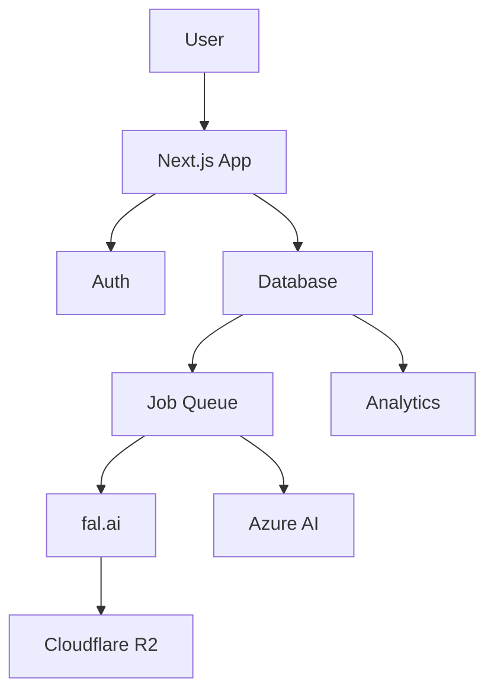

# Project Context and Understanding - Consolidated Document
## Understanding What We're Building and How

### Executive Summary

This document consolidates all project context and technical understanding from Agents 1-11, focusing on the comprehensive vision, technical patterns, constraints, and integration points. Primary sources include Agent 1's project overview, Agent 3's implementation analysis, Agent 4's verification insights, and Agent 8's solution architecture.

---

## 🎯 PROJECT VISION & GOALS

### Core Mission (From Agent 1)
Create the most impressive AI fan community platform that showcases Google's AI advancement through cutting-edge visuals, interactive demos, and AI-powered meme creation.

### Rebranded Identity (From Agent 7)
**Original**: Gemini3.FUN - Celebrating Google's Gemini AI
**Updated**: Chef3.FUN - "Cooking up AI memes" with Chef Gemmy mascot
**Reason**: Trademark litigation risk identified by Agent 6

### Key Objectives
1. **Build a visually stunning platform** with immediate "wow" factor
2. **Foster an engaged, quality-driven meme community**
3. **Create educational value** around AI breakthroughs
4. **Position as premier destination** for AI enthusiasts
5. **Achieve significant community growth** and engagement metrics

### Success Metrics
- **Technical**: 99.9% uptime, <2s page loads, 95%+ generation success
- **User Growth**: 10K+ social followers, 5K+ active members
- **Engagement**: 50%+ engagement rate, 40%+ return rate
- **Business**: Cost-efficient operations, sustainable growth

---

## 🏗️ ARCHITECTURAL CONTEXT

### Technology Stack Evolution

#### Initial Vision (Agent 1)
Complex stack with neural visualizations, Three.js, GSAP animations

#### Pragmatic Reality (Agent 3)
```typescript
interface FinalTechStack {
  frontend: {
    framework: "Next.js 15 with App Router",
    styling: "Tailwind CSS + shadcn/ui",
    state: "Zustand (minimal)",
    animations: "Framer Motion (simplified)"
  },
  backend: {
    database: "Convex (real-time, serverless)",
    auth: "Clerk (managed authentication)",
    ai: "fal.ai Imagen 4 Ultra",
    moderation: "Azure AI Content Safety"
  },
  infrastructure: {
    hosting: "Vercel Edge Functions",
    cdn: "Cloudflare R2",
    monitoring: "Built-in analytics",
    rateLimit: "Upstash Redis"
  }
}
```

#### Architecture Pattern
- **Chosen**: Monolithic Next.js application
- **Rationale**: 
  - Rapid development for 1-3 developers
  - Excellent developer experience
  - Real-time features built-in with Convex
  - Simple deployment and maintenance

### Key Architectural Decisions

1. **Real-time First (Convex)**
   - Instant updates across all features
   - Type-safe database queries
   - Built-in file storage
   - Minimal DevOps overhead

2. **Security by Design**
   - Content moderation pipeline
   - Rate limiting at multiple levels
   - Cost control mechanisms
   - Comprehensive audit logging

3. **Performance Optimized**
   - Edge deployment globally
   - Image optimization pipeline
   - Lazy loading strategies
   - Caching at multiple layers

---

## 🔧 TECHNICAL PATTERNS & CONVENTIONS

### Database Patterns (From Agent 8)

```typescript
// Real-time subscription pattern
const memes = useQuery(api.memes.getApprovedMemes, { limit: 20 });

// Optimistic updates pattern
const heartMeme = useMutation(api.memes.heartMeme);
const handleHeart = async (memeId) => {
  // Update UI immediately
  setOptimisticState(/* ... */);
  try {
    await heartMeme({ memeId });
  } catch {
    // Revert on failure
    revertOptimisticState();
  }
};
```

### Security Patterns (From Agent 4/9)

```typescript
// Atomic cost control pattern
const reserveGeneration = async (userId: string) => {
  // Redis atomic operation prevents race conditions
  const script = `
    local current = redis.call('GET', KEYS[1]) or 0
    if tonumber(current) >= limit then return 0 end
    redis.call('INCR', KEYS[1])
    return 1
  `;
  return await redis.eval(script, keys, args);
};
```

### Async Processing Pattern (From Agent 9)

```typescript
// Non-blocking generation flow
interface AsyncGenerationFlow {
  1: "Quick validation (<500ms)",
  2: "Queue job and return immediately", 
  3: "Background processing (20-45s)",
  4: "Real-time status updates",
  5: "Celebration on completion"
}
```

---

## 🚧 CONSTRAINTS & LIMITATIONS

### Technical Constraints

1. **AI Generation Time**: 20-45 seconds per image
   - Solution: Async processing with engaging wait experience
   
2. **Content Moderation**: 2-5 seconds per check
   - Solution: Background processing, non-blocking UI
   
3. **Cost Management**: $0.06 per image adds up quickly
   - Solution: Strict rate limiting, cost monitoring
   
4. **WebSocket Limits**: 1000 concurrent connections (Convex free)
   - Solution: Connection pooling, hybrid polling

### Business Constraints

1. **Legal Requirements**
   - DMCA compliance mandatory
   - Content moderation required
   - User data protection (GDPR)
   - Trademark avoidance

2. **Budget Limitations**
   - $100/day AI generation cap
   - Free tier service limits
   - Small team resources

3. **Timeline Pressure**
   - Original: 1 week (unrealistic)
   - Adjusted: 3 weeks (achievable)
   - Phased approach required

---

## 🔌 INTEGRATION POINTS

### External Service Integrations

#### 1. **fal.ai (Primary AI Service)**
- **Purpose**: Image generation from text prompts
- **Cost**: $0.06 per image
- **Integration**: REST API with queue support
- **Challenges**: Temporary URL handling, async processing

#### 2. **Clerk (Authentication)**
- **Purpose**: User authentication and management
- **Features**: Social login, MFA, session management
- **Integration**: Next.js middleware, React hooks
- **Benefits**: GDPR compliant, enterprise security

#### 3. **Azure AI Content Safety**
- **Purpose**: Content moderation
- **Features**: Multi-category detection, severity levels
- **Integration**: Pre and post-generation checks
- **Requirements**: < 24hr response for DMCA

#### 4. **Upstash Redis**
- **Purpose**: Rate limiting and caching
- **Features**: Atomic operations, global edge
- **Integration**: Cost control, user limits
- **Critical**: Prevents race conditions

#### 5. **Cloudflare R2**
- **Purpose**: Image CDN and optimization
- **Features**: Global distribution, image resizing
- **Integration**: Post-generation storage
- **Benefits**: Cost-effective, performant

### Internal Integration Patterns



---

## 📊 PROJECT STRUCTURE CONTEXT

### Monorepo Organization
```
chef3-fun/
├── src/
│   ├── app/           # Next.js 15 App Router
│   ├── components/    # Reusable UI components
│   ├── convex/        # Backend functions
│   ├── lib/           # Utilities and integrations
│   ├── hooks/         # Custom React hooks
│   └── types/         # TypeScript definitions
├── tests/             # Comprehensive test suite
├── docs/              # Developer documentation
└── monitoring/        # Observability setup
```

### Key Design Patterns

1. **Feature-Based Organization**
   - Components grouped by feature
   - Colocated tests and styles
   - Clear dependency boundaries

2. **Type Safety Throughout**
   - End-to-end TypeScript
   - Generated types from Convex
   - Strict mode enabled

3. **Progressive Enhancement**
   - Works without JavaScript
   - Enhanced with client features
   - Optimized for performance

---

## 🎨 DESIGN SYSTEM CONTEXT

### Visual Evolution

#### Original Vision (Agent 1)
- Complex "Neural Luxury" theme
- Glassmorphism effects
- Holographic gradients
- Neural network animations

#### Simplified Reality (Agent 7/10)
```typescript
interface SimplifiedDesign {
  philosophy: "Premium feel without complexity",
  colors: {
    primary: "#FF6B35",    // Chef orange (rebrand)
    secondary: "#B45AF2",  // Neural purple
    accent: "#4285F4",     // AI blue
    background: "#0A0A0F"  // Deep black
  },
  removed: [
    "Complex animations",
    "Glassmorphism",
    "Neural visualizations",
    "Holographic effects"
  ],
  kept: [
    "Clean typography",
    "Subtle shadows",
    "Smooth transitions",
    "Professional feel"
  ]
}
```

### User Experience Philosophy

1. **Transform Constraints into Features**
   - Long wait times → Engaging journey
   - Moderation delays → Anticipation building
   - Rate limits → Exclusive feeling

2. **Mobile-First Approach**
   - Touch-optimized interfaces
   - Bottom navigation pattern
   - Responsive grid layouts
   - Performance budgets

3. **Accessibility Excellence**
   - WCAG 2.1 AA compliance
   - Keyboard navigation
   - Screen reader support
   - Reduced motion options

---

## 🔍 AREAS OF COMPLEXITY

### Technical Complexity

1. **Real-time + Long Operations**
   - Challenge: WebSocket timeouts during generation
   - Solution: Hybrid polling/subscription pattern

2. **Cost Control Race Conditions**
   - Challenge: Concurrent requests exceeding limits
   - Solution: Atomic Redis operations

3. **Content Moderation Pipeline**
   - Challenge: Blocking UX during checks
   - Solution: Async processing queue

### Operational Complexity

1. **Multi-Service Coordination**
   - AI generation service
   - Content moderation service
   - File storage service
   - Authentication service

2. **Legal Compliance**
   - DMCA procedures
   - Content policies
   - User data protection
   - Terms of service

3. **Community Management**
   - Content moderation at scale
   - User support systems
   - Community guidelines
   - Appeals process

---

## 📈 SCALING CONTEXT

### Growth Projections

```typescript
interface ScalingMilestones {
  MVP: {
    users: "100-500",
    daily_memes: "50-200",
    infrastructure: "Current architecture sufficient"
  },
  Month1: {
    users: "1,000-5,000",
    daily_memes: "500-2,000",
    needs: "CDN optimization, caching"
  },
  Month3: {
    users: "10,000+",
    daily_memes: "5,000+",
    needs: "Service scaling, cost optimization"
  }
}
```

### Scaling Strategies

1. **Technical Scaling**
   - Database indexing optimization
   - CDN for global performance
   - Service worker caching
   - Connection pooling

2. **Cost Scaling**
   - Tiered user limits
   - Premium features
   - Batch processing
   - Cache optimization

3. **Operational Scaling**
   - Automated moderation
   - Community moderators
   - Self-service support
   - Monitoring automation

---

## 🎯 IMPLEMENTATION CONTEXT

### Development Approach

1. **Test-Driven Development**
   - Tests written before code
   - 80%+ coverage target
   - E2E user flow tests
   - Performance benchmarks

2. **Iterative Delivery**
   - Daily deployments
   - Feature flags
   - A/B testing
   - Continuous feedback

3. **Security-First**
   - Threat modeling
   - Security testing
   - Penetration testing
   - Incident response

### Team Context

- **Size**: 1-3 developers
- **Skills**: Full-stack JavaScript/TypeScript
- **Timeline**: 3 weeks to production
- **Approach**: Agile with daily standups

---

## 🏁 CONCLUSION

This project represents a significant technical undertaking that balances ambitious vision with practical constraints. The shift from complex neural visualizations to a clean, performant platform reflects mature technical decision-making based on user needs and real-world constraints.

Key contextual insights:
1. **Legal requirements** drove significant architectural decisions
2. **Performance constraints** shaped the user experience design
3. **Cost considerations** influenced technical choices
4. **Team size** justified monolithic architecture
5. **Timeline pressure** necessitated pragmatic solutions

The platform is well-positioned for success with a solid technical foundation, clear scaling path, and focus on user value over technical complexity.