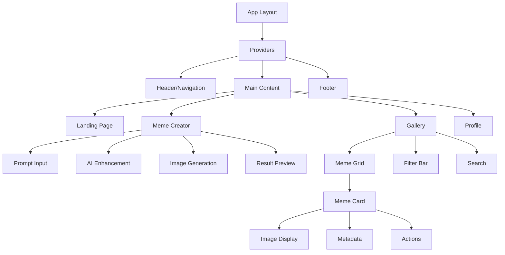
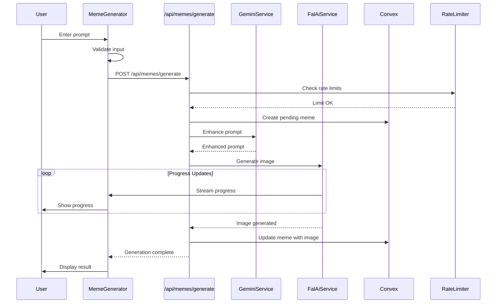
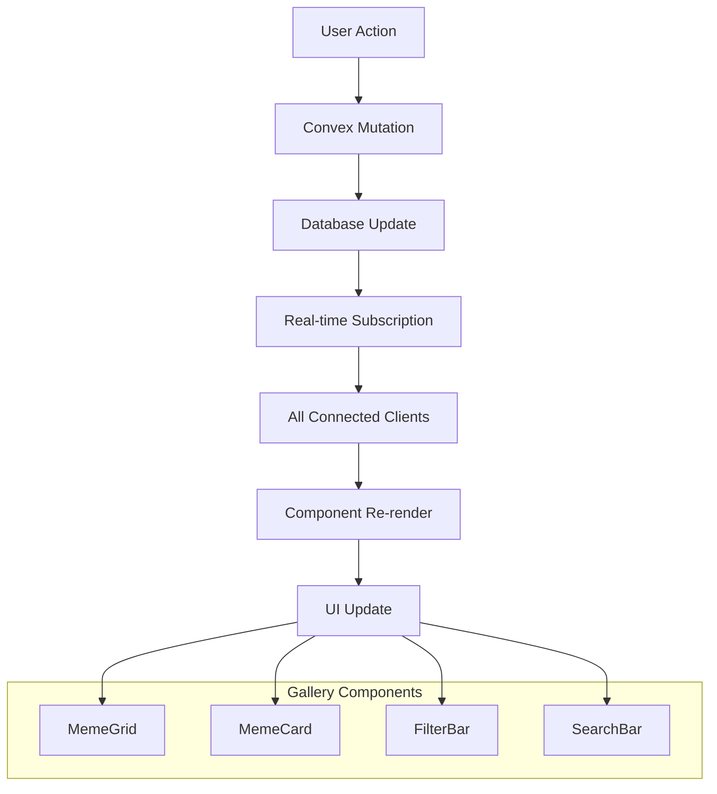
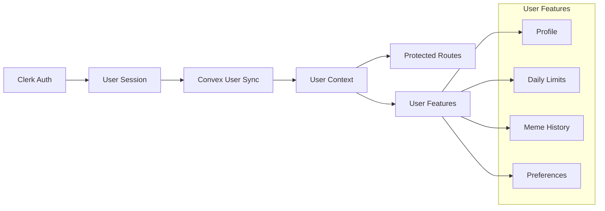
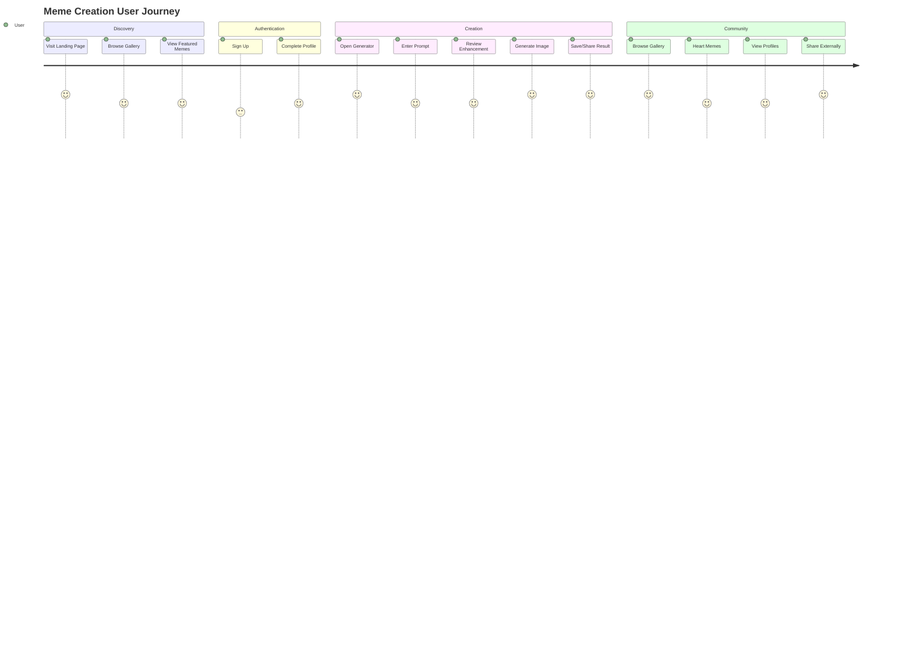

# Agent 8 - Solution Architecture & Implementation Context

## Executive Summary

This document provides comprehensive implementation context for GEMINI3.FUN based on the AI-First Showcase MVP approach confirmed by Agent 7. The architecture balances technical ambition with practical delivery, ensuring a unique AI celebration platform that can be built reliably within 10-12 days while maintaining the project's distinctive identity.

**Key Architectural Principles:**
- Real AI integration from day 1 with cost controls
- Simplified neural theme using modern CSS techniques
- Mobile-first responsive design
- Comprehensive Convex schema for scalability
- Test-driven development approach
- Performance-optimized streaming AI responses

## Project Structure Mapping

### Complete Next.js 15 App Router Structure

```
gemini3-fun/
├── 📁 src/
│   ├── 📁 app/                     # Next.js 15 App Router
│   │   ├── 📄 layout.tsx           # Root layout with providers
│   │   ├── 📄 page.tsx             # Landing page
│   │   ├── 📄 globals.css          # Global styles + Tailwind
│   │   ├── 📄 loading.tsx          # Global loading UI
│   │   ├── 📄 error.tsx            # Global error boundary
│   │   ├── 📄 not-found.tsx        # 404 page
│   │   │
│   │   ├── 📁 (landing)/           # Landing page group
│   │   │   ├── 📄 page.tsx         # Home page
│   │   │   └── 📁 components/      # Landing-specific components
│   │   │       ├── 📄 HeroSection.tsx
│   │   │       ├── 📄 FeatureShowcase.tsx
│   │   │       ├── 📄 StatsSection.tsx
│   │   │       └── 📄 CTASection.tsx
│   │   │
│   │   ├── 📁 auth/                # Authentication pages
│   │   │   ├── 📄 sign-in/page.tsx
│   │   │   ├── 📄 sign-up/page.tsx
│   │   │   └── 📄 callback/page.tsx
│   │   │
│   │   ├── 📁 memes/               # Meme features
│   │   │   ├── 📄 layout.tsx       # Memes layout wrapper
│   │   │   ├── 📁 create/          # Meme creation
│   │   │   │   ├── 📄 page.tsx     # Create meme page
│   │   │   │   └── 📄 loading.tsx  # Creation loading state
│   │   │   ├── 📁 gallery/         # Gallery views
│   │   │   │   ├── 📄 page.tsx     # Main gallery
│   │   │   │   ├── 📄 [filter]/page.tsx # Filtered views
│   │   │   │   └── 📄 loading.tsx  # Gallery loading
│   │   │   └── 📁 [id]/            # Individual meme
│   │   │       ├── 📄 page.tsx     # Meme detail page
│   │   │       └── 📄 loading.tsx  # Detail loading
│   │   │
│   │   ├── 📁 profile/             # User profiles
│   │   │   ├── 📄 page.tsx         # Current user profile
│   │   │   ├── 📄 settings/page.tsx # Profile settings
│   │   │   └── 📁 [username]/      # Public profiles
│   │   │       └── 📄 page.tsx
│   │   │
│   │   ├── 📁 admin/               # Admin dashboard (future)
│   │   │   ├── 📄 layout.tsx       # Admin layout
│   │   │   ├── 📄 page.tsx         # Admin overview
│   │   │   ├── 📄 moderation/page.tsx
│   │   │   └── 📄 analytics/page.tsx
│   │   │
│   │   └── 📁 api/                 # API routes
│   │       ├── 📁 memes/           # Meme operations
│   │       │   ├── 📄 generate/route.ts     # AI generation
│   │       │   ├── 📄 enhance-prompt/route.ts # Prompt enhancement  
│   │       │   └── 📄 moderate/route.ts     # Content moderation
│   │       ├── 📁 webhooks/        # External webhooks
│   │       │   ├── 📄 clerk/route.ts        # Clerk webhooks
│   │       │   └── 📄 fal/route.ts          # fal.ai webhooks
│   │       └── 📁 admin/           # Admin API endpoints
│   │           ├── 📄 stats/route.ts
│   │           └── 📄 moderation/route.ts
│   │
│   ├── 📁 components/              # Reusable components
│   │   ├── 📁 ui/                  # Base UI components
│   │   │   ├── 📄 Button.tsx       # Primary button component
│   │   │   ├── 📄 Card.tsx         # Neural-themed cards
│   │   │   ├── 📄 Input.tsx        # Form inputs
│   │   │   ├── 📄 Modal.tsx        # Modal dialogs
│   │   │   ├── 📄 Spinner.tsx      # Loading spinners
│   │   │   ├── 📄 Badge.tsx        # Status badges
│   │   │   ├── 📄 Tooltip.tsx      # Tooltips
│   │   │   └── 📄 index.ts         # Component exports
│   │   │
│   │   ├── 📁 layout/              # Layout components
│   │   │   ├── 📄 Header.tsx       # Site header with nav
│   │   │   ├── 📄 Navigation.tsx   # Main navigation
│   │   │   ├── 📄 Footer.tsx       # Site footer
│   │   │   ├── 📄 Sidebar.tsx      # Mobile sidebar
│   │   │   └── 📄 Container.tsx    # Content container
│   │   │
│   │   ├── 📁 features/            # Feature-specific components
│   │   │   ├── 📁 meme-generator/  # Meme creation
│   │   │   │   ├── 📄 PromptInput.tsx       # AI prompt interface
│   │   │   │   ├── 📄 GenerationFlow.tsx    # Full generation UI
│   │   │   │   ├── 📄 ProgressIndicator.tsx # Generation progress
│   │   │   │   ├── 📄 ResultPreview.tsx     # Generated result
│   │   │   │   └── 📄 ErrorFallback.tsx     # Error handling
│   │   │   │
│   │   │   ├── 📁 gallery/         # Gallery components
│   │   │   │   ├── 📄 MemeCard.tsx          # Individual meme card
│   │   │   │   ├── 📄 MemeGrid.tsx          # Grid layout
│   │   │   │   ├── 📄 FilterBar.tsx         # Gallery filters
│   │   │   │   ├── 📄 SearchBar.tsx         # Search functionality
│   │   │   │   ├── 📄 InfiniteScroll.tsx    # Pagination
│   │   │   │   └── 📄 ViewToggle.tsx        # Grid/list toggle
│   │   │   │
│   │   │   ├── 📁 user/            # User components
│   │   │   │   ├── 📄 ProfileCard.tsx       # User profile display
│   │   │   │   ├── 📄 StatsDisplay.tsx      # User statistics
│   │   │   │   ├── 📄 AvatarUpload.tsx      # Avatar management
│   │   │   │   └── 📄 MemeHistory.tsx       # User's memes
│   │   │   │
│   │   │   └── 📁 moderation/      # Content moderation
│   │   │       ├── 📄 ModerationQueue.tsx   # Review queue
│   │   │       ├── 📄 ContentFlags.tsx      # Flagging system
│   │   │       └── 📄 ApprovalFlow.tsx      # Approval workflow
│   │   │
│   │   ├── 📁 animations/          # Animation components
│   │   │   ├── 📄 NeuralPulse.tsx  # CSS neural pulse
│   │   │   ├── 📄 GradientBg.tsx   # Animated gradients
│   │   │   ├── 📄 FloatingParticles.tsx # 2D particles
│   │   │   ├── 📄 TypewriterText.tsx # Text animations
│   │   │   └── 📄 HoverEffects.tsx  # Interactive hovers
│   │   │
│   │   └── 📁 providers/           # Context providers
│   │       ├── 📄 ConvexProvider.tsx        # Convex client
│   │       ├── 📄 ClerkProvider.tsx         # Authentication
│   │       ├── 📄 ThemeProvider.tsx         # Theme context
│   │       ├── 📄 MemeProvider.tsx          # Meme state
│   │       └── 📄 Providers.tsx             # Combined providers
│   │
│   ├── 📁 lib/                     # Business logic & utilities
│   │   ├── 📁 ai/                  # AI service integrations
│   │   │   ├── 📄 fal-client.ts    # fal.ai SDK wrapper
│   │   │   ├── 📄 gemini-client.ts # Gemini API client
│   │   │   ├── 📄 prompt-enhancer.ts # Prompt optimization
│   │   │   ├── 📄 cost-manager.ts  # API cost tracking
│   │   │   ├── 📄 rate-limiter.ts  # Usage rate limiting
│   │   │   └── 📄 stream-handler.ts # Response streaming
│   │   │
│   │   ├── 📁 db/                  # Database operations
│   │   │   ├── 📄 queries.ts       # Convex query functions
│   │   │   ├── 📄 mutations.ts     # Convex mutations
│   │   │   ├── 📄 subscriptions.ts # Real-time subscriptions
│   │   │   ├── 📄 indexes.ts       # Database indexes
│   │   │   └── 📄 types.ts         # Database type definitions
│   │   │
│   │   ├── 📁 auth/                # Authentication utilities
│   │   │   ├── 📄 clerk-utils.ts   # Clerk helper functions
│   │   │   ├── 📄 permissions.ts   # Role-based permissions
│   │   │   ├── 📄 session-manager.ts # Session handling
│   │   │   └── 📄 user-sync.ts     # User data synchronization
│   │   │
│   │   ├── 📁 moderation/          # Content moderation
│   │   │   ├── 📄 content-filter.ts # Input filtering
│   │   │   ├── 📄 image-analyzer.ts # Image content analysis
│   │   │   ├── 📄 queue-manager.ts  # Moderation queue
│   │   │   └── 📄 approval-flow.ts  # Approval workflow
│   │   │
│   │   ├── 📁 storage/             # File storage utilities
│   │   │   ├── 📄 image-uploader.ts # Image upload handling
│   │   │   ├── 📄 file-optimizer.ts # File optimization
│   │   │   ├── 📄 cdn-manager.ts    # CDN integration
│   │   │   └── 📄 cleanup.ts        # File cleanup jobs
│   │   │
│   │   ├── 📁 utils/               # General utilities
│   │   │   ├── 📄 cn.ts            # Class name utility
│   │   │   ├── 📄 format.ts        # Data formatting
│   │   │   ├── 📄 validation.ts    # Input validation
│   │   │   ├── 📄 constants.ts     # App constants
│   │   │   ├── 📄 helpers.ts       # Helper functions
│   │   │   └── 📄 api.ts           # API utilities
│   │   │
│   │   ├── 📁 hooks/               # Custom React hooks
│   │   │   ├── 📄 useAuth.ts       # Authentication hook
│   │   │   ├── 📄 useMemes.ts      # Meme data hook
│   │   │   ├── 📄 useInfiniteScroll.ts # Pagination hook
│   │   │   ├── 📄 useLocalStorage.ts # Local storage hook
│   │   │   ├── 📄 useDebounce.ts   # Debounce hook
│   │   │   └── 📄 useToast.ts      # Toast notifications
│   │   │
│   │   └── 📁 types/               # TypeScript definitions
│   │       ├── 📄 api.ts           # API response types
│   │       ├── 📄 user.ts          # User data types
│   │       ├── 📄 meme.ts          # Meme data types
│   │       ├── 📄 ui.ts            # UI component types
│   │       └── 📄 global.ts        # Global type definitions
│   │
│   └── 📁 styles/                  # Styling & animations
│       ├── 📄 globals.css          # Global styles
│       ├── 📄 components.css       # Component-specific styles
│       ├── 📄 animations.css       # CSS animations
│       ├── 📄 neural-theme.css     # Neural theme styles
│       └── 📄 utilities.css        # Utility classes
│
├── 📁 convex/                      # Convex backend
│   ├── 📄 schema.ts                # Database schema
│   ├── 📄 users.ts                 # User operations
│   ├── 📄 memes.ts                 # Meme operations
│   ├── 📄 moderation.ts            # Moderation functions
│   ├── 📄 analytics.ts             # Analytics tracking
│   ├── 📄 _generated/              # Generated files
│   └── 📄 auth.config.js           # Auth configuration
│
├── 📁 tests/                       # Test files
│   ├── 📁 __mocks__/               # Test mocks
│   ├── 📁 components/              # Component tests
│   ├── 📁 pages/                   # Page tests
│   ├── 📁 api/                     # API tests
│   ├── 📁 e2e/                     # End-to-end tests
│   ├── 📄 setup.ts                 # Test setup
│   └── 📄 utils.tsx                # Test utilities
│
├── 📁 public/                      # Static assets
│   ├── 📁 images/                  # Static images
│   ├── 📁 icons/                   # Icon files
│   ├── 📄 favicon.ico              # Site favicon
│   ├── 📄 manifest.json            # PWA manifest
│   └── 📄 robots.txt               # SEO robots file
│
├── 📄 package.json                 # Dependencies & scripts
├── 📄 next.config.js               # Next.js configuration
├── 📄 tailwind.config.ts           # Tailwind configuration
├── 📄 tsconfig.json                # TypeScript configuration
├── 📄 jest.config.js               # Jest test configuration
├── 📄 .env.local                   # Environment variables
├── 📄 .gitignore                   # Git ignore rules
├── 📄 README.md                    # Project documentation
└── 📄 vercel.json                  # Vercel deployment config
```

## Component Architecture

### Component Hierarchy & Data Flow



### Props Interfaces & Data Flow

```typescript
// Core Data Interfaces
interface User {
  id: string;
  clerkId: string;
  username: string;
  email?: string;
  avatar?: string;
  dailyMemeCount: number;
  totalMemeCount: number;
  subscription?: 'free' | 'premium';
  preferences: UserPreferences;
  createdAt: number;
  lastActiveAt: number;
}

interface Meme {
  _id: Id<"memes">;
  creatorId: Id<"users">;
  originalPrompt: string;
  enhancedPrompt: string;
  imageUrl: string;
  thumbnailUrl?: string;
  imageMetadata: ImageMetadata;
  generationMetadata: GenerationMetadata;
  status: 'pending' | 'processing' | 'completed' | 'failed' | 'moderated';
  moderationFlags?: string[];
  hearts: number;
  views: number;
  shares: number;
  tags?: string[];
  isPublic: boolean;
  createdAt: number;
  updatedAt: number;
}

interface MemeGenerationRequest {
  prompt: string;
  userId: Id<"users">;
  enhancePrompt?: boolean;
  style?: string;
}

interface MemeGenerationResponse {
  success: boolean;
  memeId?: Id<"memes">;
  imageUrl?: string;
  error?: string;
  cost?: number;
  processingTime?: number;
}
```

### State Management Patterns

```typescript
// React Context Pattern (Initial Implementation)
interface MemeContextType {
  // Current generation state
  isGenerating: boolean;
  currentMeme: Meme | null;
  generationProgress: number;
  
  // Actions
  generateMeme: (request: MemeGenerationRequest) => Promise<void>;
  clearCurrentMeme: () => void;
  
  // Gallery state
  memes: Meme[];
  filteredMemes: Meme[];
  activeFilter: string;
  
  // Filter actions
  setFilter: (filter: string) => void;
  searchMemes: (query: string) => void;
}

// User Context
interface UserContextType {
  user: User | null;
  isAuthenticated: boolean;
  dailyLimitsReached: boolean;
  
  // Actions
  updateProfile: (updates: Partial<User>) => Promise<void>;
  checkDailyLimits: () => boolean;
}
```

### AI Integration Flow

```typescript
// AI Service Integration Pattern
class AIService {
  // Prompt Enhancement (Gemini 2.5 Flash)
  async enhancePrompt(originalPrompt: string): Promise<string> {
    try {
      const response = await fetch('/api/memes/enhance-prompt', {
        method: 'POST',
        headers: { 'Content-Type': 'application/json' },
        body: JSON.stringify({ prompt: originalPrompt })
      });
      
      if (!response.ok) throw new Error('Enhancement failed');
      
      const { enhancedPrompt } = await response.json();
      return enhancedPrompt;
    } catch (error) {
      console.warn('Prompt enhancement failed, using original');
      return originalPrompt;
    }
  }
  
  // Image Generation (fal.ai)
  async generateImage(prompt: string): Promise<GenerationResult> {
    const response = await fetch('/api/memes/generate', {
      method: 'POST',
      headers: { 'Content-Type': 'application/json' },
      body: JSON.stringify({ 
        prompt,
        userId: this.currentUserId,
        timestamp: Date.now()
      })
    });
    
    if (!response.ok) {
      throw new Error(`Generation failed: ${response.statusText}`);
    }
    
    // Handle streaming response
    const reader = response.body?.getReader();
    return this.handleStreamingResponse(reader);
  }
  
  private async handleStreamingResponse(reader: ReadableStreamDefaultReader) {
    // Implementation for streaming AI responses
    // Updates UI progressively as generation proceeds
  }
}
```

### Mobile-Responsive Component Design

```typescript
// Responsive Design Patterns
interface ResponsiveProps {
  children: React.ReactNode;
  breakpoint?: 'sm' | 'md' | 'lg' | 'xl';
  fallback?: React.ReactNode;
}

// Mobile-optimized components
const MobileOptimized = {
  // Touch-friendly buttons (44px minimum)
  Button: styled(BaseButton)`
    min-height: 44px;
    min-width: 44px;
    @media (hover: hover) {
      &:hover { /* Desktop hover states */ }
    }
  `,
  
  // Optimized image loading
  Image: ({ src, alt, ...props }) => (
    <NextImage
      src={src}
      alt={alt}
      placeholder="blur"
      blurDataURL="data:image/jpeg;base64,..."
      sizes="(max-width: 768px) 100vw, 50vw"
      loading="lazy"
      {...props}
    />
  ),
  
  // Mobile-first gallery grid
  Grid: styled.div`
    display: grid;
    grid-template-columns: repeat(2, 1fr);
    gap: 0.5rem;
    
    @media (min-width: 640px) {
      grid-template-columns: repeat(3, 1fr);
      gap: 1rem;
    }
    
    @media (min-width: 1024px) {
      grid-template-columns: repeat(4, 1fr);
      gap: 1.5rem;
    }
  `
};
```

## Database Design

### Complete Convex Schema

```typescript
// convex/schema.ts
import { defineSchema, defineTable } from "convex/server";
import { v } from "convex/values";

export default defineSchema({
  // User Management
  users: defineTable({
    clerkId: v.string(),
    username: v.string(),
    email: v.optional(v.string()),
    avatar: v.optional(v.string()),
    
    // Usage Tracking
    dailyMemeCount: v.number(),
    totalMemeCount: v.number(),
    lastMemeDate: v.optional(v.number()),
    
    // Subscription & Limits
    subscription: v.optional(v.union(
      v.literal("free"),
      v.literal("premium"),
      v.literal("unlimited")
    )),
    dailyLimit: v.number(), // Based on subscription
    
    // Profile Settings
    preferences: v.object({
      theme: v.optional(v.string()),
      notifications: v.boolean(),
      publicProfile: v.boolean(),
      allowComments: v.boolean(),
    }),
    
    // Social Features
    followers: v.array(v.id("users")),
    following: v.array(v.id("users")),
    
    // Achievements & Gamification
    achievements: v.array(v.object({
      type: v.string(),
      unlockedAt: v.number(),
      progress: v.optional(v.number()),
    })),
    
    // Moderation
    role: v.union(
      v.literal("member"),
      v.literal("moderator"), 
      v.literal("admin")
    ),
    isActive: v.boolean(),
    
    // Timestamps
    createdAt: v.number(),
    lastActiveAt: v.number(),
    updatedAt: v.number(),
  })
  .index("by_clerk_id", ["clerkId"])
  .index("by_username", ["username"])
  .index("by_role", ["role"])
  .index("by_created_at", ["createdAt"]),

  // Meme Management
  memes: defineTable({
    // Ownership
    creatorId: v.id("users"),
    
    // Content
    originalPrompt: v.string(),
    enhancedPrompt: v.string(),
    imageUrl: v.string(),
    thumbnailUrl: v.optional(v.string()),
    
    // Metadata
    imageMetadata: v.object({
      width: v.number(),
      height: v.number(),
      size: v.number(),
      format: v.string(),
      aspectRatio: v.number(),
    }),
    
    // Generation Data
    generationMetadata: v.object({
      model: v.string(), // "fal-ai/imagen-4"
      provider: v.string(), // "fal.ai"
      cost: v.number(), // USD cents
      processingTime: v.number(), // milliseconds
      requestId: v.string(),
      parameters: v.optional(v.object({
        style: v.optional(v.string()),
        quality: v.optional(v.string()),
        aspectRatio: v.optional(v.string()),
      })),
    }),
    
    // Status & Moderation
    status: v.union(
      v.literal("pending"),
      v.literal("processing"),
      v.literal("completed"),
      v.literal("failed"),
      v.literal("reviewing"),
      v.literal("approved"),
      v.literal("rejected"),
      v.literal("flagged")
    ),
    
    moderationData: v.optional(v.object({
      flags: v.array(v.string()),
      reviewedBy: v.optional(v.id("users")),
      reviewedAt: v.optional(v.number()),
      notes: v.optional(v.string()),
      autoModeration: v.object({
        nsfw: v.number(), // 0-1 confidence
        violence: v.number(),
        hate: v.number(),
        spam: v.number(),
      }),
    })),
    
    // Engagement
    hearts: v.number(),
    views: v.number(),
    shares: v.number(),
    comments: v.number(),
    saves: v.number(),
    
    // Engagement Arrays (for detailed tracking)
    heartedBy: v.array(v.id("users")),
    savedBy: v.array(v.id("users")),
    
    // Discovery & Organization
    tags: v.array(v.string()),
    category: v.optional(v.string()),
    isPublic: v.boolean(),
    isFeatured: v.boolean(),
    
    // AI Analysis (for recommendations)
    aiAnalysis: v.optional(v.object({
      style: v.string(),
      mood: v.string(),
      colors: v.array(v.string()),
      objects: v.array(v.string()),
      concepts: v.array(v.string()),
    })),
    
    // Timestamps
    createdAt: v.number(),
    updatedAt: v.number(),
    publishedAt: v.optional(v.number()),
  })
  .index("by_creator", ["creatorId"])
  .index("by_status", ["status"])
  .index("by_hearts", ["hearts"])
  .index("by_created_at", ["createdAt"])
  .index("by_published_at", ["publishedAt"])
  .index("by_public", ["isPublic"])
  .index("by_featured", ["isFeatured"])
  .searchIndex("search_memes", {
    searchField: "enhancedPrompt",
    filterFields: ["status", "isPublic", "creatorId"]
  }),

  // Comments System
  comments: defineTable({
    memeId: v.id("memes"),
    authorId: v.id("users"),
    content: v.string(),
    parentId: v.optional(v.id("comments")), // For replies
    
    // Moderation
    status: v.union(
      v.literal("pending"),
      v.literal("approved"),
      v.literal("flagged"),
      v.literal("deleted")
    ),
    
    // Engagement
    hearts: v.number(),
    heartedBy: v.array(v.id("users")),
    
    // Timestamps
    createdAt: v.number(),
    updatedAt: v.number(),
  })
  .index("by_meme", ["memeId"])
  .index("by_author", ["authorId"])
  .index("by_parent", ["parentId"])
  .index("by_status", ["status"]),

  // Analytics & Usage Tracking
  analytics: defineTable({
    // Event Data
    eventType: v.union(
      v.literal("meme_generated"),
      v.literal("meme_viewed"),
      v.literal("meme_shared"),
      v.literal("meme_hearted"),
      v.literal("user_signup"),
      v.literal("user_login"),
      v.literal("search_performed"),
      v.literal("filter_applied")
    ),
    
    // References
    userId: v.optional(v.id("users")),
    memeId: v.optional(v.id("memes")),
    
    // Event Details
    metadata: v.optional(v.object({
      source: v.optional(v.string()), // "gallery", "profile", "search"
      duration: v.optional(v.number()),
      device: v.optional(v.string()),
      referrer: v.optional(v.string()),
      userAgent: v.optional(v.string()),
    })),
    
    // Cost Tracking (for AI operations)
    cost: v.optional(v.number()),
    
    // Timestamps
    timestamp: v.number(),
    sessionId: v.optional(v.string()),
  })
  .index("by_event_type", ["eventType"])
  .index("by_user", ["userId"])
  .index("by_timestamp", ["timestamp"])
  .index("by_session", ["sessionId"]),

  // Moderation Queue
  moderationQueue: defineTable({
    itemType: v.union(
      v.literal("meme"),
      v.literal("comment"),
      v.literal("user_report")
    ),
    itemId: v.string(), // Generic ID reference
    
    // Queue Status
    status: v.union(
      v.literal("pending"),
      v.literal("in_review"),
      v.literal("completed"),
      v.literal("escalated")
    ),
    
    // Assignment
    assignedTo: v.optional(v.id("users")),
    priority: v.union(
      v.literal("low"),
      v.literal("medium"),
      v.literal("high"),
      v.literal("urgent")
    ),
    
    // Reason & Context
    reason: v.string(),
    reportedBy: v.optional(v.id("users")),
    autoFlagged: v.boolean(),
    
    // Review Details
    reviewNotes: v.optional(v.string()),
    decision: v.optional(v.union(
      v.literal("approve"),
      v.literal("reject"),
      v.literal("require_changes"),
      v.literal("escalate")
    )),
    
    // Timestamps
    createdAt: v.number(),
    assignedAt: v.optional(v.number()),
    completedAt: v.optional(v.number()),
  })
  .index("by_status", ["status"])
  .index("by_assigned_to", ["assignedTo"])
  .index("by_priority", ["priority"])
  .index("by_created_at", ["createdAt"]),

  // System Configuration
  systemConfig: defineTable({
    key: v.string(),
    value: v.any(),
    category: v.string(), // "limits", "features", "ui", "costs"
    description: v.optional(v.string()),
    updatedBy: v.id("users"),
    updatedAt: v.number(),
  })
  .index("by_key", ["key"])
  .index("by_category", ["category"]),

  // File Storage References
  files: defineTable({
    storageId: v.string(), // Convex storage ID
    filename: v.string(),
    contentType: v.string(),
    size: v.number(),
    
    // Metadata
    uploadedBy: v.id("users"),
    associatedWith: v.optional(v.object({
      type: v.string(), // "meme", "avatar", "thumbnail"
      id: v.string(),
    })),
    
    // Processing Status
    processed: v.boolean(),
    thumbnailGenerated: v.boolean(),
    
    // URLs (after processing)
    publicUrl: v.optional(v.string()),
    thumbnailUrl: v.optional(v.string()),
    
    // Timestamps
    uploadedAt: v.number(),
    processedAt: v.optional(v.number()),
  })
  .index("by_uploaded_by", ["uploadedBy"])
  .index("by_storage_id", ["storageId"])
  .index("by_processed", ["processed"]),
});
```

### Query Patterns for Real-Time Features

```typescript
// convex/memes.ts - Query patterns
import { query, mutation } from "./_generated/server";
import { v } from "convex/values";

// Real-time gallery feed
export const getPublicMemes = query({
  args: {
    filter: v.optional(v.string()),
    limit: v.optional(v.number()),
    cursor: v.optional(v.string()),
  },
  handler: async (ctx, { filter = "recent", limit = 20, cursor }) => {
    let memesQuery = ctx.db
      .query("memes")
      .withIndex("by_published_at")
      .filter((q) => 
        q.and(
          q.eq(q.field("isPublic"), true),
          q.eq(q.field("status"), "approved")
        )
      );

    switch (filter) {
      case "popular":
        memesQuery = ctx.db
          .query("memes")
          .withIndex("by_hearts")
          .filter((q) => 
            q.and(
              q.eq(q.field("isPublic"), true),
              q.eq(q.field("status"), "approved")
            )
          );
        break;
      case "featured":
        memesQuery = memesQuery.filter((q) => 
          q.eq(q.field("isFeatured"), true)
        );
        break;
    }

    const memes = await memesQuery
      .order("desc")
      .take(limit);

    // Include creator information
    const memesWithCreators = await Promise.all(
      memes.map(async (meme) => {
        const creator = await ctx.db.get(meme.creatorId);
        return {
          ...meme,
          creator: creator ? {
            username: creator.username,
            avatar: creator.avatar,
          } : null,
        };
      })
    );

    return memesWithCreators;
  },
});

// Real-time user feed
export const getUserMemes = query({
  args: { userId: v.id("users") },
  handler: async (ctx, { userId }) => {
    return await ctx.db
      .query("memes")
      .withIndex("by_creator", (q) => q.eq("creatorId", userId))
      .order("desc")
      .collect();
  },
});

// Search with real-time updates
export const searchMemes = query({
  args: { 
    searchQuery: v.string(),
    filters: v.optional(v.object({
      creator: v.optional(v.string()),
      dateRange: v.optional(v.string()),
      minHearts: v.optional(v.number()),
    }))
  },
  handler: async (ctx, { searchQuery, filters = {} }) => {
    const results = await ctx.db
      .query("memes")
      .withSearchIndex("search_memes", (q) =>
        q.search("enhancedPrompt", searchQuery)
          .eq("status", "approved")
          .eq("isPublic", true)
      )
      .collect();

    // Apply additional filters
    let filteredResults = results;
    
    if (filters.minHearts) {
      filteredResults = filteredResults.filter(
        meme => meme.hearts >= filters.minHearts!
      );
    }

    return filteredResults;
  },
});
```

### Relationships and Indexes

```typescript
// Database relationship patterns
interface DatabaseRelationships {
  // One-to-Many
  users_memes: "user.id -> memes.creatorId";
  memes_comments: "meme.id -> comments.memeId";
  
  // Many-to-Many
  user_followers: "users.followers <-> users.following";
  meme_hearts: "memes.heartedBy <-> users (hearts)";
  meme_saves: "memes.savedBy <-> users (saves)";
  
  // Hierarchical
  comment_replies: "comments.id -> comments.parentId";
  
  // Reference
  moderation_items: "moderationQueue.itemId -> memes.id | comments.id";
  analytics_events: "analytics.userId -> users.id, analytics.memeId -> memes.id";
}

// Performance indexes
const criticalIndexes = [
  // Gallery performance
  "memes.by_published_at", // Real-time feed
  "memes.by_hearts", // Popular sort
  "memes.by_featured", // Featured content
  
  // User experience
  "users.by_clerk_id", // Authentication lookup
  "memes.by_creator", // User profiles
  
  // Moderation
  "moderationQueue.by_status", // Queue management
  "memes.by_status", // Content approval
  
  // Analytics
  "analytics.by_timestamp", // Time-series data
  "analytics.by_event_type", // Event aggregation
];
```

## API Integration Patterns

### fal.ai Image Generation Flow

```typescript
// lib/ai/fal-client.ts
import * as fal from "@fal-ai/serverless-client";

export class FalAiService {
  private readonly model = "fal-ai/imagen-4-ultra";
  
  constructor() {
    fal.config({
      credentials: process.env.FAL_KEY,
    });
  }

  async generateImage(request: {
    prompt: string;
    userId: string;
    aspectRatio?: string;
    style?: string;
  }): Promise<GenerationResult> {
    try {
      // Cost check before generation
      await this.checkUserLimits(request.userId);
      
      const startTime = performance.now();
      
      // Submit generation request
      const result = await fal.subscribe(this.model, {
        input: {
          prompt: request.prompt,
          aspect_ratio: request.aspectRatio || "1:1",
          num_images: 1,
          enable_safety_checker: true,
          safety_tolerance: 2,
        },
        logs: true,
        onQueueUpdate: (update) => {
          // Stream progress updates to client
          this.broadcastProgress(request.userId, {
            status: update.status,
            progress: this.calculateProgress(update),
            logs: update.logs,
          });
        },
      });

      const processingTime = performance.now() - startTime;
      const cost = this.calculateCost(result);

      // Track usage
      await this.trackUsage(request.userId, cost);

      return {
        success: true,
        imageUrl: result.images[0].url,
        width: result.images[0].width,
        height: result.images[0].height,
        cost,
        processingTime,
        requestId: result.request_id,
      };

    } catch (error) {
      console.error("fal.ai generation failed:", error);
      
      return {
        success: false,
        error: this.parseError(error),
        cost: 0,
        processingTime: 0,
      };
    }
  }

  private async checkUserLimits(userId: string): Promise<void> {
    const user = await this.getUserUsage(userId);
    const dailyLimit = user.subscription === 'premium' ? 100 : 10;
    
    if (user.dailyMemeCount >= dailyLimit) {
      throw new Error("Daily generation limit reached");
    }
    
    const estimatedCost = 0.06; // $0.06 per image
    if (user.todaySpend + estimatedCost > user.dailyBudget) {
      throw new Error("Daily budget limit reached");
    }
  }

  private calculateProgress(update: any): number {
    // Map fal.ai queue status to progress percentage
    const statusMap = {
      'IN_QUEUE': 10,
      'IN_PROGRESS': 50,
      'COMPLETED': 100,
    };
    return statusMap[update.status] || 0;
  }

  private broadcastProgress(userId: string, progress: ProgressUpdate): void {
    // Use Convex mutations to broadcast real-time updates
    // This enables live progress in the UI
  }
}
```

### Gemini Prompt Enhancement Integration

```typescript
// lib/ai/gemini-client.ts
import { GoogleGenerativeAI } from "@google/generative-ai";

export class GeminiService {
  private genAI: GoogleGenerativeAI;
  
  constructor() {
    this.genAI = new GoogleGenerativeAI(process.env.GEMINI_API_KEY!);
  }

  async enhancePrompt(originalPrompt: string): Promise<string> {
    try {
      const model = this.genAI.getGenerativeModel({ 
        model: "gemini-2.0-flash-exp" 
      });

      const enhancementPrompt = `
        You are an expert at creating detailed, creative prompts for AI image generation.
        
        Original prompt: "${originalPrompt}"
        
        Enhance this prompt to create a more detailed, visually interesting meme image while maintaining the original intent. Add specific visual details, style elements, and composition notes that will make the generated image more engaging and meme-worthy.
        
        Guidelines:
        - Keep the core concept intact
        - Add visual details and style
        - Make it meme-appropriate
        - Keep it under 200 characters
        - Avoid inappropriate content
        
        Enhanced prompt:
      `;

      const result = await model.generateContent(enhancementPrompt);
      const response = await result.response;
      const enhancedPrompt = response.text().trim();

      // Validate enhancement
      if (enhancedPrompt.length > 200) {
        return originalPrompt; // Fallback if too long
      }

      return enhancedPrompt;

    } catch (error) {
      console.warn("Prompt enhancement failed:", error);
      return originalPrompt; // Graceful fallback
    }
  }

  async moderatePrompt(prompt: string): Promise<ModerationResult> {
    try {
      const model = this.genAI.getGenerativeModel({ 
        model: "gemini-2.0-flash-exp" 
      });

      const moderationPrompt = `
        Analyze this prompt for inappropriate content:
        "${prompt}"
        
        Check for:
        - NSFW content
        - Hate speech
        - Violence
        - Harassment
        - Illegal activities
        
        Respond with JSON:
        {
          "safe": boolean,
          "issues": string[],
          "severity": "low" | "medium" | "high",
          "suggestion": "alternative prompt if unsafe"
        }
      `;

      const result = await model.generateContent(moderationPrompt);
      const response = await result.response;
      
      return JSON.parse(response.text());

    } catch (error) {
      console.error("Prompt moderation failed:", error);
      
      // Conservative fallback
      return {
        safe: false,
        issues: ["Moderation service unavailable"],
        severity: "medium",
        suggestion: null,
      };
    }
  }
}
```

### Rate Limiting and Cost Control Implementation

```typescript
// lib/ai/rate-limiter.ts
import { Redis } from "@upstash/redis";

export class RateLimiter {
  private redis: Redis;
  
  constructor() {
    this.redis = new Redis({
      url: process.env.UPSTASH_REDIS_REST_URL!,
      token: process.env.UPSTASH_REDIS_REST_TOKEN!,
    });
  }

  async checkLimit(
    userId: string, 
    action: 'generate' | 'enhance' | 'search',
    limit: number,
    window: number = 3600 // 1 hour in seconds
  ): Promise<{ allowed: boolean; remaining: number; resetTime: number }> {
    const key = `rateLimit:${userId}:${action}`;
    const now = Date.now();
    const windowStart = now - (window * 1000);

    try {
      // Get current count in window
      const pipeline = this.redis.pipeline();
      pipeline.zremrangebyscore(key, 0, windowStart);
      pipeline.zcard(key);
      pipeline.zadd(key, { score: now, member: `${now}-${Math.random()}` });
      pipeline.expire(key, window);
      
      const results = await pipeline.exec();
      const currentCount = results[1] as number;

      const allowed = currentCount < limit;
      const remaining = Math.max(0, limit - currentCount - 1);
      const resetTime = now + (window * 1000);

      return { allowed, remaining, resetTime };

    } catch (error) {
      console.error("Rate limiting check failed:", error);
      
      // Fail open for availability
      return { allowed: true, remaining: limit - 1, resetTime: now + window };
    }
  }

  async trackCost(userId: string, cost: number): Promise<void> {
    const today = new Date().toISOString().split('T')[0];
    const key = `cost:${userId}:${today}`;
    
    try {
      await this.redis.incrbyfloat(key, cost);
      await this.redis.expire(key, 86400); // 24 hours
    } catch (error) {
      console.error("Cost tracking failed:", error);
    }
  }

  async getDailyCost(userId: string): Promise<number> {
    const today = new Date().toISOString().split('T')[0];
    const key = `cost:${userId}:${today}`;
    
    try {
      const cost = await this.redis.get(key) as number;
      return cost || 0;
    } catch (error) {
      console.error("Cost retrieval failed:", error);
      return 0;
    }
  }
}
```

### Error Handling and Fallback Strategies

```typescript
// lib/ai/error-handler.ts
export class AIErrorHandler {
  static handleGenerationError(error: any): UserFriendlyError {
    // Map technical errors to user-friendly messages
    const errorMap = {
      'RATE_LIMIT_EXCEEDED': {
        message: "You've reached your generation limit. Please try again later.",
        code: 'RATE_LIMIT',
        retryAfter: 3600,
        canRetry: true,
      },
      'INSUFFICIENT_FUNDS': {
        message: "Daily budget reached. Upgrade your plan or try tomorrow.",
        code: 'BUDGET_LIMIT',
        retryAfter: null,
        canRetry: false,
      },
      'CONTENT_VIOLATION': {
        message: "Your prompt contains inappropriate content. Please modify and try again.",
        code: 'CONTENT_POLICY',
        retryAfter: null,
        canRetry: true,
      },
      'SERVICE_UNAVAILABLE': {
        message: "AI service is temporarily unavailable. Please try again.",
        code: 'SERVICE_DOWN',
        retryAfter: 300,
        canRetry: true,
      },
      'TIMEOUT': {
        message: "Generation took too long. Please try again with a simpler prompt.",
        code: 'TIMEOUT',
        retryAfter: null,
        canRetry: true,
      },
    };

    const errorType = this.classifyError(error);
    return errorMap[errorType] || {
      message: "Something went wrong. Please try again.",
      code: 'UNKNOWN_ERROR',
      retryAfter: null,
      canRetry: true,
    };
  }

  private static classifyError(error: any): string {
    if (error.status === 429) return 'RATE_LIMIT_EXCEEDED';
    if (error.status === 402) return 'INSUFFICIENT_FUNDS';
    if (error.status === 400 && error.message?.includes('safety')) {
      return 'CONTENT_VIOLATION';
    }
    if (error.status >= 500) return 'SERVICE_UNAVAILABLE';
    if (error.name === 'TimeoutError') return 'TIMEOUT';
    
    return 'UNKNOWN_ERROR';
  }
}

// Fallback strategies
export class FallbackManager {
  async generateWithFallback(request: GenerationRequest): Promise<GenerationResult> {
    const strategies = [
      () => this.primaryGeneration(request),
      () => this.simplifiedGeneration(request),
      () => this.templateGeneration(request),
    ];

    for (const strategy of strategies) {
      try {
        const result = await strategy();
        if (result.success) return result;
      } catch (error) {
        console.warn("Fallback strategy failed:", error);
        continue;
      }
    }

    throw new Error("All generation strategies failed");
  }

  private async primaryGeneration(request: GenerationRequest) {
    // Full fal.ai generation with enhancement
    return await this.falAiService.generateImage(request);
  }

  private async simplifiedGeneration(request: GenerationRequest) {
    // Direct generation without enhancement
    return await this.falAiService.generateImage({
      ...request,
      enhancePrompt: false,
    });
  }

  private async templateGeneration(request: GenerationRequest) {
    // Use pre-generated template with text overlay
    return await this.templateService.generateWithTemplate(request);
  }
}
```

### Content Moderation Pipeline

```typescript
// lib/moderation/content-filter.ts
export class ContentModerationPipeline {
  async moderateContent(content: {
    type: 'prompt' | 'image';
    data: string;
    userId: string;
  }): Promise<ModerationResult> {
    
    const stages = [
      this.stage1_RuleBasedFilter,
      this.stage2_AIAnalysis,
      this.stage3_ImageAnalysis,
    ];

    let result: ModerationResult = {
      approved: true,
      confidence: 1.0,
      flags: [],
      requiresReview: false,
    };

    for (const stage of stages) {
      try {
        result = await stage(content, result);
        
        // Early rejection for high-confidence violations
        if (!result.approved && result.confidence > 0.9) {
          break;
        }
        
        // Queue for human review if uncertain
        if (result.confidence < 0.7) {
          result.requiresReview = true;
          await this.queueForReview(content, result);
          break;
        }
        
      } catch (error) {
        console.error(`Moderation stage failed:`, error);
        
        // Conservative fallback
        result.requiresReview = true;
        result.confidence = 0.5;
      }
    }

    return result;
  }

  private async stage1_RuleBasedFilter(
    content: any, 
    previousResult: ModerationResult
  ): Promise<ModerationResult> {
    // Keyword-based filtering
    const blockedTerms = await this.getBlockedTerms();
    const text = content.data.toLowerCase();
    
    const violations = blockedTerms.filter(term => 
      text.includes(term.toLowerCase())
    );

    if (violations.length > 0) {
      return {
        ...previousResult,
        approved: false,
        confidence: 0.95,
        flags: [...previousResult.flags, ...violations],
      };
    }

    return previousResult;
  }

  private async stage2_AIAnalysis(
    content: any,
    previousResult: ModerationResult
  ): Promise<ModerationResult> {
    if (content.type !== 'prompt') return previousResult;

    try {
      const analysis = await this.geminiService.moderatePrompt(content.data);
      
      if (!analysis.safe) {
        return {
          ...previousResult,
          approved: false,
          confidence: this.mapSeverityToConfidence(analysis.severity),
          flags: [...previousResult.flags, ...analysis.issues],
        };
      }

      return previousResult;
      
    } catch (error) {
      // Degrade gracefully
      return {
        ...previousResult,
        confidence: Math.min(previousResult.confidence, 0.6),
        requiresReview: true,
      };
    }
  }

  private async stage3_ImageAnalysis(
    content: any,
    previousResult: ModerationResult
  ): Promise<ModerationResult> {
    if (content.type !== 'image') return previousResult;

    // Use AWS Rekognition or similar for image content analysis
    try {
      const analysis = await this.imageAnalysisService.analyze(content.data);
      
      const violations = this.checkImageViolations(analysis);
      
      if (violations.length > 0) {
        return {
          ...previousResult,
          approved: false,
          confidence: analysis.confidence,
          flags: [...previousResult.flags, ...violations],
        };
      }

      return previousResult;
      
    } catch (error) {
      return {
        ...previousResult,
        requiresReview: true,
        confidence: 0.5,
      };
    }
  }
}
```

## Development Workflow

### Git Workflow and Branching Strategy

```bash
# Branch naming convention
feature/component-name     # New features
fix/bug-description       # Bug fixes  
enhancement/improvement   # Improvements
docs/documentation-update # Documentation
test/test-addition       # Test additions

# Example workflow
git checkout -b feature/meme-generator
git add src/components/features/meme-generator/
git commit -m "feat: implement AI-powered meme generator

- Add PromptInput component with validation
- Integrate fal.ai API for image generation
- Add real-time progress updates
- Include error handling and fallbacks

🤖 Generated with [Claude Code](https://claude.ai/code)

Co-Authored-By: Claude <noreply@anthropic.com>"
```

### Testing Patterns

```typescript
// tests/components/MemeGenerator.test.tsx
import { render, screen, fireEvent, waitFor } from '@testing-library/react';
import { MemeGenerator } from '@/components/features/meme-generator/GenerationFlow';
import { mockConvexClient } from '../__mocks__/convex';

describe('MemeGenerator', () => {
  beforeEach(() => {
    jest.clearAllMocks();
  });

  describe('Input Validation', () => {
    it('should validate prompt length limits', () => {
      render(<MemeGenerator />);
      
      const input = screen.getByPlaceholderText('Describe your meme idea...');
      const longPrompt = 'a'.repeat(501);
      
      fireEvent.change(input, { target: { value: longPrompt } });
      
      expect(screen.getByText(/prompt too long/i)).toBeInTheDocument();
    });

    it('should sanitize user input', () => {
      render(<MemeGenerator />);
      
      const input = screen.getByPlaceholderText('Describe your meme idea...');
      const maliciousInput = '<script>alert("xss")</script>';
      
      fireEvent.change(input, { target: { value: maliciousInput } });
      
      expect(input.value).not.toContain('<script>');
    });
  });

  describe('Generation Flow', () => {
    it('should handle successful generation', async () => {
      const mockGenerate = jest.fn().mockImplementation(() => ({
        success: true,
        imageUrl: 'https://example.com/meme.jpg',
        memeId: '123',
      }));

      render(<MemeGenerator onGenerate={mockGenerate} />);
      
      const input = screen.getByPlaceholderText('Describe your meme idea...');
      const button = screen.getByText('Generate Meme');
      
      fireEvent.change(input, { target: { value: 'funny cat meme' } });
      fireEvent.click(button);
      
      expect(screen.getByText(/generating/i)).toBeInTheDocument();
      
      await waitFor(() => {
        expect(screen.getByRole('img')).toBeInTheDocument();
      });
    });

    it('should handle API failures gracefully', async () => {
      const mockGenerate = jest.fn().mockRejectedValue(
        new Error('Rate limit exceeded')
      );

      render(<MemeGenerator onGenerate={mockGenerate} />);
      
      const input = screen.getByPlaceholderText('Describe your meme idea...');
      const button = screen.getByText('Generate Meme');
      
      fireEvent.change(input, { target: { value: 'test prompt' } });
      fireEvent.click(button);
      
      await waitFor(() => {
        expect(screen.getByText(/rate limit/i)).toBeInTheDocument();
      });
    });

    it('should enforce daily usage limits', async () => {
      const mockUser = { dailyMemeCount: 10, dailyLimit: 10 };
      
      render(<MemeGenerator user={mockUser} />);
      
      const button = screen.getByText('Generate Meme');
      
      expect(button).toBeDisabled();
      expect(screen.getByText(/daily limit reached/i)).toBeInTheDocument();
    });
  });

  describe('Real-time Updates', () => {
    it('should show generation progress', async () => {
      const mockStream = {
        subscribe: (callback: Function) => {
          callback({ progress: 25, status: 'processing' });
          callback({ progress: 50, status: 'processing' });
          callback({ progress: 100, status: 'completed' });
        }
      };

      render(<MemeGenerator streamService={mockStream} />);
      
      const input = screen.getByPlaceholderText('Describe your meme idea...');
      const button = screen.getByText('Generate Meme');
      
      fireEvent.change(input, { target: { value: 'test' } });
      fireEvent.click(button);
      
      await waitFor(() => {
        expect(screen.getByText('25%')).toBeInTheDocument();
      });
    });
  });
});
```

### Deployment Pipeline with Vercel

```json
// vercel.json
{
  "framework": "nextjs",
  "buildCommand": "npm run build",
  "devCommand": "npm run dev",
  "installCommand": "npm install",
  "functions": {
    "src/app/api/memes/generate/route.ts": {
      "maxDuration": 30
    }
  },
  "env": {
    "CONVEX_DEPLOYMENT": "@vercel-env:CONVEX_DEPLOYMENT",
    "NEXT_PUBLIC_CONVEX_URL": "@vercel-env:NEXT_PUBLIC_CONVEX_URL",
    "CLERK_SECRET_KEY": "@vercel-env:CLERK_SECRET_KEY",
    "FAL_KEY": "@vercel-env:FAL_KEY",
    "GEMINI_API_KEY": "@vercel-env:GEMINI_API_KEY"
  },
  "headers": [
    {
      "source": "/api/(.*)",
      "headers": [
        {
          "key": "Access-Control-Allow-Origin",
          "value": "https://gemini3.fun"
        },
        {
          "key": "Access-Control-Allow-Methods",
          "value": "GET, POST, PUT, DELETE, OPTIONS"
        }
      ]
    }
  ]
}
```

### Environment Configuration

```bash
# .env.local
# Convex
CONVEX_DEPLOYMENT=your-deployment-name
NEXT_PUBLIC_CONVEX_URL=https://your-deployment.convex.cloud

# Clerk Authentication
NEXT_PUBLIC_CLERK_PUBLISHABLE_KEY=pk_test_...
CLERK_SECRET_KEY=sk_test_...
CLERK_WEBHOOK_SECRET=whsec_...

# AI Services
FAL_KEY=your-fal-key-here
GEMINI_API_KEY=your-gemini-key-here

# Rate Limiting
UPSTASH_REDIS_REST_URL=https://your-redis.upstash.io
UPSTASH_REDIS_REST_TOKEN=your-token

# Monitoring
SENTRY_DSN=https://your-sentry-dsn
NEXT_PUBLIC_ANALYTICS_ID=your-analytics-id

# Development
NODE_ENV=development
NEXT_PUBLIC_APP_URL=http://localhost:3000
```

### Code Quality Standards

```json
// .eslintrc.json
{
  "extends": [
    "next/core-web-vitals",
    "@typescript-eslint/recommended",
    "prettier"
  ],
  "rules": {
    "@typescript-eslint/no-unused-vars": "error",
    "@typescript-eslint/explicit-function-return-type": "warn",
    "react-hooks/exhaustive-deps": "error",
    "import/order": ["error", {
      "groups": ["builtin", "external", "internal"],
      "pathGroups": [
        {
          "pattern": "@/**",
          "group": "internal"
        }
      ],
      "pathGroupsExcludedImportTypes": ["builtin"]
    }]
  }
}
```

## Component Relationship Diagrams

### AI Generation Flow



### Real-Time Gallery Updates



### Authentication & User State



## Data Flow Mappings

### Meme Creation Data Flow

```typescript
interface MemeCreationFlow {
  // Step 1: User Input
  userInput: {
    originalPrompt: string;
    userId: string;
    preferences?: UserPreferences;
  };

  // Step 2: Validation & Enhancement
  processing: {
    validatedPrompt: string;
    enhancedPrompt: string;
    moderationResult: ModerationResult;
    costEstimate: number;
  };

  // Step 3: Generation
  generation: {
    requestId: string;
    status: 'pending' | 'processing' | 'completed' | 'failed';
    progress: number;
    imageUrl?: string;
    metadata?: GenerationMetadata;
  };

  // Step 4: Storage & Distribution
  storage: {
    memeId: string;
    publicUrl: string;
    thumbnailUrl: string;
    databaseRecord: Meme;
  };

  // Step 5: Real-time Updates
  broadcast: {
    galleryUpdate: boolean;
    userProfileUpdate: boolean;
    analyticsEvent: AnalyticsEvent;
  };
}
```

### User State Management

```typescript
interface UserStateFlow {
  // Authentication State
  auth: {
    isAuthenticated: boolean;
    user: ClerkUser | null;
    session: ClerkSession | null;
  };

  // Application User Data
  userData: {
    profile: User;
    preferences: UserPreferences;
    dailyUsage: DailyUsage;
    subscription: Subscription;
  };

  // Real-time State
  realTimeState: {
    activeMemes: Meme[];
    notifications: Notification[];
    onlineStatus: boolean;
  };

  // Derived State
  computed: {
    canGenerateMeme: boolean;
    remainingGenerations: number;
    subscriptionStatus: string;
    achievementProgress: Achievement[];
  };
}
```

## Integration Point Documentation

### Clerk Authentication Integration

```typescript
// app/layout.tsx - Root authentication setup
import { ClerkProvider } from '@clerk/nextjs';
import { ConvexProviderWithClerk } from "convex/react-clerk";

export default function RootLayout({
  children,
}: {
  children: React.ReactNode;
}) {
  return (
    <ClerkProvider publishableKey={process.env.NEXT_PUBLIC_CLERK_PUBLISHABLE_KEY!}>
      <html lang="en">
        <body>
          <ConvexProviderWithClerk 
            client={convex}
            useAuth={useAuth}
          >
            {children}
          </ConvexProviderWithClerk>
        </body>
      </html>
    </ClerkProvider>
  );
}

// lib/auth/clerk-utils.ts - Authentication utilities
export async function syncUserToConvex(clerkUser: ClerkUser) {
  const convexUser = await convex.mutation(api.users.syncFromClerk, {
    clerkId: clerkUser.id,
    username: clerkUser.username || clerkUser.firstName || 'Anonymous',
    email: clerkUser.emailAddresses[0]?.emailAddress,
    avatar: clerkUser.imageUrl,
  });
  
  return convexUser;
}
```

### Convex Real-Time Integration

```typescript
// lib/db/subscriptions.ts - Real-time data subscriptions
export function useRealtimeGallery(filter: string = 'recent') {
  const memes = useQuery(api.memes.getPublicMemes, { 
    filter,
    limit: 20 
  });
  
  // Auto-refresh when new memes are added
  const { mutate: refreshGallery } = useMutation(api.memes.getPublicMemes);
  
  useEffect(() => {
    // Subscribe to gallery updates
    const unsubscribe = subscribeToGalleryUpdates((update) => {
      if (update.type === 'new_meme' || update.type === 'meme_approved') {
        refreshGallery();
      }
    });
    
    return unsubscribe;
  }, [filter]);
  
  return {
    memes: memes || [],
    isLoading: memes === undefined,
    error: null,
  };
}
```

### AI Service Integration Points

```typescript
// API Routes Integration
// app/api/memes/generate/route.ts
export async function POST(req: Request) {
  try {
    const { prompt, userId } = await req.json();
    
    // 1. Authentication check
    const { userId: clerkUserId } = auth();
    if (!clerkUserId) {
      return new Response('Unauthorized', { status: 401 });
    }
    
    // 2. Rate limiting
    const rateLimitResult = await rateLimiter.checkLimit(
      userId, 
      'generate', 
      10 // 10 per hour
    );
    
    if (!rateLimitResult.allowed) {
      return new Response('Rate limit exceeded', { 
        status: 429,
        headers: {
          'X-RateLimit-Reset': rateLimitResult.resetTime.toString(),
        }
      });
    }
    
    // 3. Content moderation
    const moderationResult = await moderationPipeline.moderateContent({
      type: 'prompt',
      data: prompt,
      userId,
    });
    
    if (!moderationResult.approved) {
      return Response.json({ 
        error: 'Content policy violation',
        flags: moderationResult.flags 
      }, { status: 400 });
    }
    
    // 4. AI Generation (with streaming)
    const encoder = new TextEncoder();
    const stream = new ReadableStream({
      async start(controller) {
        try {
          // Create pending meme record
          const memeId = await convex.mutation(api.memes.create, {
            creatorId: userId,
            originalPrompt: prompt,
            status: 'pending',
          });
          
          // Stream progress updates
          controller.enqueue(encoder.encode(
            `data: ${JSON.stringify({ type: 'progress', progress: 10 })}\n\n`
          ));
          
          // Enhance prompt
          const enhancedPrompt = await geminiService.enhancePrompt(prompt);
          controller.enqueue(encoder.encode(
            `data: ${JSON.stringify({ type: 'progress', progress: 30 })}\n\n`
          ));
          
          // Generate image
          const result = await falAiService.generateImage({
            prompt: enhancedPrompt,
            userId,
          });
          
          if (result.success) {
            // Update meme record
            await convex.mutation(api.memes.updateWithImage, {
              memeId,
              imageUrl: result.imageUrl,
              metadata: result.metadata,
              status: 'completed',
            });
            
            controller.enqueue(encoder.encode(
              `data: ${JSON.stringify({ 
                type: 'complete',
                memeId,
                imageUrl: result.imageUrl 
              })}\n\n`
            ));
          } else {
            throw new Error(result.error);
          }
          
        } catch (error) {
          controller.enqueue(encoder.encode(
            `data: ${JSON.stringify({ 
              type: 'error',
              error: error.message 
            })}\n\n`
          ));
        } finally {
          controller.close();
        }
      }
    });
    
    return new Response(stream, {
      headers: {
        'Content-Type': 'text/event-stream',
        'Cache-Control': 'no-cache',
        'Connection': 'keep-alive',
      },
    });
    
  } catch (error) {
    console.error('Generation error:', error);
    return Response.json({ error: 'Generation failed' }, { status: 500 });
  }
}
```

## API Contract Definitions

### REST API Contracts

```typescript
// Meme Generation API
interface GenerateMemeRequest {
  prompt: string;           // Required: User's meme idea
  enhancePrompt?: boolean;  // Optional: Use Gemini enhancement
  style?: string;          // Optional: Style preference
  aspectRatio?: '1:1' | '16:9' | '4:3'; // Optional: Image aspect ratio
}

interface GenerateMemeResponse {
  success: boolean;
  memeId?: string;
  imageUrl?: string;
  thumbnailUrl?: string;
  cost?: number;           // USD cents
  processingTime?: number; // milliseconds
  error?: string;
  retryAfter?: number;     // seconds until retry allowed
}

// Gallery API
interface GetMemesRequest {
  filter?: 'recent' | 'popular' | 'featured';
  limit?: number;          // Max 50
  cursor?: string;         // For pagination
  search?: string;         // Search query
  creatorId?: string;      // Filter by creator
}

interface GetMemesResponse {
  memes: MemeWithCreator[];
  nextCursor?: string;
  totalCount?: number;
  hasMore: boolean;
}

// User Profile API
interface UpdateProfileRequest {
  username?: string;
  preferences?: {
    theme?: 'dark' | 'light' | 'auto';
    notifications?: boolean;
    publicProfile?: boolean;
  };
}

interface UpdateProfileResponse {
  success: boolean;
  user?: User;
  error?: string;
}
```

### WebSocket Event Contracts

```typescript
// Real-time event types
interface WebSocketEvents {
  // Meme generation progress
  'generation:progress': {
    userId: string;
    requestId: string;
    progress: number;      // 0-100
    status: string;
    estimatedTime?: number; // seconds remaining
  };

  // Gallery updates
  'gallery:new_meme': {
    meme: MemeWithCreator;
    filter: string;        // Which gallery views to update
  };

  // User notifications
  'user:notification': {
    userId: string;
    type: 'generation_complete' | 'meme_hearted' | 'comment_added';
    data: any;
    timestamp: number;
  };

  // Moderation events
  'moderation:content_flagged': {
    itemType: 'meme' | 'comment';
    itemId: string;
    reason: string;
    priority: 'low' | 'medium' | 'high';
  };
}
```

## State Management Strategy

### React Context Implementation

```typescript
// providers/MemeProvider.tsx
interface MemeContextState {
  // Generation State
  isGenerating: boolean;
  currentGeneration: {
    progress: number;
    status: string;
    requestId?: string;
  } | null;
  
  // Gallery State
  activeFilter: string;
  searchQuery: string;
  selectedMeme: Meme | null;
  
  // User State
  dailyGenerations: number;
  dailyLimit: number;
  
  // UI State
  showGenerationModal: boolean;
  showMemeDetail: boolean;
}

interface MemeContextActions {
  // Generation Actions
  startGeneration: (prompt: string) => Promise<void>;
  cancelGeneration: () => void;
  
  // Gallery Actions
  setFilter: (filter: string) => void;
  setSearchQuery: (query: string) => void;
  selectMeme: (meme: Meme) => void;
  
  // UI Actions
  openGenerationModal: () => void;
  closeGenerationModal: () => void;
  openMemeDetail: (meme: Meme) => void;
  closeMemeDetail: () => void;
}

export const MemeProvider: React.FC<{ children: React.ReactNode }> = ({
  children
}) => {
  const [state, setState] = useState<MemeContextState>({
    isGenerating: false,
    currentGeneration: null,
    activeFilter: 'recent',
    searchQuery: '',
    selectedMeme: null,
    dailyGenerations: 0,
    dailyLimit: 10,
    showGenerationModal: false,
    showMemeDetail: false,
  });

  const actions: MemeContextActions = {
    startGeneration: async (prompt: string) => {
      setState(prev => ({
        ...prev,
        isGenerating: true,
        currentGeneration: { progress: 0, status: 'starting' }
      }));

      try {
        // Start streaming generation
        const response = await fetch('/api/memes/generate', {
          method: 'POST',
          headers: { 'Content-Type': 'application/json' },
          body: JSON.stringify({ prompt }),
        });

        const reader = response.body?.getReader();
        if (!reader) throw new Error('No response stream');

        while (true) {
          const { done, value } = await reader.read();
          if (done) break;

          const chunk = new TextDecoder().decode(value);
          const lines = chunk.split('\n');

          for (const line of lines) {
            if (line.startsWith('data: ')) {
              const data = JSON.parse(line.slice(6));
              
              setState(prev => ({
                ...prev,
                currentGeneration: {
                  progress: data.progress || prev.currentGeneration?.progress || 0,
                  status: data.status || 'processing',
                  requestId: data.requestId,
                }
              }));

              if (data.type === 'complete') {
                setState(prev => ({
                  ...prev,
                  isGenerating: false,
                  currentGeneration: null,
                  dailyGenerations: prev.dailyGenerations + 1,
                }));
                break;
              }

              if (data.type === 'error') {
                throw new Error(data.error);
              }
            }
          }
        }
      } catch (error) {
        setState(prev => ({
          ...prev,
          isGenerating: false,
          currentGeneration: null,
        }));
        throw error;
      }
    },

    // ... other actions
  };

  return (
    <MemeContext.Provider value={{ ...state, ...actions }}>
      {children}
    </MemeContext.Provider>
  );
};
```

### Zustand Migration Path

```typescript
// lib/store/meme-store.ts (Future implementation)
import { create } from 'zustand';
import { devtools, persist } from 'zustand/middleware';

interface MemeStore extends MemeContextState, MemeContextActions {}

export const useMemeStore = create<MemeStore>()(
  devtools(
    persist(
      (set, get) => ({
        // State
        isGenerating: false,
        currentGeneration: null,
        activeFilter: 'recent',
        // ... other state

        // Actions
        startGeneration: async (prompt: string) => {
          // Implementation similar to context version
          // but with Zustand's simpler state updates
        },
        
        // ... other actions
      }),
      {
        name: 'meme-store',
        partialize: (state) => ({
          activeFilter: state.activeFilter,
          searchQuery: state.searchQuery,
          // Only persist UI preferences, not transient state
        }),
      }
    )
  )
);
```

## Event Flow Documentation

### User Journey Event Flow



### System Event Flow

```typescript
// Event tracking implementation
interface SystemEvent {
  type: string;
  userId?: string;
  sessionId: string;
  timestamp: number;
  data: Record<string, any>;
  context: {
    userAgent: string;
    referrer?: string;
    path: string;
    device: 'mobile' | 'desktop' | 'tablet';
  };
}

class EventTracker {
  private events: SystemEvent[] = [];
  
  track(event: Omit<SystemEvent, 'timestamp' | 'sessionId'>) {
    const fullEvent: SystemEvent = {
      ...event,
      timestamp: Date.now(),
      sessionId: this.getSessionId(),
    };
    
    this.events.push(fullEvent);
    
    // Send to analytics (batch every 10 events or 30 seconds)
    this.maybeFlushEvents();
  }
  
  // Key events to track
  trackMemeGeneration(userId: string, prompt: string, cost: number) {
    this.track({
      type: 'meme_generated',
      userId,
      data: {
        promptLength: prompt.length,
        cost,
        enhancementUsed: true,
      },
      context: this.getContext(),
    });
  }
  
  trackGalleryView(userId?: string, filter: string) {
    this.track({
      type: 'gallery_viewed',
      userId,
      data: { filter },
      context: this.getContext(),
    });
  }
  
  trackMemeInteraction(
    userId: string, 
    memeId: string, 
    action: 'view' | 'heart' | 'share'
  ) {
    this.track({
      type: 'meme_interaction',
      userId,
      data: { memeId, action },
      context: this.getContext(),
    });
  }
}
```

## File Responsibility Matrix

### Component Responsibilities

| File Path | Primary Responsibility | Secondary Features | Dependencies |
|-----------|----------------------|-------------------|--------------|
| `src/app/layout.tsx` | Root app layout & providers | Theme, auth, global state | Clerk, Convex, Context |
| `src/app/page.tsx` | Landing page content | Hero, features, CTA | Layout components |
| `src/app/memes/create/page.tsx` | Meme creation page | Generation flow, validation | MemeGenerator, Auth |
| `src/app/memes/gallery/page.tsx` | Gallery display | Filtering, search, pagination | Gallery components |
| `src/components/features/meme-generator/GenerationFlow.tsx` | Complete generation UI | Progress, results, errors | AI services, Convex |
| `src/components/features/gallery/MemeCard.tsx` | Individual meme display | Interactions, metadata | Image optimization |
| `src/components/ui/Button.tsx` | Base button component | Variants, states, accessibility | Tailwind classes |
| `src/lib/ai/fal-client.ts` | fal.ai integration | Image generation, streaming | API client, rate limiting |
| `src/lib/ai/gemini-client.ts` | Gemini integration | Prompt enhancement, moderation | Google AI SDK |
| `src/lib/db/queries.ts` | Database queries | Real-time subscriptions | Convex client |
| `convex/schema.ts` | Database schema | Table definitions, indexes | Convex validation |
| `convex/memes.ts` | Meme operations | CRUD, real-time updates | Schema validation |

### API Route Responsibilities

| Route | Method | Responsibility | Input | Output |
|-------|--------|----------------|-------|--------|
| `/api/memes/generate` | POST | AI image generation | `{ prompt, userId }` | Streaming response |
| `/api/memes/enhance-prompt` | POST | Prompt enhancement | `{ prompt }` | `{ enhancedPrompt }` |
| `/api/memes/moderate` | POST | Content moderation | `{ content, type }` | `{ approved, flags }` |
| `/api/webhooks/clerk` | POST | User sync from Clerk | Clerk webhook payload | Status response |
| `/api/webhooks/fal` | POST | fal.ai webhook handler | fal.ai webhook data | Status response |
| `/api/admin/stats` | GET | Admin statistics | Query parameters | Analytics data |

### Utility Function Responsibilities

| File | Functions | Purpose |
|------|-----------|---------|
| `src/lib/utils/cn.ts` | `cn()` | Tailwind class merging |
| `src/lib/utils/validation.ts` | `validatePrompt()`, `sanitizeInput()` | Input validation |
| `src/lib/utils/format.ts` | `formatDate()`, `formatCurrency()` | Data formatting |
| `src/lib/hooks/useAuth.ts` | `useAuth()` | Authentication state |
| `src/lib/hooks/useMemes.ts` | `useMemes()`, `useInfiniteScroll()` | Meme data management |
| `src/lib/ai/cost-manager.ts` | `trackCost()`, `checkLimits()` | AI cost management |
| `src/lib/moderation/content-filter.ts` | `moderateContent()` | Content filtering |

## Performance Standards & Monitoring

### Core Web Vitals Targets

```typescript
interface PerformanceTargets {
  // Core Web Vitals
  LCP: {
    good: '< 2.5s',
    needsImprovement: '2.5s - 4.0s',
    poor: '> 4.0s'
  };
  FID: {
    good: '< 100ms',
    needsImprovement: '100ms - 300ms', 
    poor: '> 300ms'
  };
  CLS: {
    good: '< 0.1',
    needsImprovement: '0.1 - 0.25',
    poor: '> 0.25'
  };
  
  // Custom Metrics
  memeGenerationTime: {
    target: '< 15s',
    acceptable: '< 30s',
    timeout: '45s'
  };
  
  galleryLoadTime: {
    initialLoad: '< 1.5s',
    scrollLoad: '< 500ms'
  };
  
  imageOptimization: {
    mobileDataSaving: '> 60%',
    desktopQuality: 'High',
    loadingStrategy: 'Progressive'
  };
}
```

### Monitoring Implementation

```typescript
// lib/monitoring/performance.ts
export class PerformanceMonitor {
  static measurePageLoad() {
    if (typeof window !== 'undefined') {
      const observer = new PerformanceObserver((list) => {
        for (const entry of list.getEntries()) {
          if (entry.entryType === 'navigation') {
            this.trackMetric('page_load_time', entry.duration);
          }
          
          if (entry.entryType === 'largest-contentful-paint') {
            this.trackMetric('lcp', entry.startTime);
          }
          
          if (entry.entryType === 'first-input-delay') {
            this.trackMetric('fid', entry.processingStart - entry.startTime);
          }
        }
      });
      
      observer.observe({ entryTypes: ['navigation', 'largest-contentful-paint', 'first-input-delay'] });
    }
  }
  
  static trackMemeGeneration(startTime: number, endTime: number) {
    const duration = endTime - startTime;
    this.trackMetric('meme_generation_time', duration);
    
    // Alert if generation takes too long
    if (duration > 30000) {
      this.alertSlowGeneration(duration);
    }
  }
  
  private static trackMetric(name: string, value: number) {
    // Send to analytics service
    if (typeof window !== 'undefined') {
      gtag('event', name, {
        custom_parameter: value,
        event_category: 'performance'
      });
    }
  }
}
```

## Conclusion

This comprehensive solution architecture provides a complete roadmap for implementing GEMINI3.FUN as an AI-First Showcase MVP. The architecture balances technical ambition with practical constraints, ensuring:

1. **Real AI Integration**: Genuine AI capabilities from day 1 with proper cost controls
2. **Scalable Foundation**: Database schema and component architecture built for growth
3. **Performance-First**: Mobile-optimized with Core Web Vitals compliance
4. **Community-Focused**: Features that celebrate AI and foster engagement
5. **Quality Standards**: Comprehensive testing and monitoring strategies

The 10-12 day timeline is realistic with this structured approach, maintaining the project's unique identity while delivering a production-ready platform that can evolve into the full GEMINI3.FUN vision.

**Key Success Factors:**
- Follow the component hierarchy and data flow patterns precisely
- Implement real-time features using Convex subscriptions
- Maintain strict AI cost controls and rate limiting
- Test on real mobile devices throughout development
- Monitor performance metrics from day 1

This architecture serves as the definitive guide for Agent 9 (Implementation Specialist) and Agent 10 (Final Validation) to execute the AI-First Showcase MVP successfully.